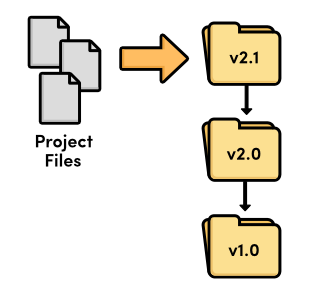
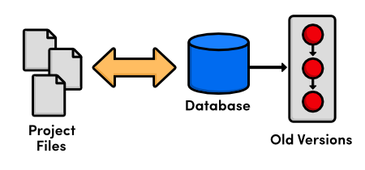
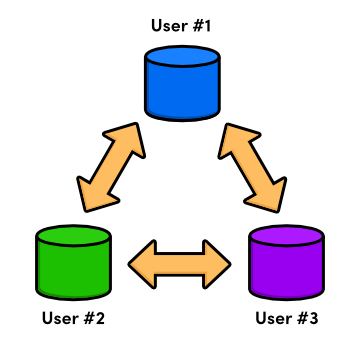

 Introduction
============

깃(Git)은 파일의 변경사항을 관리하는 작업을 위한 버전 관리 시스템(VCS, Version control system)이다. 
소프트웨어 프로젝트를 진행하면서 발생하는 모든 변경사항을 관리해주며, 이러한 변경들이 어디서부터 발생했는지 파악해 볼 수도 있다. 
깃은 큰 프로젝트들을 관리하는 데 있어 필수적인 도구이며, 또한 개인적인 업무방식(workflow)에도 많은 변화를 줄 수 있다.

## 개정 관리에 대한 요약 정리

깃(Git)의 핵심 철학에 대해 좀 더 자세히 얘기할 것이다. 
이에 앞서, 버전 관리 시스템의 발전 과정을 단계별로 살펴보도록 하자.

### 파일과 폴더 (Files and Folders)

개정 관리 소프트웨어가 등장하기 전에는 오직 파일과 폴더만 있었다. 
프로젝트의 개정사항을 기록하는 유일한 방법은 프로젝트 폴더를 통채로 복사해서 새로운 이름으로 저장하는 것이었다. 
여러분이 지금껏 `my-term-paper-2.doc` 라는 식으로 얼마나 많은 “백업”을 저장했는지 한번 생각해 보자. 
이것은 버전 관리의 매우 단순한 형태이다.

> 파일과 폴더를 이용한 개정 관리

하지만, 폴더에서 폴더로 파일을 복사하는 것이 소프트웨어 개발자에게 어떤 재앙을 가져올 수 있는지 보여주기는 쉽다. 
만약 폴더에 이름을 잘못 붙이면 어떻게 될까? 아니면 문제가 있는 파일을 덮어쓰기 했다면 무슨 일이 일어날까? 
심지어 아주 중요한 코드 일부를 날려버렸다는 사실을 어떻게 알 수 있을까? 
소프트웨어 개발자들에게 좀 더 신뢰할만한 무언가가 필요하다는 사실을 깨닫는데까지 그리 오래 걸리지 않았다.

### 로컬 VCS (Local VCS)

그래서, 개발자들은 파일 개정사항을 관리하는 전용 유틸리티 프로그램을 만들기 시작했다. 
이전 버전(old version)들을 독립적인 파일로 유지하는 대신, 새로운 VCS는 데이터베이스에 파일들을 저장했다. 
이전 버전에 대해 조회가 필요할 경우 파일에 직접 접근하는 대신 VCS를 사용했다. 
이런 식으로, 주어진 시점에 단 하나의 “체크 아웃된(checked out)” 프로젝트 복사본을 가질 수 있었고, 
개정사항이 뒤섞이거나 분실될 가능성을 제거해 주었다.

> 로컬 버전 관리

당시에는 버전 관리가 개발자의 로컬 컴퓨터(Local Computer)에서 가능했다. 
즉, 여러 프로그래머들끼리 코드를 효율적으로 공유할 방법은 없었다.

### 중앙집중식 VCS (Centralized VCS)

중앙집중식 버전 관리 시스템(CVCS, Centeralized VCS)를 살펴보자. 
개발자의 하드디스크에 프로젝트 히스토리를 저장하는 대신에, 새로운 CVCS 프로그램은 서버에 모든 것을 저장했다. 
개발자들은 네트워크를 통해 파일을 체크아웃하고 프로젝트에 다시 저장했다. 
이 설정은 여러 개발자들이 프로젝트에 협업할 수 있도록 하나의 진입점을 제공하였다.

> 중앙집중식 버전 관리

로컬 VCS에 비해 큰 발전이긴 하지만, 중앙집중식 시스템은 다음의 새로운 문제점을 제시했다: 
사용자 다수가 동시에 같은 파일에 접근하여 작업하려면 어떻게 해야 할까? 
두 사람이 같은 버그를 수정하고 중앙 서버에 commit을 시도하려고 하는 시나리오를 상상해 보자. 
누구의 변경사항이 반영되어야 할까?

CVCS는 사용자가 다른 사용자의 작업을 무시하지(overriding) 못하게 함으로써 이 문제를 해결했다. 
만약 두 변경사항이 충돌(conflict)하면, 누군가가 수작업으로 차이점을 찾아 병합(merge)해야 했다. 
이 해결책은 상대적으로 적은 업데이트(상대적으로 적은 충돌을 의미)의 프로젝트에는 효과가 있었으나, 
다수의 활동적인 참여자들이 매일 여러 개의 업데이트를 제출하는 프로젝트에는 적용하기 힘든 것으로 드러났다: 
모든 병합 충돌(merge conflict)을 해결하고 전체 개발 팀이 사용할 수 있을 때까지 개발이 진행될 수 없었다.

### 분산 VCS (Distributed VCS)

개정 관리 프로그램의 다음 세대는 단일 중앙집중식 저장소의 개념에서 벗어나 모든 개발자에게 
전체 프로젝트에 대한 자신만의 로컬 사본을 제공하는 것을 택하는 것으로 변하게 되었다. 
저장소가 네트워크에 분산된 결과 개발자 각자 독립적으로 일할 수 있게 되었다. 
이것은 로컬 VCS와 비슷하지만 CVCS의 충돌 해결 문제는 이제 좀 더 나은 해결책을 갖게 되었다.

> 분산 버전관리

이제 더이상 중앙 저장소가 없기 때문에, 모든 사용자는 그들 자신의 속도에 따라 개발하고, 
로컬에 업데이트를 저장할 수 있게 되었다. 그리고 상황에 따라 충돌 병합을 미룰 수 도 있었다. 
게다가 분산 버전 관리 시스템(DVCS, Distributed VCS)은 분리된 개발 브랜치(branch)들을 효율적으로 관리하는데 중점을 두고 있어, 
코드를 공유하고 충돌을 병합하고, 새로운 아이디어를 실험하기가 더욱 쉬워졌다.

DVCS의 지역적인 특성은 더 이상 네트워크를 통해 작업을 수행하지 않아도 되기 때문에 개발을 더욱 더 빠르게 해주었다. 
그리고 모든 사용자가 프로젝트의 완전한 사본을 갖기 때문에 서버 고장의 위험, 저장소의 손상 혹은 
다른 형태의 데이터 손실 가능성이 CVCS 이전 시스템들보다 더욱 낮아졌다.

## Git의 탄생

그래서, 우리는 Git에 도달했다. Git은 리눅스 커널을 관리하기 위해 만들어진 일종의 분산 버전 관리 시스템이다. 
2005년에 리눅스 커뮤니티는 2002년부터 사용해 온 상용 DVCS인 비트키퍼(BitKeeper) 소프트웨어에 대한 무료 사용권을 잃게 되었다. 
이에 대응하여, 리누스 토발즈(Linus Torvalds)는 대안으로 새로운 오픈소스 DVCS의 개발을 주창했다. 
이것이 Git의 탄생 배경이다.

전체 리눅스 커널을 위한 소스코드 관리자로서, Git은 다음을 포함하는 몇가지 고유한 제약조건을 가진다:

* 신뢰성 (Reliability)
* 대형 프로젝트의 효율적인 관리
* 분산 개발을 위한 지원
* 비 선형(non-linear) 개발을 위한 지원

그 당시 다른 DVCS들이 존재했으나 (예를 들면, GNU의 Arch 혹은 David Roundy의 Darcs), 
어느 것도 이 조건을 모두 만족하진 못했다. 
이러한 목표에 힘입어, Git은 수년간 활발한 개발이 진행되었고, 
이제는 제법 안정성, 대중성, 커뮤니티 참여가 이루어지고 있다.

Git은 명령 줄(command-line) 프로그램에 기반을 두고 있으나 수년간 비주얼 인터페이스를 가진 다양한 프로그램이 출시되었다. 
그래픽적인 도구들은 Git의 복잡성을 감춰주고 저장소의 상태를 시각화하는데 도움을 주지만 
여전히 분산 버전 관리에 대한 튼튼한 기초 지식을 요구한다. 
이를 염두에 두고, 우리는 Git과 상호작용하는 가장 일반적인 방법인 명령 줄 인터페이스 사용을 고수할 것이다.

## 설치

앞으로 나올 내용에서는 실제 시나리오에 명령들을 적용해 보면서 Git의 특징들을 살펴볼 것이다. 
그러나 먼저, 실험을 위한 Git 설치가 필요하다. 
[Git 공식 웹사이트](http://git-scm.com/)에서 지원하는 모든 플랫폼에 대한 다운로드가 가능하다. 
도우 사용자는 *Git Bash*라는 특별한 명령 쉘(command shell)을 설치할 것이다. 
Git 명령을 실행하기 위해 기본 명령 프롬프트 대신 이 쉘을 사용해야 한다. OS X와 리눅스 사용자는 그냥 쉘에서 Git을 사용할 수 있다.  
설치가 잘 되었는지 테스트를 위해, 새로운 명령 프롬프트를 열고 `git –version`을 실행해 보자. 
`git version 1.7.10.2 (Apple Git-33)`와 비슷하게 출력될 것이다.

## 준비!

본 *튜토리얼(Ry’s Git Tutorial)*은 Git의 특징들을 *설명*하고자 만들어졌고, 
가장 일반적인 명령에 대한 개요만을 제공한다. 
튜토리얼을 최대한 활용하려면 눈으로만 보지말고 명령어를 직접 실행해 보는 것이 중요하다. 
그러면 컴퓨터 앞에 앉아 있는지 확인하고 시작해 보자!
