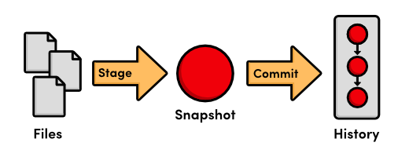
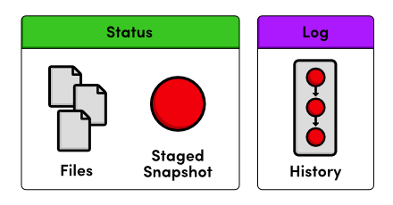
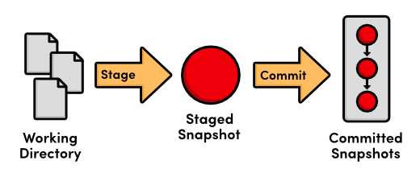

 The Basics
==========

전반적인 버전 관리 시스템에 대해 기본적인 이해가 되었으면, 이제 우리는 Git을 가지고 실습을 시작할 수 있다. 
VCS로써 Git을 사용한다고 해서 여러분이 평소 소프트웨어 프로젝트를 작업할 때와 별반 다르지 않다. 
여전히 파일에 코드를 작성하고, 그 파일들을 폴더에 저장할 것이다. 
다만, 이제 이 파일들을 처리할 다양한 Git 명령어들을 접할 것이다.

예를 들어, 만약 프로젝트를 예전 버전으로 되돌리기(revert) 원하면, 간단한 Git 명령어를 실행하는 것이 전부다. 
이 명령은 Git의 내부 데이터베이스에 들어가 원하는 상태의 프로젝트가 어떤 모습인지 알아내어 
여러분의 프로젝트 폴더(또는 **워킹 디렉토리, working directory**) 내부의 기존 모든 파일을 업데이트 할 것이다. 
외부에서 보았을 때, 여러분의 프로젝트는 마법같이 과거로 돌아가는 것처럼 보일 것이다.

본 단원은 기본적인 Git 워크플로우를 살펴본다: 
저장소를 생성, 스냅샷을 stage하고 commit, 옵션 설정하기, 저장소 상태(status) 확인. 
또한 전체 튜토리얼을 위해 실행 예제로서 제공되는 HTML 웹사이트를 소개한다. 
HTML과 CSS에 대한 매우 기본적인 지식은 다양한 Git 명령들의 근본적인 목적을 더 깊이 이해하도록 해 줄 것이나 필수 요구 사항은 아니다.

## 예제 사이트 생성

Git 명령어를 실행하기에 앞서, 예제 프로젝트를 생성할 필요가 있다. 
프로젝트를 저장하기 위해 `my-git-repo`라는 이름으로 새 폴더를 생성하고, `index.html`을 추가하자.
선호하는 에디터로 `index.html` 파일을 연 다음 아래 HTML을 입력하자.

```html
<!DOCTYPE html>
<html lang="en">
<head>
  <title>A Colorful Website</title>
  <meta charset="utf-8" />
</head>
<body>
  <h1 style="color: #07F">A Colorful Website</h1>
  <p>This is a website about color!</p>    
  
  <h2 style="color: #C00">News</h2>
  <ul>
    <li>Nothing going on (yet)</li>
  </ul>
</body>
</html>
```

파일을 다 작성했으면 저장하자. 이것은 예제 프로젝트의 토대로 쓰인다. 
일단 `index.html`을 웹브라우저에서 열어보고 어떤 종류의 웹사이트인지 확인해 보자. 
완전 예쁜 건 아니지만 우리의 목적에 맞다.

## Git 저장소 초기화

자, 이제 우리는 첫번째 Git 저장소를 생성할 준비가 되었다. 
명령 프롬프트 (윈도 사용자는 Git Bash)를 열고 다음을 실행하여 프로젝트 디렉토리로 이동하자:

```
cd /path/to/my-git-repo
```
여기에서 `/path/to/my-git-repo`는 이전 단계에서 생성한 폴더 경로이다. 
예를 들어, 만약 바탕화면에 `my-git-repo`를 생성했다면, 다음과 같이 실행할 것이다:

```
cd ~/Desktop/my-git-repo
```

그 다음, 디렉토리를 Git 저장소로 변경하기 위해 다음 명령어를 실행하자.

```
git init
```

이것은 저장소를 초기화하며, 앞으로 나올 Git의 강력한 기능들을 가능하게 한다. 
`my-git-repo`안에 `.git`디렉토리가 생성되었음에 주목하자. 
이것은 우리의 저장소를 위한 모든 추적 데이터를 저장한다. 
(이 폴더를 보려면 아마도 숨김 파일 보기를 활성화해야 할 수도 있다). 
Git 저장소와 일반 폴더의 유일한 차이점은 `.git`폴더이다. 
그래서 이것을 삭제하는 것은 프로젝트를 버전 관리되지 않는 파일들의 집합으로 되돌릴 것이다.

## 저장소 상태 확인하기

변경 사항 생성을 시작하기 전에, 새로운 저장소의 상태를 확인하는 것이 도움이 된다. 
명령 프롬프트에서 다음을 실행해 보자:

```
git status
```

이것은 다음과 같이 출력할 것이다:

```
# On branch master
#
# Initial commit
#
# Untracked files:
#   (use "git add <file>..." to include in what will be committed)
#
#       index.html
nothing added to commit but untracked files present (use "git add" to track)
```

당분간 `On branch master` 부분은 무시하자. 
이 상태 메시지는 우리가 초기 commit 상태에 있고, “비추적(untracked) 파일” 외에 commit할 것이 없다고 알려준다.

**비추적 파일(untracked file)**은 버전 관리 되지 않는 것이다. 
Git은 자동으로 파일을 추적(track)하지 않는데, 버전 관리를 원하지 않는 프로젝트 파일이 종종 있기 때문이다. 
C 프로그램에 의해 생성된 바이너리들, 컴파일된 파이썬 모듈(`.pyc` 파일) 혹은 저장소를 불필요하게 부풀리는 모든 컨텐츠들이 여기에 해당한다. 프로젝트를 작고 효율적으로 유지하려면, 오로지 <em>소스</em> 파일만을 추적해야 하고 
이들 파일로부터 생겨날 수 있는 모든 것을 생략해야 한다 ? 버전 관리가 아니라 빌드 과정의 부분이다.

## 스냅샷을 stage하기

자, 우리는 저장소에 `index.html`을 추가하기 위해 명시적으로 Git에게 알려줄 필요가 있다. 
적절하게 이름 붙여진 `git add` 명령어는 `index.html`파일의 추적을 시작하기 위해 Git에게 알려준다.

```
git add index.html
git status
```

“Untracked files” 목록 대신에 다음 상태를 확인할 수 있다.

```
# Changes to be committed:
#   (use "git rm --cached <file>..." to unstage)
#
#       new file:   index.html
```

우리는 다음 commit을 위한 스냅샷(snapshot)에 그냥 `index.html`을 추가했다. 
**스냅샷(snapshot)**은 주어진 시점의 프로젝트의 상태를 나타낸다. 
이 경우, 우리는 한 개의 파일로 스냅샷을 생성했다:  `index.html`. 
만약 우리가 Git에게 이 스냅샷으로 되돌리기(revert)를 명령하면, 
전체 프로젝트 폴더는 정확히 같은 HTML을 포함하는 이 한개의 파일로 교체될 것이다.

스냅샷을 생성하는 것을 Git 용어로 **staging**이라 부른다. 
실제로 프로젝트 히스토리에 commit하기 전에 다수의 파일을 추가 혹은 삭제할 수 있기 때문이다. 
Staging은 연관된 변경사항들을 서로 다른 스냅샷으로 그룹지을 수 있는 기회를 준다. 
소프트웨어 프로젝트의 의미있는 진행 과정 (그냥 임의의 코드 라인 대신)을 추적하는 것을 가능하게 해준다.

## 스냅샷 commit하기

우리는 스냅샷을 stage 했으나, 여전히 프로젝트 히스토리에 **커밋(commit)**할 필요가 있다. 
다음 명령어는 텍스트 에디터를 띄우고 commit 메시지의 입력을 요구할 것이다.

```
git commit
```

메시지를 위해 `Create index page` 를 입력하고 나머지 텍스트를 남겨둔 채 파일을 저장하고 편집기를 종료한다. 
다소 애매모호한 출력들 중에서 `1 files changed` 메시지를 볼 수 있다. 
이 변경된 파일은 우리의 `index.html`이다.

방금 설명한 바와 같이, 프로젝트의 버전을 저장하는 것은 다음 두 단계의 절차로 이뤄진다:

1. **Staging.** 다음 commit에 어떤 파일을 파일을 포함할지 Git에게 알려준다.
2. **Committing.** commit 메시지와 함께 staged 스냅샷을 기록한다.

`git add` 명령어로 파일을 staging하는 것은 실제 눈에 띌 정도로 저장소에 영향을 주지는 않는다. 
단지 다음 commit을 위하여 파일을 모으는 것이다. 
오로지 `git commit`를 실행한 이후에야 저장소에 스냅샷이 기록될 것이다. 
commit된 스냅샷은 프로젝트의 “안전한(safe)” 버전으로 간주될 수 있다. 
이것은 Git이 그것들을 절대 변경하지 않을 것이며, “안전한” 개정 사항들을 잃어버리지 않고 프로젝트에 원하는 거의 모든 것을 할 수 있다는 것을 의미한다. 
이것은 모든 버전 관리 시스템의 주요 목표이기도 하다.


> Stage 및 Commit 절차

## 저장소 히스토리 확인

`git status`는 이제 commit할 것이 없다(`nothing to commit`)라고 알려준다. 
이는 우리의 현재 상태가 저장소에 저장된 것과 일치한다는 것을 의미한다. 
`git status` 명령은 <em>단지</em> commit되지 않은 변경사항만을 우리에게 보여줄 것이다. 
프로젝트 히스토리를 보기 위해서는, 우리는 다음의 새로운 명령어가 필요하다:

```
git log
```

이 명령을 실행하면, Git은 다음과 같이 commit에 관련된 정보만을 출력할 것이다:

```
commit b650e4bd831aba05fa62d6f6d064e7ca02b5ee1b
Author: unknown <user@computer.(none)>
Date:   Wed Jan 11 00:45:10 2012 -0600

    Create index page
```

좀 더 자세히 살펴보자. 먼저, commit은 매우 길고, 매우 랜덤해 보이는 문자열(`b650e4b...`)로 식별된다. 
이것은 commit 내용의 SHA-1 체크섬이며, commit은 Git이 알지 못한채 손상되는 일이 결코 없을 것을 보장한다. 
여러분의 모든 SHA-1 체크섬은 본 튜토리얼에 표시되는 것과 다를 것인데 
이는 여러분의 commit에 있는 날짜와 작성자가 다르기 때문이다. 
다음 단원에서, 우리는 commit을 위한 유일한 ID로서 체크섬이 어떻게 쓰이는지 확인할 것이다.

다음, Git은 commit의 작성자를 표시한다. 
그러나, 아직 Git에게 우리 이름을 알려주지 않았기 때문에, 그냥 `unknown`으로 표시된다. 
또한 Git은 commit이 발생한 날짜, 시간, 그리고 타임존(`-0600`)을 출력한다. 
마지막으로, 우리는 이전 단계에서 입력했던 commit 메시지를 확인할 수 있다.

## Git 환경설정

다른 스냅샷을 commit하기 전에  우리가 누구인지 Git에게 알려줘야 한다. `git config` 명령어로 이것을 할 수 있다.

```
git config --global user.name "Your Name"
git config --global user.email your.email@example.com
```

`Your Name`과 `your.email@example.com`을 실제 이름과 이메일로 교체하자. 
`--global` 플래그는 Git이 여러분에게 모든 저장소에 디폴트로 이 설정을 사용할 것이라고 지시한다. 
이를 생략하면 각각의 저장소마다 서로 다른 사용자 정보를 지정하게 되며, 향후에 쓸 일이 있을 것이다.

## 새로운 HTML 파일 생성하기

웹사이트 개발을 계속해보자. 아래 내용으로 `orange.html` 이름의 파일을 생성하자:

```html
<!DOCTYPE html>
<html lang="en">
<head>
  <title>The Orange Page</title>
  <meta charset="utf-8" />
</head>
<body>
  <h1 style="color: #F90">The Orange Page</h1>
  <p>Orange is so great it has a
  <span style="color: #F90">fruit</span> named after it.</p>
</body>
</html>
```

그리고 나서, `blue.html` 페이지를 추가한다:

```html
<!DOCTYPE html>
<html lang="en">
<head>
  <title>The Blue Page</title>
  <meta charset="utf-8" />
</head>
<body>
  <h1 style="color: #00F">The Blue Page</h1>
  <p>Blue is the color of the sky.</p>
</body>
</html>
```

## 새로운 파일을 Stage하기

다음, 우리는 첫번째 스냅샷에서 생성했던 것과 같은 방법으로 파일을 stage할 수 있다.

```
git add orange.html blue.html
git status
```

`git add`에 1개 이상의 파일을 전달할 수 있음에 주목하자. 
파일을 추가한 후에, 여러분의 상태는 다음과 같이 보일 것이다.

```
# On branch master
# Changes to be committed:
#   (use "git reset HEAD <file>..." to unstage)
#
#       new file:   blue.html
#       new file:   orange.html
```

`git log`를 실행해보자. 
오직 한개의 commit만을 출력하는데 저장소 히스토리에 아직 `blue.html`과 `orange.html`이 추가되지 않았다고 알려준다. 
다음을 꼭 기억하자. 
우리는 `git log`가 아니라 `git status`로 <em>staged</em> 변경사항을 확인 할 수 있다. 
`git log`는 오직 <em>committ된</em> 변경사항만을 위해 사용된다.


> 상태 출력 vs. 로그 출력

## 새로운 파일을 commit하기
우리의 staged 스냅샷을 commit해보자.

```
git commit
```

commit 메시지로서 `Create blue and orange pages`를 사용하고, 파일을 저장하고 닫는다. 
이제, `git log`는 두 개의 commit을 출력할 것이고, 두번째 것은 우리의 이름과 이메일 설정을 반영하고 있다. 
프로젝트 히스토리는 다음과 같이 시각화할 수 있다:


> Current project history

각각의 원은 commit을 나타내며, 빨간 원은 현재 우리가 보고 있는 commit을 가리킨다. 
그리고 화살표는 이전 commit을 가리킨다. 
마지막 부분은 직관적이지 않을 수도 있지만, commit들 사이에 기본 관계를 반영한다. 
(즉, 새로운 commit은 그의 부모 commit을 참조한다). 
여러분은 본 튜토리얼을 통해 이런 형태의 다이어그램을 자주 보게 될 것이다.

## HTML 페이지 수정하기

우리가 <em>새로운</em> 파일을 stage하기 위해 사용한 `git add`명령은 <em>수정된</em> 파일을 stage하는데도 사용된다. 
index.html의 아래에서 닫는 `&lt;/body&gt;`태그 바로 직전에 다음 내용을 추가하자:

```html
<h2>Navigation</h2>
<ul>
  <li style="color: #F90">
    <a href="orange.html">The Orange Page</a>
  </li>
  <li style="color: #00F">
    <a href="blue.html">The Blue Page</a>
  </li>
</ul>
```

다음, `orange.html`과 `blue.html`의 아래에 홈페이지 링크를 추가하자 
(다시 말해, `&lt;/body&gt;` 라인 전에):

```html
<p><a href="index.html">Return to home page</a></p>
```

웹브라우저에서 확인하면 이제 페이지간에 이동할 수 있다.

## 스냅샷을 stage하고 commit하기

다시 한번, 우리는 수정 사항을 stage할 것이다. 그리고 나서, 스냅샷을 commit하자.

```
git status
git add index.html orange.html blue.html
git status
git commit -m "Add navigation links"
```

`-m` 옵션은 텍스트 편집기를 여는 대신에 명령줄에 commit 메시지를 입력하게 해준다. 
이것은 그냥 편리한 지름길이다 (우리가 이전에 commit한 것과 정확하게 동일한 효과를 가진다).

이제 우리 히스토리는 다음과 같이 표현될 수 있다. 
빨간원에 주목하자. 이것은 현재 commit을 나타내며, 매번 새로운 스냅샷을 commit할 때마다 자동적으로 앞으로 이동한다.


> 현재 프로젝트 히스토리

## 리포지토리 히스토리 탐색하기

`git log` 명령은 다양한 포맷팅 옵션과 같이 사용한다. 
본 튜토리얼을 통해 일부분이 소개될 것이다. 
지금부터, 우리는 편리한 `--oneline` 플래그를 사용할 것이다.

```
git log --oneline
```

출력을 한 줄로 압축하는 것은 저장소에 대한 고수준의 개요를 얻기위한 훌륭한 방법이다. 
또다른 유용한 설정은 `git log`에 파일이름을 전달하는 것이다:

```
git log --oneline blue.html
```

이것은 `blue.html` 히스토리만을 표시한다. 
초기의 `Create index page` commit은 빠져있음에 주목하자. 
왜나하면 `blue.html`은 그 당시 스냅샵에 존재하지 않기 때문이다.

## 결론

이번 장에서는, 기본적인 Git 작업흐름을 소개하였다: 
파일을 편집하고, 스냅샷을 stage하고, 스냅샷을 commit한다. 
우리는 또한 이 절차에 관련된 구성요소들과 함께 약간의 실습을 해보았다.


> 기본적인 Git 작업흐름

워킹 디렉토리, staged 스냅샷, committed 스냅샷 사이의 구분은 Git 버전 관리에 있어서 가장 핵심적인 사항이다. 
대부분의 Git 명령어는 특정 방식으로 이들 구성요소 중 하나를 조작한다. 
그래서 이들 사이의 상호작용을 이해하는 것은 Git을 마스터하는데 아주 중요한 기초가 된다.

다음 장은 이전 스냅샷으로 되돌리기(revert)를 함으로서 기존 프로젝트 히스토리를 작업하게 해준다. 
여러분 자신의 프로젝트를 위한 단순한 버전 관리 도구로서 Git을 사용한다면 이것이 필요한 모든 것이다.

## 정리

`git init`  
현재 폴더에 Git 저장소를 생성한다.

`git status`  
저장소 내 각 파일의 상태를 표시한다.

`git add <file>`  
다음 commit을 위해 파일을 stage한다.

`git commit`  
commit을 설명하는 메시지와 함께 staged 파일을 commit한다.

`git log`  
저장소의 commit 히스트리를 표시한다.

`git config --global user.name "<name>"`  
모든 저장소에 사용할 작성자 이름을 정의한다.

`git config --global user.email <email>`  
모든 저장소에 사용한 작성자 이메일을 정의한다.
