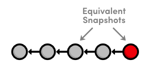
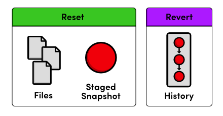

 Undoing Changes
===============

지난 장에서, 우리는 Git 저장소에 프로젝트의 버전을 어덯게 기록하는지 배웠다. 
이들 “안전한(safe)” 사본을 유지하는 요점은 마음의 평화를 위함이다: 
만약 우리의 프로젝트가 갑자기 손상되면, 우리는 잘 작동하는 버전으로 쉽게 접근해서 문제가 발생한 위치를 정확하게 찾아낼 수 있다.

이를 위해, “안전한” 버전을 저장하는 것은 그것을 복구하는 능력말고는 그다지 도움이 되지 않는다. 
우리의 다음 작업은 프로젝트의 이전 상태를 확인하는 방법, 그것들을 되돌리는 방법, 
commit되지 않는 변경사항들을 리셋하는 방법을 배우는 것이다.

 [이번 장을 위한 저장소 다운로드 받기](media/repo-zips/undoing-changes.zip)

이전 장에서부터 계속 진행중이라면, 여러분은 이미 필요한 모든 것을 가지고 있다. 
그렇지 않으면, 위의 링크에서 압축된 Git 저장소를 다운로드 받아 압축을 풀자. 
그리고 나서 진행해도 좋다.

## 커밋 체크섬(commit checksum) 표시

복습을 위해 저장소 히스토리를 표시해 보자. 
명령줄(혹은 Git Bash)에서 `my-git-repo` 폴더로 이동한 후 다음을 실행하자.

```
git log --oneline
```

다음과 비슷한 결과가 출력될 것이다. 단, commit 체크섬은 다르다.

```
1c310d2 Add navigation links
54650a3 Create blue and orange pages
b650e4b Create index page
```

Git은 체크섬의 첫 7자리만을 출력한다(`git log`의 디폴트 포맷팅으로 풀버전을 볼 수 있음을 기억하자). 
이들 첫 몇 자리는 각 commit을 위한 고유한 ID로서 효과적으로 쓰인다.

## 이전 개정사항을 보기

`git checkout`이라는 새로운 Git 명령을 사용해서, 우리는 이전 스냅샷의 내용을 볼수 있다. 
다음 명령에서 `54650a3`을 여러분의 *두번째* commit의 ID으로 꼭 변경하자.

```
git checkout 54650a3
```

이것은 `detached HEAD` 상태에 관한 많은 정보를 출력할 것이다. 당분간은 이것을 무시해도 좋다. 
반드시 알아야 할 것은 위의 명령이 여러분의 `my-git-repo` 디렉토리를 
[The Basics](01-the-basics.html)에서 commit했던 두번째 commit과 완전히 같은 내용으로 바꾼다는 점이다.

우리가 세번째 commit에서 추가한 이동 링크가 사라졌음을 확인하기 위해 텍스트 편집기나 웹브라우저에서 HTML파일을 열어보자. 
`git log`를 실행하면 세번째 commit이 더이상 프로젝트의 일부가 아니라고 알려준다. 
두번째 commit을 체크아웃한 뒤의 우리의 저장소 히스토리는 다음과 같이 보일 것이다 (빨간 원은 현재 commit을 나타낸다).


> 두번째 commit을 체크 아웃하기

## 더 이전의 개정사항 보기

히스토리에서 좀 더 과거로 이동해보자. `b650e4b`를 여러분의 *첫번째* commit ID로 변경했는지 확인하자.

```
git checkout b650e4b
```

이제 `blue.html`과 `orange.html` 파일은 사라졌고 `git log` 히스토리도 없어졌다.


> 첫번째 commit을 체크 아웃

이전 장에서, 우리는 Git이 commit된 스냅샷을 절대 잃어버리지 않도록 디자인되었다고 말했다. 
그러면, 우리의 두번째와 세번째 스탭샷이 어디로 갔을까? 
간단하게 `git status`는 우리를 위해 질문에 답을 해 줄 것이다:

```
# Not currently on any branch.
nothing to commit (working directory clean)
```

이전 장에서의 상태 출력과 이것을 비교해 보자:

```
# On branch master
nothing to commit (working directory clean)
```

*The Basics*에서 모든 우리의 명령은 `master` 브랜치에서 일어났고, 두번째와 세번째 commit은 여전히 거기에 있다. 
완전한 히스토리를 가져오려면, 우리는 이 브랜치를 그냥 체크아웃하면 된다. 
이것은 브랜치에 대한 아주 짤막한 소개이지만 commit 간에 이동하기 위해 우리가 알아야 할 모든 것이기도 하다. 
다음 단원에서 브랜치는 완전 자세히 다룰 것이다.

## 현재 버전으로 돌아가기

`master` 브랜치로 돌아가려면 동일하게 `git checkout` 명령어를 사용할 수 있다.

```
git checkout master
```

이것은 `master` 브랜치 스냅샷의 상태를 반영하기 위해 우리의 워킹 디렉토리를 Git이 업데이트하게 만든다. 
우리를 위해 `blue.html`과 `orange.html`을 재생성하고, `index.html`의 내용을 또한 업데이트한다. 
이제 우리는 프로젝트의 현재 상태로 돌아왔으며 히스토리는 다음과 같이 보인다:


> 현재 프로젝트 히스토리

## 릴리즈 태그하기

이것을 예제 웹사이트의 안정화(stable) 버전이라고 부르자. 
우리는 버전 번호와 함께 가장 최근 commit을 **태그(tagging)**하여 공식적인 것으로 만들 수 있다.

```
git tag -a v1.0 -m "Stable version of the website"
```

태그는 공식적인 릴리즈(release)에 대한 편리한 참조이며, 소프트웨어 프로젝트에서 중요한 이정표(milestone)가 된다. 
그것은 개발자가 중요한 개정을 쉽게 조회하고 체크아웃하도록 해준다. 
예를 들면, 이제 우리는 랜덤한 ID 대신 세번째 commit에 대한 참조로 `v1.0` 태그를 사용할 수 있다. 
기존 태그의 목록을 조회하기 위해서 그냥 `git tag`를 실행하자.

위의 명령에서, `-a` 플래그는 Git에게 **주석 태그(annotated tag)**를 생성할 것을 지시하고, 
우리의 이름과 날짜, 설명 메시지(`-m` 플래그로 지정)를 기록하게 해준다. 
우리가 다소 미친 실험을 한 후에 안정화 버전을 찾기 위해 태그를 사용할 것이다.

## Crazy 실험 해보기

모든 commit된 내용에 영향을 주지 않고 예제 사이트에 대해 마음껏 실험적 변경사항을 추가해도 된다. `crazy.html` 이름으로 새로운 파일을 생성하고 아래의 HTML을 추가하자.

```html
<!DOCTYPE html>
<html lang="en">
<head>
  <title>A Crazy Experiment</title>
  <meta charset="utf-8" />
</head>
<body>
  <h1>A Crazy Experiment</h1>
  <p>We're trying out a <span style="color: #F0F">crazy</span>
  <span style="color: #06C">experiment</span>!
    
  <p><a href="index.html">Return to home page</a></p>
</body>
</html>
```
## 스냅샷 stage와 Commit하기

평소처럼 새 파일을 stage하고 commit하자.

```
git add crazy.html
git status
git commit -m "Add a crazzzy experiment"
git log
```

`git commit -m`을 실행하기 전에 commit하려고 하는 대상이 무엇인지 확인하기 위해 `git status`를 실행하는 것은 아주 좋은 습관이다. 
이는 현재 스냅샷에 속하지 않는 파일을 의도하지 않게 commit하는 것으로부터 지켜준다.

기대했듯이 새로운 스냅샷은 저장소의 히스토리를 보여준다. 만약 여러분의 로그 히스토리가 한 화면을 넘게 차지한다면, `Space`를 눌러 스크롤할 수 있고, `q`를 눌러 명령줄로 돌아갈 수 있다.

## 안정적인 commit 보기

우리의 안정적인 버전으로 다시 돌아가서 내용을 보자. 
`v1.0` 태그가 세번째 commit에 대한 사용하기 쉬운 바로가기로서 쓰이는 것을 기억하자.

```
git checkout v1.0
```

사이트의 안정적 버전을 확인한 후에 우리는 미친 실험을 버리기로 결정했다. 
그러나 변경사항을 취소(undo)하기 전에 우리는 `master` 브랜치로 돌아갈 필요가 있다. 
그렇게 안하면, 우리의 모든 업데이트가 존재하지 않는 브랜치에 적용될 것이다. 
우리는 다음 단원에서 살펴볼 내용으로 여러분은 이전 버전에 직접적으로 변경사항을 만들어서는 절대 안된다.

```
git checkout master
git log --oneline
```

이 지점에서, 우리의 히스토리는 다음과 같다:

```
514fbe7 Add a crazzzy experiment
1c310d2 Add navigation links
54650a3 Create blue and orange pages
b650e4b Create index page
```
## commit된 변경사항 취소하기(undo)

우리는 가장 최근의 commit을 제거하여 우리의 안정적인 태그로 복구할 준비가 되었다. 
다음 명령을 실행하기 전에 `514fbe7`을 *crazy experiment’s commit*의 ID로 변경하도록 하자.

```
git revert 514fbe7
```

이것은 디폴트로 `Revert "Add a crazzzy experiment"...` 와 함께 commit 메시지를 요구할 것이다. 
여러분은 디폴트 메시지를 그대로 두고 파일을 닫을 수 있다. 
`crazy.html` 파일이 없어지는 것을 확인한 후에 `git log --oneline`으로 히스토리를 살펴보자.

```
506bb9b Revert "Add a crazzzy experiment"
514fbe7 Add a crazzzy experiment
1c310d2 Add navigation links
54650a3 Create blue and orange pages
b650e4b Create index page
```

“crazzzy experiment” commit을 삭제하는 대신에 Git은 어떻게 변경사항을 취소할지 파악하고 나서, 
최종 내용과 함께 또 다른 commit을 덧붙인다. 
그래서 우리의 다섯번째 commit과 세번째 commit은 아래 그림에 보이는 것처럼 정확히 동일한 스냅샷을 나타낸다. 
다시말해, Git은 히스토리를 절대 잃어버리지 않도록 디자인되었다: 
네번째 스냅샷은 우리가 그것으로 개발을 계속 진행해 나가길 원하면 여전히 접근가능하다.


> 현재 프로젝트 히스토리

`git revert`를 사용할 때, 취소하기(undo)를 원하는 commit을 지정해야 함을 기억하자. 
되돌아가기를 원하는 안정적인 commit을 지정하는 것이 아니다. 
“이 버전으로 복구(restore this version)”라기 보다는 “이 commit을 취소(undo this commit)”이라고 말하면 
이 명령을 생각하는 것이 도움이 될 것이다.

## 좀더 작은 실험 시작하기

이제 더 작은 실험을 시도해보자. 
`dummy.html`을 생성하고 내용이 없는 빈 파일로 둔다. 
그리고 나서, 다음과 같이 `index.html`의 “Navigation” 부분에 링크를 추가하자.

```html
<h2>Navigation</h2>
<ul>
  <li style="color: #F90">
    <a href="orange.html">The Orange Page</a>
  </li>
  <li style="color: #00F">
    <a href="blue.html">The Blue Page</a>
  </li>
  <li>
    <a href="dummy.html">The Dummy Page</a>
  </li>
</ul>
```

다음 섹션에서, 우리는 이 commit되지 않은 실험을 중지하려고 할 것이다. 
그러나 `git revert` 명령은 취소를 위한 commit ID를 요구하기 때문에 우리는 위에서 설명한 방법을 사용할 수 없다.

## commit되지 않은 변경사항 취소하기

취소하는 것을 시작하기 전에, 우리 저장소의 상태를 한번 살펴보자.

```
git status
```

우리는 추적 파일을 하나 가지고 있고 변경될 필요가 있는 비추적파일 하나를 가지고 있다. 
먼저, `index.html`에 주목하자.

```
git reset --hard
```

이 명령은 *추적(tracked)*되는 모든 파일을 가장 최근의 commit에 일치하도록 변경한다. 
`--hard` 플래그는 실제로 파일을 업데이트 하는 것이다. 
플래그 없이 `git reset`을 실행하는 것은 단순히 `index.html`을 unstage하는 것이고, 
파일의 내용은 있는 그대로 둔다. 
어느 경우에나, `git reset`은 오직 워킹 디렉토리와 staging 영역(area)에서만 동작하며, 
그래서 우리의 `git log` 히스토리는 변경되지 않은 채로 있다.

다음,`dummy.html`파일을 제거하자. 
물론, 우리는 그것을 수작업으로 삭제할 수 있다. 
하지만 변경사항 취소를 위해 Git을 사용하는 것은 규모가 큰 팀에 많은 파일을 가지고 작업할 때 휴먼 에러를 제거한다.

```
git clean -f
```

이 명령은 *비추적(untracked)* 파일을 제거할 것이다. 
`dummy.html`가 없어지면서 `git status`는 우리가 “깨끗한(clean)” 워킹 디렉토리를 가졌다고 알려준다. 
이는 가장 최근의 commit과 우리의 프로젝트가 일치함을 의미하기도 한다.

`git reset`과 `git clean`을 ***조심하자.***
둘다 commit된 스냅샷이 아니라 워킹 디렉토리를 조작한다. 
`git revert`와 다르게, 그것들은 ***영구적으로*** 변경사항을 취소한다. 
그래서 그것들을 사용하기 전에 여러분이 작업하고 있는 것을 버리는 것을 정말로 원하는지 확인하자.

## 결론

이전 장에서 언급한 바와 같이, 대부분의 Git 명령어는 Git 저장소의 세가지 주요 구성요소
(워킹 디렉토리, staged 스냅샷, commit된 스냅샷) 중 하나를 조작한다. 
`git reset` 명령은 워킹 디렉토리와 staged 스냅샷에 변경사항을 취소한다. 
반면에 `git revert`는 commit된 스냅샷에 포함된 변경사항을 취소한다. 
놀랄 것없이, `git status`와 `git log`는 이러한 행동이 직접 비교된다.


> Resetting vs. Reverting

commit을 완전히 없애는 대신에 `git revert`는 나중에 돌아갈 경우를 대비해 커밋을 저장한다고 얘기했다. 
이것은 커밋된 스냅샷을 보존해야할 유일한 이유이다. 
우리가 리모트 저장소로 일을 할 때 커밋을 제거하여 히스토리를 변경하는 것은 다른 개발자들과 협업에 있어 극적인 결과를 갖는다.

이번 장은 `git checkout`으로 여러 commit과 브랜치 사이를 바꾸는 개념을 소개했다. 
브랜치는 핵심 Git 구성요소의 내용을 완성하고, 그것들이 여러분의 개발 작업흐름을 최적하는데 우아한 옵션을 제공한다. 
다음 장에서, 우리는 기본적인 Git 브랜치 명령을 다룰 것이다.

## 정리

`git checkout`  
이전 commit을 본다.

`git tag -a -m "<description>"`  
가장 최근의 commit을 가리키는 주석 태그를 생성한다. 

`git revert`  
새로운 commit을 적용하여 특정 commit을 취소한다.

`git reset --hard`  
가장 최근의 commit과 일치시키기 이해 추적 파일을 초기화한다. 

`git clean -f`  
비추적 파일을 삭제한다. 

`git reset --hard / git clean -f`  
commit되지 않은 변경사항을 영구적으로 취소한다.
