 Branches, Part I
================

브랜치(branch)는 Git 버전 관리의 마지막 요소이다. 
앞으로 튜토리얼의 남은 부분을 통해 함께 작업할 네 개의 핵심 요소이다:

- 워킹 디렉토리 (Working Directory)
- 스테이지 스냅샷 (Staged Snapshot)
- 커밋된 스냅샷 (Committed Snapshots)
- 개발 브랜치 (Development Branches)

Git에서 **브랜치(branch)**는 개발의 독립적인 라인이다. 
예를 들어 만약 여러분이 Git을 사용하지 않고 새로운 아이디어를 실험하기 원한다면, 
아마도 다른 디렉토리로 전체 프로젝트 파일을 복사하여 변경사항을 만들기 시작할 것이다. 
만약 결과가 만족스럽다면, 원래 프로젝트로 바뀐 파일들을 복사할 수도 있다. 
그렇지 않으면, 여러분은 그냥 전체 실험 내용을 삭제하고 그것을 잊어버릴 것이다.

이것은 Git branch가 제공하는 정확한 기능이며 몇 가지 주요 개선사항을 포함한다. 
첫째로 branch는 실험으로부터 변경사항을 결합하기 위해 오류 방지(error-proof) 방법을 제공한다. 
두번째, 모든 실험내용을 단일 디렉토리에 저장하게 해주어서 변경 사항을 추적하거나 다른 이들과 공유하는 것을 훨씬 더 쉽게 만들어준다. 
또한 branch는 개인과 협업 개발을 위한 몇 가지 표준화된 작업흐름에 있어 도움을 준다. 
본 튜토리얼의 후반부에서 살펴볼 내용이다.

 [이번 장을 위한 저장소 다운로드 받기](media/repo-zips/branches-1.zip)

이전 장에서부터 계속 진행중이라면, 여러분은 이미 필요한 모든 것을 가지고 있다. 
그렇지 않으면, 위의 링크에서 압축된 Git 저장소를 다운로드 받아 압축을 풀자. 
그리고 나서 진행해도 좋다.

## 이미 존재하는 branch 보기

우리 프로젝트를 위한 현재 존재하는 branch를 나열해 봄으로 탐구를 시작하자.

```
git branch
```

이것은 우리의 하나뿐인 branch를 표시할 것이다: `* master`. 
`master`는 Git의 기본 branch이며 옆에 나오는 별표(*)는 현재 체크 아웃되어 있음을 말해준다. 
이것은 `master`에 있는 가장 최근의 스냅샷이 워킹 디렉토리에 있음을 의미한다.

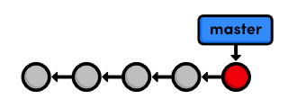
> The `master` branch

프로젝트를 위한 워킹 디렉토리는 단 하나만 존재하기 때문에 
특정 시점에 오직 한개의 branch만 체크 아웃 될 수 있는 것이다.

## Crazy 실험을 체크 아웃하기

이전 장에서 이전 commit을 체크아웃한 것이 실제로 어떻게 동작하는가에 대해서는 자제한 내용을 생략했다. 
이제 우리는 더 깊이 이 주제를 다룰 준비가 되었다. 
먼저, 우리는 commit 스냅샷의 체크섬(checksum)이 필요하다.

```
git log --oneline
```

이 명령은 다음 히스토리를 출력한다.

```
506bb9b Revert "Add a crazzzy experiment"
514fbe7 Add a crazzzy experiment
1c310d2 Add navigation links
54650a3 Create blue and orange pages
b650e4b Create index page
```

지난 장의 crazy 실험을 체크아웃 하자. 
`514fbe7`을 여러분의 네 번째 commit의 ID로 변경하는 것을 잊지 말자.

```
git checkout 514fbe7
```

이 명령은 우리가 `detached HEAD state` 에 있고 
**HEAD**는 이제 `514fbe7`이라고 알려주는 메시지를 반환한다. 
`HEAD`는 현재 체크 아웃된 스냅샷을 가리키는 내부적인 방법이다. 
이것은 우리의 히스토리 다이어그램에서 빨간 원이 실제로 Git의 **HEAD**를 나타낸다. 
다음 그림은 저장소의 상태를 보여주며, 이전 commit을 체크 아웃 하기 전과 후를 보여준다.

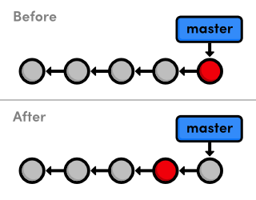
> 네 번째 commit을 체크아웃

“before” 다이어그램에서 보듯 `HEAD`는 보통 개발 branch의 tip(끝부분)에 위치한다. 
그러나 이전 commit을 체크아웃했을 때 `HEAD`는 branch의 중간 지점으로 이동했다. 
`HEAD`보다 더 최신의 스냅샷을 포함하기 때문에 우리는 더 이상 `master` branch에 있다라고 얘기할 수 없다. 
이것은 `git branch`의 출력에 반영되며, 현재 `(no branch)`에 머물러있다고 우리에게 말해준다.

## 새로운 branch 생성하기

우리는 어느 한 branch 위에 있지 않을 때 새로운 commit을 추가할 수 없다. 
그래서 지금 branch 하나를 생성해 보자. 
이것은 현재 워킹 디렉토리를 가지고 새로운 branch를 생성하게 될 것이다.

```
git branch crazy
```

`git branch`는 branch를 나열하고 또한 생성하는데 사용될 수 있는 다목적 명령어이다. 
그러나, 위의 명령은 단지 `crazy` branch <em>생성</em>만 하고 체크아웃은 하지 않는다.

```
git checkout crazy
```

이제 우리는 `master` branch에 아무 방해 없이 워킹 디렉토리에 마음껏 실험을 할 수 있다. 
`crazy` branch는 다음 그림과 같이 그려질 수 있는 <em>완전히 독립된</em> 개발 환경이다.

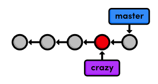
> 새로운 branch 생성하기

자 이제, `crazy`, `HEAD`, 워킹 디렉토리가 네 번째 commit으로 완전히 동일해졌다. 
그러나 우리가 또다른 스냅샷을 추가하는 즉시 프로젝트 히스토리에 갈림길을 보게 될 것이다.

## Rainbow 만들기

우리는 다음과 같이 `crazy.html`을 변경하여 crazy 실험 개발을 계속 진행할 것이다.

```html
<!DOCTYPE html>
<html lang="en">
<head>
  <title>A Crazy Experiment</title>
  <meta charset="utf-8" />
</head>
<body>
  <h1>A Crazy Experiment</h1>
  <p>Look! A Rainbow!</p>

  <ul>
    <li style="color: red">Red</li>
    <li style="color: orange">Orange</li>
    <li style="color: yellow">Yellow</li>
    <li style="color: green">Green</li>
    <li style="color: blue">Blue</li>
    <li style="color: indigo">Indigo</li>
    <li style="color: violet">Violet</li>
  </ul>
    
  <p><a href="index.html">Return to home page</a></p>
</body>
</html>
```

## Rainbow를 stage하고 commit하기

바라건대, 지금쯤 여러분은 스냅샵을 stage하고 commit하는데 익숙해졌을 것이다:

```
git add crazy.html
git status
git commit -m "Add a rainbow to crazy.html"
```

`crazy` branch에서 commit을 한 후에 우리는 프로젝트 개발에 대한 두개의 독립적인 라인을 볼 수 있을 것이다:

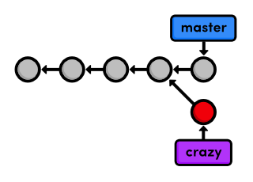
> 분기된 프로젝트 히스토리

또한 `HEAD`(빨간원으로 표시된)는 자동적으로 새로운 commit을 향해 앞으로 이동하였다. 
이것은 프로젝트를 개발할 때 우리가 직관적으로 기대하는 것이다.

위의 다이어그램은 우리 저장소의 완전한 상태를 표현한다. 
하지만 `git log`는 단지 현재 branch에 대한 히스토리만 표시한다:

```
677e0e0 Add a rainbow to crazy.html
514fbe7 Add a crazzzy experiment
*1c310d2 Add navigation links
*54650a3 Create blue and orange pages
*b650e4b Create index page
```

분기 전의 히스토리는 새로운 branch(위에서 별표(asterisk)로 표시된)의 일부로 여겨지는데 주목하자. 
다시 말해, `crazy` 히스토리는 첫번째 commit끝까지 걸쳐있다:

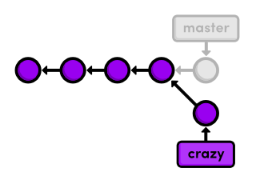
> `crazy` branch의 히스토리

이제 전체 프로젝트는 복잡한 히스토리를 가진다. 
그러나, 각각의 branch는 여전히 <em>선형으로 된(liner)</em> 히스토리를 가지고 있다 (스냅샷이 잇따라 발생한다). 
이것은 처음의 두 장에서 배웠던 바와 완전히 동일한 방식으로 branch와 상호작용할 수 있음을 의미한다.

## Rainbow 이름 바꾸기

`crazy` branch에 스냅샷을 더 추가해보자. 
`crazy.html`을 `rainbow.html`로 이름을 바꾸고, 저장소를 업데이트하기 위해 다음 Git 명령어를 사용하자.

```
git status
git rm crazy.html
git status
git add rainbow.html
git status
```

`git rm` 명령은 Git에게 `crazy.html`의 추적을 중지할 것을 지시한다 (그리고 필요시 그것을 삭제한다), 
그리고 `git add`는 `rainbow.html`에 대한 추적을 시작한다. 
마지막의 상태 출력에서  `renamed: crazy.html -&gt; rainbow.html` 메시지는 
우리가 파일의 이름을 바꿀 때 Git은 이를 알아낼 정도로 똑똑하다.

우리의 스냅샷은 stage되었고 commit될 준비가 되었다:

```
git commit -m "Rename crazy.html to rainbow.html"
git log --oneline
```

추가가 끝나면, 우리의 완전한 저장소 히스토리는 다음과 같이 보일 것이다. 
`crazy` branch는 분기 이후에 `master`에 있는 어떠한 commit도 포함하지 않는다는 것을 기억하자.

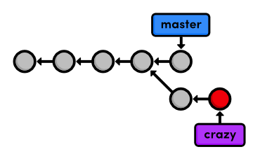
> 현재 프로젝트 히스토리

## master branch로 돌아가기

이제 다시 `master` branch로 전환하자:

```
git checkout master
git branch
git log --oneline
```

체크아웃 후에, `crazy.html`은 워킹 디렉토리에 존재하지 않는다. 
그리고 앞서 수행한 commit들이 히스토리에 보이지 않는다. 
이 두 개의 branch는 분기 이후 <em>완전히 독립적인</em> 개발 환경이 되었다. 
여러분은  `git checkout`으로 전환하여 그것들을 서로 별개의 프로젝트 폴더로 생각할 수 있다. 
하지만 처음 네 개의 commit을 서로 공유하고 있다.

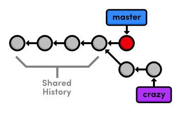
> branch 히스토리 공유하기

## CSS branch 생성하기

우리는 crazy 실험은 잠시 제쳐두고 CSS(cascading stylesheet)와 함께 HTML 페이지를 꾸미보는데 관심을 두려고 한다. 
만약 여러분이 HTML과 CSS에 익숙하지 않다면 앞으로 나올 파일 내용이 Git 명령어만큼 중요한 것은 아니라는 것을 알아두자.

`css`라는 이름으로 새로운 branch를 생성하고 체크 아웃 하자.

```
git branch css
git checkout css
```

새로운 branch는 현재 체크 아웃된 스냅샷을 가리키고, `master` branch와 일치하게 된다:

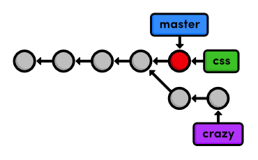
> `css` branch 생성

## CSS 스타일시트 추가하기

다음, `style.css` 이름으로 파일을 생성하고 다음 내용을 입력하자. 
CSS는 우리의 다른 파일들에 있는 HTML에 포맷을 적용하는데 사용된다.

```css
body {
  padding: 20px;
  font-family: Verdana, Arial, Helvetica, sans-serif;
  font-size: 14px;
  color: #111;
}

p, ul {
  margin-bottom: 10px;
}

ul {
  margin-left: 20px;
}
```

평소대로 스타일시트를 commit하자.

```
git add style.css
git status
git commit -m "Add CSS stylesheet"
```

## 스타일시트 링크걸기

우리는 여전히 `style.css`안의 포맷팅을 사용하기 위해 HTML 페이지에 링크할 필요가 있다. 
`index.html`, `blue.html`, `orange.html` 안에 있는 `&lt;title&gt;` 바로 뒤에 
다음에 나오는 내용을 한 줄 추가하자(`rainbow.html`은 `crazy` branch에만 존재함을 기억하자). 
여러분은 웹 브라우저에서 `index.html`을 불러들여 CSS 포맷팅을 확인할 수 있을 것이다.

```html
<link rel="stylesheet" href="style.css" />
```

변경사항을 commit하자.

```
git add index.html blue.html orange.html
git status
git commit -m "Link HTML pages to stylesheet"
git log --oneline
```

commit 히스토리가 다음과 같이 출력된다:

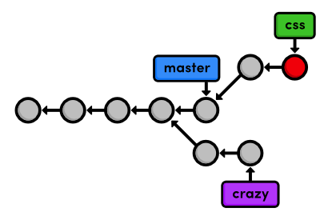
> 현재 프로젝트 히스토리

## master branch로 돌아가기 (다시)

`css` branch는 `master` branch의 안정성을 위협하지 않은채 우리의 포맷팅을 생성하고 테스트하게 해 주었다. 
그러나 이제 우리는 메인 프로젝트에 이러한 변경사항들을 merge할 필요가 있다.
merge를 시도하기 전에, 우리는 `master` branch에 돌아갈 필요가 있다.

```
git checkout master
```

`style.css` 가 존재하지 않는 것과 HTML 페이지에 링크가 없는 것을 확인하자. 
저장소 히스토리는 변경되지 않았고 현재 워킹 디렉토리는 `master` branch가 가리키는 스냅샷과 일치한다.

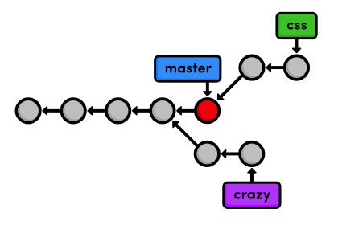
> 현재 프로젝트 히스토리

또한 `git log --oneline` 출력을 살펴보자.

```
af23ff4 Revert "Add a crazzzy experiment"
a50819f Add a crazzzy experiment
4cd95d9 Add navigation links
dcb9e07 Create blue and orange pages
f757eb3 Create index page
```

기대한 것 처럼, `master` 히스토리에는 CSS 추가에 대한 언급이 없다. 그러나 우리는 그것을 변경하려고 한다.

## CSS branch merge하기

`git merge` 명령어를 사용해서 `css` branch의 스냅샷을 가져와 `master` branch에 그것들을 추가하자.

```
git merge css
```

이 명령은 현재 branch로 항상 merge한다: `css` 바뀌지 않는다. 
`css` 히스토리가 `master` 추가되는 것을 확실히 하기 위해 히스토리를 체크하자.

```
git log --oneline
```

아래 다이어그램은 merge를 나타낸다.

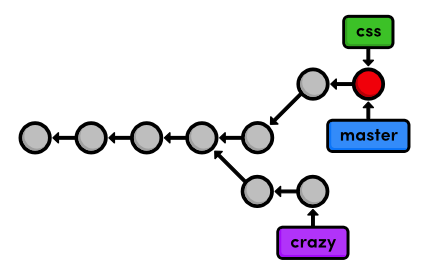
> `css` branch를 `master` merge하기

`css`에 commit을 재생성하고 `master`의 히스토리에 그것들을 추가하는 대신, 
Git은 기존 스냅샷을 재사용하여 `css`의 tip(끝부분)에 일치하도록 `master`의 tip을 단순히 이동한다. 
이러한 종류의 merge를 **빨리감기(fast-forward) 병합**이라 부르는데, 
Git은 `css` branch안에 있는 새로운 commit을 통해 “빨리 감는(fast-forwarding)” 것이다.

merge 이후, 두 branch는 정확히 같은 히스토리를 가진다. 
이는 중복이 된다. 우리가 `css` branch에 개발을 계속하지 않는다면 그것을 제거할 수 있다.

## css branch 삭제하기

우리는 `git branch`에 `-d` 플래그를 사용해서 branch를 안전하게 삭제할 수 있다.

```
git branch -d css
git branch
```

`css`와 `master` branch는 동일한 branch를 나타내기 때문에 우리의 히스토리는 `css` branch를 제거하더라도 동일하게 보인다. 
다음 그림에서 `master` branch의 commit이 직선 위에 놓여 있는데 앞으로 나올 내용에서 추적을 더 쉽게 해줄 것이다.

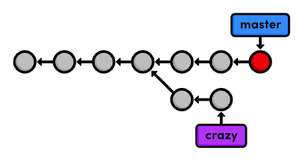
> `css` branch 삭제하기

만약 여러분이 merge되지 않은 branch를 삭제하려는 경우 Git이 경고를 한다는 점에서 
branch를 삭제하는 것은 비교적 “안전한(safe)” 명령이다. 
이것은 여러분의 작업을 절대 잃어버리지 않겠다는 Git의 약속의 또다른 예이다.

## 결론

이번 장은 새로운 추가 사항을 실험해보고자 두 개의 branch를 사용했다. 
두 경우 모두 branch는 웹사이트의 “안정화된(stable)” 버전으로부터 완전히 독립된 환경을 제공했다. (`master` branch)
안정적인 버전에 CSS 변경사항이 merge되었고, branch는 삭제되었다. 
우리 실험 중 하나는 다음 장에 나온다. 
이와 같이 작은 기능을 개발하기 위해 branch를 사용하는 것은 Git 기반의 소프트웨어 관리의 전형적인 특징 중 하나이다.

이번 장은 저장소의 완전한 상태를 보여주기 위해 branch 다이어그램에 많이 의존했다. 
하지만 여러분이 매일 개발을 하면서 마음속에 이런 고차원의 전체 모습을 생각할 필요는 없다. 
새로운 branch를 만드는 것은 정말로 그냥 독립적인 워킹 디렉토리, 스테이지 스냅샷, 히스토리를 요청하는 하나의 방법니다. 
처음의 두 장에서 나오는 기능을 증대시키기 위한 방법으로 branch를 생각할 수 있다.

다음으로 우리는 베테랑 Git 사용자의 전형적인 작업흐름을 체험해 봄으로써 branch 관리 기술을 연습할 것이다. 
또한, 위에서 소개한 패스트-포워드 merge보다 좀 더 복잡한 merge를 다룰 것이다.

## 정리

`git branch`  
모든 branch를 출력한다.

`git branch <branch-name>`  
현재 워킹 디렉토리를 베이스로 새로운 branch를 생성한다.

`git checkout <branch-name>`  
워킹 디렉토리를 만들고 HEAD를 특정 branch에 일치시킨다.

`git merge <branch-name>`  
branch를 체크아웃되어 있는 branch로 merge한다.

`git branch -d <branch-name>`  
branch를 삭제한다.

`git rm <file>`  
워킹 디렉토리에서 파일을 삭제하고(가능한 경우) 파일에 대한 추적을 중지한다.
