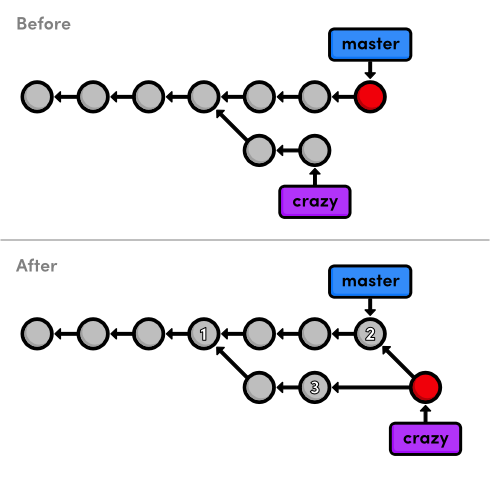
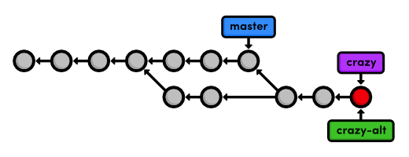
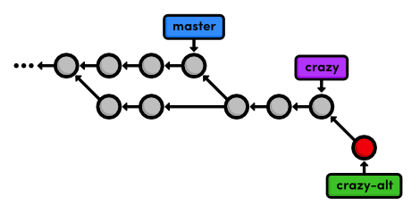
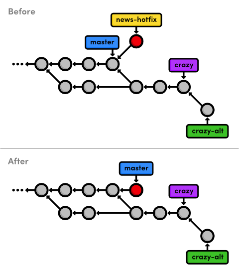
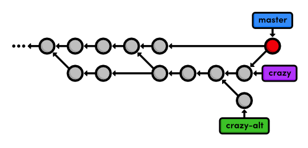

 Branches, Part II
=================

우리는 Git branch에 대한 기능적인 측면을 다루었으니, 
이제는 그것들이 소프트웨어 개발 과정에 끼치는 실제 영향에 대해 논의할 수 있게 되었다. 
새로운 명령어을 소개하는 대신, 이번 장은 branch 환경에서 일어나는 몇가지 문제와 더불어 
전형적인 Git 사용자가 실제 프로젝트에 어떻게 이 워크플로우(workflow)를 적용하는지 다룬게 된다.

Git에 있어, branch는 그냥 branch일 뿐이다. 
하지만 가끔 서로 다른 branch에 특별한 의미를 부여하는 것이 유용하다. 
예를 들면, 우리의 예제 프로젝트를 위한 안정화된(stable) branch를 `master` branch로 사용하고, 
CSS 포맷팅을 추가하기 위한 임시 branch를 사용하기도 한다. 
후자의 임시 branch는 **topic branches**라 불리는데 왜냐하면 어떤 토픽(topic)을 개발하기 위해 존재하고, 
나중에 삭제되기 때문이다. 
우리는 두 가지 형태의 topic branch를 이 장에서 실습할 것이다.

Git branch를 탐구하는 도중에 우리는 “패스트-포워드(fast-forwarded)”를 할 수 없는 merge들을 발견하기도 할 것이다. 
두 branch의 히스토리가 나눠질 때, 전용 commit이 branch를 결합하기 위해 요구된다. 
이러한 상황은 또한 병합 충돌(merge conflict)을 발생시키기도 하는데 
무엇이든 저장소에 commit되기 전에 반드시 수작업으로 해결되어야 한다.

 [이번 장을 위한 저장소 다운로드 받기](media/repo-zips/branches-2.zip)

이전 장에서부터 계속 진행중이라면, 여러분은 이미 필요한 모든 것을 가지고 있다. 
그렇지 않으면, 위의 링크에서 압축된 Git 저장소를 다운로드 받아 압축을 풀자. 
그리고 나서 진행해도 좋다.

## Crazy 실험 계속하기

`crazy` branch를 체크 아웃 하는 것으로 시작하자.

```
git branch
git checkout crazy
git log --oneline
```

`crazy` branch는 topic branch 중 장기적으로 운용되는 형태(longer-runnging type)이며 
**기능 브랜치(feature branch)** 라 불린다. 
이것은 특정 *기능*을 개발할 의도로 생성하는 경우에 알맞다. 
또한 이 용어는 Git의 기여자(contribution)로 하여금 개발 워크플로우를 쉽게 알 수 있게 해준다: 
branch는 여러분이 특정 시점에 깔끔하게 정의된 하나의 기능을 개발하는데 집중할 수 있게 해준다.

이것은 Git branch 활용을 위한 나만의 가이드라인을 가져온 것이다:

- 여러분에 프로젝트에 주요 추가(major addition) 마다 매번 새로운 branch를 생성하자.
- 특별한 이름을 부여할 수 없다면 branch를 생성하지 *말자*.

이 단순한 가이드라인을 따르는 것은 여러분의 프로그래밍 효율에 엄청난 영향을 줄 것이다.

## CSS 업데이트 merge하기

우리가 `master`로 merge한 CSS 포맷팅은 어디에서도 발견되지 않는다. 
만약 우리가 이들 업데이트를 우리 실험에 반영하기 원하는 경우 이것은 약간의 문제점을 제시한다. 
편리하게도, Git은 어느 branch로도 변경사항을 merge하게 해 준다 (꼭 `master` branch가 아니라도). 
그래서 우리는 익숙한 `git merge` 명령을 사용해서 업데이트를 가져올 수 있다. 
merge는 오직 체크 아웃된 branch에 영향을 준다는 사실을 기억하자.

```
git merge master
git log --oneline
```

Git 1.7.10에서, 이것은 에디터를 열고 왜 commit이 필요한지 이유를 설명하는 메시지를 입력하도록 요구할 것이다. 
디폴트인 `Merge branch 'master' into crazy` 를 사용할 수 있다. 
파일을 저장하고 닫으면, 프로젝트 히스토리에 별도의 commit을 목격하게 될 것이다. 
우리의 첫번째 merge에서는 어떤 새로운 commit도 추가하지 않았던 사실을 생각해보자; 
단지 `master` branch의 tip(끝부분)을 “패스트 포워드” 했었다. 
우리의 새로운 merge에 있어서 아래와 같이 그 경우는 아니다.


> `crazy` branch로 `master`를 merge하기

현재 merge가 왜 패스트 포워드 될 수 없는지 잠깐 살펴보자. 
Git이 어떻게 `crazy` 포인터를 `master` branch의 tip으로 옮길 수 있을까? 
패스트 포워딩 개념이 실패하여 백트랙킹(backtracking) 없이는 불가능하다. 
우리는 branch를 결합하기 위해 새로운 방법을 사용했다: **3-way merge**.

3-way merge는 여러분이 히스토리가 분기된 두 개의 branch를 merge하려고 시도할 때 발생한다. 
그것은 두 branch 사이의 연결고리로 작동하는 추가적인 **merge commit**을 생성한다. 
그 결과, 그것은 *두* 개의 부모 commit을 가진다. 
위 그림에서 `crazy`의 tip에서 나오는 두 개의 화살표와 함게 이를 나타낸다. 
“이 commit은 `crazy` branch와 `master` 둘 다로부터 왔다”라고 말하는 것과 같다. 
merge 이후 `crazy` branch는 그것의 히스토리와 `master` 히스토리 둘 다 접근할 수 있다.

내부적인 방법에 의해 만들어진 이름은 merge commit을 생성하는데 사용된다. 
Git은 merge의 최종 상태를 만들기 위해 *세* 개의 commit(위 그림에 숫자료 표기된)을 바라본다.

이러한 종류의 branch 상호작용은 무엇이 Git을 그토록 강력한 개발 도구로 만드는가에 대해 많은 부분을 차지한다. 
우리는 개발의 독립적인 라인을 생성할 수 있을 뿐만 아니라 
또한 3-way merge로 히스토리를 서로 묶음으로써 그것들 사이에 정보를 서로 공유할 수 있다.

## Rainbow Page에 스타일 주기

이제 우리는 `master`로부터 CSS 업데이트에 접근할 수 있게 되었고, crazy 실험을 계속해서 개발할 수 있다. 
`rainbow.html`안에서 `<title>` 바로 뒤에 다음 내용을 추가하여 CSS 스타일시트를 연결하자.

```html
<link rel="stylesheet" href="style.css" />
```

업데이트를 stage하고 commit한 후 히스토리에 반영되었음을 체크하자.

```
git status
git commit -a -m "Add CSS stylesheet to rainbow.html"
git log --oneline
```

이번에는 stage 단계를 생략했다. 
`git add`를 사용하는 대신에 우리는 `git commit`에 `-a` 플래그를 전달했다. 
이 편리한 파라미터는 git이 추적되고 있는 모든 파일을 staged 스냅샷에 자동적으로 포함하도록 한다. 
`-m` 플래그와 결합하여, 우리는 단 하나의 명령으로 stage와 commit을 수행할 수 있다. 
그러나, `-a` 플래그를 사용할 때 의도하지 않은 파일이 포함되지 않도록 주의하기 바란다.

## Rainbow Page에 링크

우리는 홈 페이지에 네비게이션 링크를 추가할 필요가 있다. 
`index.html`의 “Navigation” 섹션을 다음과 같이 변경하자.

```html
<h2>Navigation</h2>
<ul>
  <li style="color: #F90">
    <a href="orange.html">The Orange Page</a>
  </li>
  <li style="color: #00F">
    <a href="blue.html">The Blue Page</a>
  </li>
  <li>
    <a href="rainbow.html">The Rainbow Page</a>
  </li>
</ul>
```

평소처럼, 스냅샷을 stage하고 commit하자.

```
git commit -a -m "Link index.html to rainbow.html"
git log --oneline
```

## 다른 방식의 rainbow 생성하기

다음, 우리는 현재 `rainbow.html` 페이지에 다른 대안을 브레인스토밍 하려고 한다. 
지금이 또 다른 topic branch를 만들기 위한 완벽한 타임이다:

```
git branch crazy-alt
git checkout crazy-alt
```

우리는 `crazy`나 `master`를 걱정하지 않고 여기에 우리가 원하는 무언가를 할 수 있다. 
`git branch`가 branch를 생성할 때, 새로운 branch를 위한 시작점으로 현재의 `HEAD`를 사용한다. 
이것은 `crazy`와 동일한 파일들로 시작한다는 것을 의미한다 
(만약 우리가 `master`로부터 `git branch`를 호출하면, 우리는 `rainbow.html`을 다시 만들어야 될수도 있다). 
새로운 branch를 생성한 후에, 우리의 저장소 히스토리는 다음과 같다:



> `crazy-alt` branch 생성하기

## Rainbow 변경하기

아래의 `rainbow.html` 에 있는 컬러 리스트를:

```html
<ul>
  <li style="color: red">Red</li>
  <li style="color: orange">Orange</li>
  <li style="color: yellow">Yellow</li>
  <li style="color: green">Green</li>
  <li style="color: blue">Blue</li>
  <li style="color: indigo">Indigo</li>
  <li style="color: violet">Violet</li>
</ul>

```

다음과 같이 변경하자:

```html
<div style="background-color: red"></div>
<div style="background-color: orange"></div>
<div style="background-color: yellow"></div>
<div style="background-color: green"></div>
<div style="background-color: blue"></div>
<div style="background-color: indigo"></div>
<div style="background-color: violet"></div>
```

그리고 나서, `<meta>` 태그 바로 뒤 `<head>`에 CSS 포맷팅을 추가하자:

```html
<style>
  div {
    width: 300px;
    height: 50px;
  }
</style>
```

만약 여러분이 브라우저에서 `rainbow.html`을 열어보면, 컬러 텍스트 대신에 컬러 블록들을 보게 될 것이다. 
변경 사항을 commit하는 것을 잊지 말자:

```
git commit -a -m "Make a REAL rainbow"
```

결과적인 프로젝트 히스토리는 아래와 같이 보인다. 표시를 위해 처음 네 개의 commit은 생략한다.



> `crazy-alt` branch를 commit하는 중

## 긴급 업데이트!

*우리의 사장님이 약간의 긴급 뉴스를 가지고 부르셨다!*
그는 우리가 즉시 사이트를 업데이트할 것을 원했지만 우리가 `rainbow.html` 개발을 하고 있다면 어떻게 해야 할까? 
자, Git branch의 아름다움은 우리가 그것들을 벗어나 `master`에 뉴스 속보를 추가할 수 있다는 사실이다.

우리는 뉴스 업데이트를 만들고 테스트하기 위해 **핫픽스 브랜치 (hotfix branch)** 라 불리는 것을 사용할 것이다. 
비교적 길게 운용되는 feature branch (`crazy`)와는 대조적으로, hotfix branch는 출시된 제품을 빠르게 패치(patch)하기 위해 사용된다. 
예를 들면, 여러분이 운영중인 소프트웨어 프로젝트에 시급한 버그를 고치기 위해서 hotfix branch를 사용할 것이다. 
이 차이점은 언제 새로운 branch를 생성하는 것이 적절한지 설명하기에는 유용하지만 사실은 개념적인 것이다. 
Git에 따르면 branch는 단지 branch일 뿐이다. (a branch is a branch).

```
git checkout master
git branch news-hotfix
git checkout news-hotfix
```

다음과 같이 `index.html`에 있는 “News” 목록을 변경하자.

```html
<h2 style="color: #C00">News</h2>
<ul>
  <li><a href="news-1.html">Blue Is The New Hue</a></li>
</ul>
```

그리고 나서, 다음 내용으로 `news-1.html`라는 이름으로 새로운 HTML 페이지를 생성하자.

```html
<!DOCTYPE html>
<html lang="en">
<head>
  <title>Blue Is The New Hue</title>
  <link rel="stylesheet" href="style.css" />
  <meta charset="utf-8" />
</head>
<body>
  <h1 style="color: #079">Blue Is The New Hue</h1>
  <p>European designers have just announced that
  <span style="color: #079">Blue</span> will be this year's
  hot color.</p>
    
  <p><a href="index.html">Return to home page</a></p>
</body>
</html>
```

우리는 `news-1.html`을 자동적으로 stage하기 위해 `git commit -a`를 사용할 수 없다. 
왜냐하면 그것은 *비추적(untracked)* 파일이기 때문이다 (`git status`로 보는 바와 같이). 
그래서 명시적으로 `git add`를 사용하자:

```
git add index.html news-1.html
git status
git commit -m "Add 1st news item"
```

링크가 잘 작동하는지, 타이핑 오류가 있는지 등등 확인을 위해 브라우저에서 추가한 내용을 테스트해보자. 
만약 문제가 없으면, 우리는 안정화된(stable) `master` branch로 그것들을 merge하여 변경사항을 “게시(publish)”할 수 있다. 
별개의 branch로 이것을 분리하는 것은 우리의 하찮은 예제에서는 정말로 불필요하지만 
실무에서는 이것이 안정화된 프로젝트를 건들지 않고 빌드 테스트를 수행할 기회를 제공할 것이다.

## 뉴스 핫픽스(news hotfix)를 게시하기

`master` branch로 merge하기 위해 우리는 먼저 그것을 체크 아웃할 필요가 있음을 기억하자.

```
git checkout master
git merge news-hotfix
```

이제 `master`가 뉴스 업데이트를 포함하기 때문에, 우리는 hotfix branch를 삭제할 수 있다:

```
git branch -d news-hotfix
git branch
```

다음 다이어그램은 우리의 저장소 히스토리를 merge 전과 후로 보여준다. 
왜 3-way merge 대신 패스트-포워드(fast-forward) merge가 되었는지 이해되나요?



> `news-hotfix` branch에 `master`를 패스트-포워드


또한 우리의 히스토리에 또다른 분기(fork)를 가졌음을 주목하자 
(두 방향의 `master` branch 이전 commit). 
이것은 가까운 미래에 또다른 merge commit을 보게 될 것을 기대할 수 있다는 것을 의미한다.

## Crazy 실험 완성하기

자, 좀 더 commit해서 crazy 실험을 마치도록 하자.

```
git checkout crazy
```

기대한 바와 같이 뉴스 기사는 이제 어디서나 찾을 수 있다(이 branch는 완전히 독립된 개발 환경이다).

우리는 홈 페이지에 그것을 위한 뉴스 아이템을 추가하여 crazy 실험을 끝내려고 한다. 
다음과 같이 `index.html`에 뉴스 목록을 변경하자:

```html
<h2 style="color: #C00">News</h2>
<ul>
  <li><a href="rainbow.html">Our New Rainbow</a></li>
</ul>
```

눈치 빠른 독자는 아마도 `news-hotfix` branch에서 변경한 것과 이것이 직접적으로 충돌(conflict)이 날 것을발견했을 것이다. 
우리는 다른 뉴스에 정상적으로 추가하지 않을 것인데 왜냐하면 현재 branch와는 아무런 관계가 없기 때문이다. 
게다가, `news-1.html`은 지금 branch에 없기 때문에 링크가 작동하는지 확인할 방법이 없을 것이다. 
이것은 사소한 것처럼 보일 수 있으나 에러가 발생해서 `news-hotfix`가 수십개의 변경사항을 만들게 될 때를 상상해 보자.

우리는 충돌이 없는 한 단순하게 스냅샷을 stage하고 commit할 것이다:

```
git commit -a -m "Add news item for rainbow"
git log --oneline
```

L모든 실험 commit을 확인하자 (밑에 별표로 표시되었음)!

```
*42fa173 Add news item for rainbow
*7147cc5 Link index.html to rainbow.html
*6aa4b3b Add CSS stylesheet to rainbow.html
b9ae1bc Merge branch 'master' into crazy
ae4e756 Link HTML pages to stylesheet
98cd46d Add CSS stylesheet
*33e25c9 Rename crazy.html to rainbow.html
*677e0e0 Add a rainbow to crazy.html
506bb9b Revert "Add a crazzzy experiment"
*514fbe7 Add a crazzzy experiment
1c310d2 Add navigation links
54650a3 Create blue and orange pages
b650e4b Create index page
```

## Crazy 실험 게시(publish)하기

마지막으로 우리의 `crazy` branch를 master로 merge할 준비가 되었다.

```
git checkout master
git merge crazy
```

다음과 같은 메시지가 표시될 것이다:

```
Auto-merging index.html
CONFLICT (content): Merge conflict in index.html
Automatic merge failed; fix conflicts and then commit the result.
```

이것은 우리의 첫 **merge conflict(병합 충돌)** 이다. 
충돌은 우리가 같은 내용을 편집했던 branch를 merge하려고 시도할 때 발생한다. 
Git은 두 변경사항을 어떻게 결합해야 할 지 모른다. 
그래서 우리에게 어떻게 할지 묻기 위해 중단한다. 
우리는 이미 알고 있는 `git status` 명령으로 뭐가 잘못되었는지 정확하게 확인할 수 있다.

```
# On branch master
# Changes to be committed:
#
#       new file:   rainbow.html
#
# Unmerged paths:
#   (use "git add/rm <file>..." as appropriate to mark resolution)
#
#       both modified:      index.html
#
```

우리는 merge commit의 stage 스냅샷을 보고 있다. 
우리는 첫번째 3-way merge에서는 이것을 보지 못했었는데 해결할 충돌이 없었기 때문이다. 
그러나 지금은, Git이 우리로 하여금 스냅샷을 commit하기 전에 파일을수정하고 충돌을 해결하게 하려고 멈췄다. 
“Unmerged paths” 부분은 충돌이 있는 파일을 포함한다.

`index.html`을 열어 다음 부분을 찾아보자:

```
<<<<<<< HEAD
    <li><a href="news-1.html">Blue Is The New Hue</a></li>
=======
    <li><a href="rainbow.html">Our New Rainbow</a></li>
>>>>>>> crazy
```

Git이 나서서 어느 라인에 문제가 있는지 정확히 보여주기 위해 충돌 파일을 수정했다. 
위의 텍스트 포맷은 두버전의 파일 간 차이점을 보여준다. 
`<<<<<<< HEAD` 로 표시된 부분은 현재 branch에 버전을 보여주는 반면, 
`=======` 이후 부분은 `crazy` branch의 버전을 보여준다.

## Merge 충돌을 해결하기

Merge 충돌을 해결하기 위해 관련된 라인을 우리가 원하는 것으로 변경할 수 있다. 
두 버전으로 부터 변경사항을 모두 유지하기 위해 `index.html`의 뉴스섹션을 편집하자:

```html
<h2 style="color: #C00">News</h2>
<ul>
  <li><a href="news-1.html">Blue Is The New Hue</a></li>
  <li><a href="rainbow.html">Our New Rainbow</a></li>
</ul>
```

`<<<<<<<`, `=======`, 
그리고 `>>>>>>>` 표시는 단지 충돌을 보여주는 데 사용될 뿐으므로 삭제되어야 한다. 
다음, 우리는 Git에게 충돌을 해결했음을 알려줄 필요가 있다:

```
git add index.html
git status
```

맞다, 여러분이 해야할 것은 해결된 것으로 표시하기 위해 스테이지 스냅샷에 `index.html`을 추가하는 것이다.
마지막으로, 3-way merge를 완성하자:

```
git commit
```

우리는 Git이 이미 merge commit을 위한 디폴트 메시지를 제공했기 때문에 
메시지 지정을 위해 `-m` 플래그를사용하지 않는다. 
또한, “충돌(Conflict)” 목록을 제공하는데 프로젝트에 어느 부분이 잘못되었는가 
확인하려고할 때 특히 유용할 수 있다. merge commit을 생성하기 위해 파일을 저장하고 닫도록 하자.

우리 프로젝트의 마지막 상태는 다음과 같다.



> `crazy` branch를 `master`로 merge하기

## Feature Branch 정리하기

우리의 crazy 실험이 성공적으로 merge되었기 때문에, 우리는 feature branch를 제거할 수 있다.

```
git branch -d crazy
git branch -d crazy-alt
```

이전 장에서 언급한 것처럼, `git branch -d` 명령은 
merge되지 않는 변경사항을 포함하는 branch를 삭제하도록 하지 않는다. 
그러나, 우리가 정말로 대안 실험을 버리기 원한다. 
그래서 이 행동을 무시하는 다음 에러 메시지의 지시를 따라야 할 것이다:

```
git branch -D crazy-alt
```

우리는 `crazy-alt`를 `master`로 변경하지지 않았기 때문에, 영원히 잃게 된다. 
그러나, `crazy` branch는 그것의 commit을 통해 여전히 접근 가능하며, 
이제는 `master` branch를 통해 도달할 수 있다. 
즉 말하자면, 우리가 그것에 대한 참조를 삭제 했음에도 불구하고 여전히 저장소 히스토리의 구조의 부분으로 있다.


> feature branch 삭제하기


패스트-포워드(fast-forward) merge는 프로젝트 히스토리에 반영되지 않는다. 
그것은 패스트-포워드 merge와 3-way merge의 명백한 차이점이다. 
다음 장에서 둘의 적절한 사용과 비선형(non-linear) 히스토리의 잠재적인 복잡성을 논의할 것이다.

## 결론

이번 장은 Git branch의 가장 일반적인 사용법 세 종류를 설명했다:

- 장기-운용 기능(long-running feature)를 개발하는 것 (`crazy`)
- 빠른 업데이트를 적용하는 것 (`news-hotfix`)
- 프로젝트의 진행사항을 기록하는 것 (`master`)

처음 두 경우에서, 우리는 안정적인 코드로 그것들을 merge하기 전 몇가지 변경사항을 테스트하기 위해 *독립적인* 환경이 필요했다. 
여러분이 Git과 함께 좀더 편안함을 얻기 위해서, 독립된 topic branch에 여러분 스스로가상으로 모든것을 하고 나서 
다되면 안정적인 branch로 그것을 merge하는 것을 여러분 스스로 발견할 것이다. 
실제로, 이것은 여러분이 프로젝트의 손상된 버전을 결코 가질 일이 없을 것이라는 것을 의미한다.

우리는 모든 임시 branch를 위한 토대로서 영구적인 `master` branch를 사용했다. 
이것은 효율적으로 우리 전체의 프로젝트에 대한 역사가로 만들었다. 
`master`에 추가하여, 많은 프로그래머는 종종 `develop`이라는 이름으로 두번째 영구 branch를 추가하기도 한다. 
이것은 `master`를 *정말로* 안정적인 branch를 기록하기 위해 사용하도록 해준다(예. 공개 출시) 
또한, `master`를 위한 준비 영역으로 `develop`을 사용한다.

또, 이번 장은 3-way merge를 소개했다. 전용 commit을 사용해서 두 개의 branch를 결합했다. 
3-way merge와 패스트-포워드 merge는 실제로 branch를 아주 강력하게 만들어 주는 것이다: 
이는 개발자들이 안정적인 결과를 가지고 독립적인 업데이트를 공유하고 통합하게 한다.

다음에는 저장소 히스토리를 어떻게 정리하는지 배울 것이다. 
새로운 Git 명령어를 사용하여 merge commit을 더 잘 관리할 것이고, 우리의 히스토리가 쉽게 이동할 수 있게 됨을 확인할 것이다.

## 정리

`git commit -a -m "<message>"`  
모든 추적파일을 stage하고 특정 메시지를 사용해서 스냅샷을 commit한다.

`git branch -D <branch-name>`  
merge되지 않은 branch를 강제로 삭제한다 (조심하자, branch를 영원히 잃게 된다).
