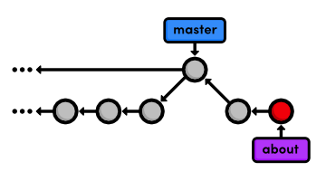
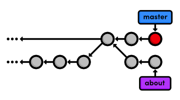
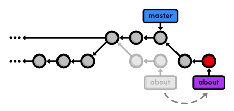
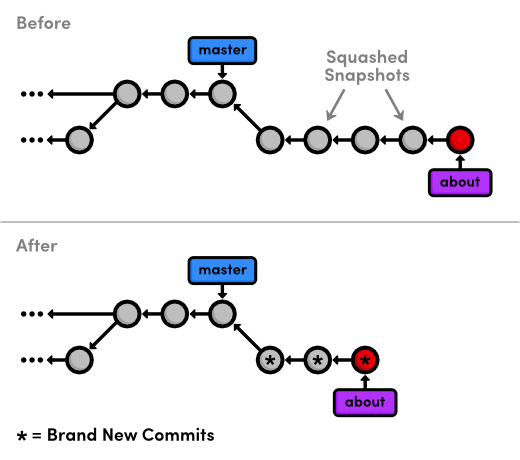
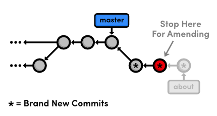
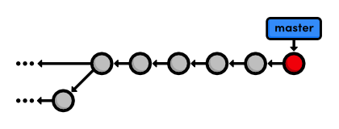

 Rebasing
=====================================

우리의 히스토리를 자세히 살펴보는 것으로 이번 장을 시작하자. 
아래의 별표(*)로 표시된 여섯 개의 commit은 같은 생각의 흐름에 있는 부분이다. 
우리는 그것들을 feature branch로 만들어 개발했다. 
그러나, 별도의 merge commit(`b9ae1bc`)으로 인해 다른 branch의 commit과 함께 여기저기 배치되어 표시된다. 
다시 말해, 우리의 저장소 히스토리는 어지럽게 섞여 있다:

```
ec1b8cb Merge branch 'crazy'
*42fa173 Add news item for rainbow
3db88e1 Add 1st news item
*7147cc5 Link index.html to rainbow.html
*6aa4b3b Add CSS stylesheet to rainbow.html
b9ae1bc Merge branch 'master' into crazy
ae4e756 Link HTML pages to stylesheet
98cd46d Add CSS stylesheet
*33e25c9 Rename crazy.html to rainbow.html
*677e0e0 Add a rainbow to crazy.html
506bb9b Revert "Add a crazzzy experiment"
*514fbe7 Add a crazzzy experiment
1c310d2 Add navigation links
54650a3 Create blue and orange pages
b650e4b Create index page
```

다행스럽게도, Git은 우리 commit들을 정리하도록 돕기 위해 툴을 제공한다: `git rebase`. 
리베이스는 base가 되는 commit을 변경함으로서 branch를 이동시켜 준다. 
개념적으로, 이것이 우리가 하도록 허락된 것이다:


> `master`위에 feature branch 리베이스

 리베이스 이후, `feature` branch는 새로운 부모 commit을 가지는데 `master`가 가리키는 것과 같은 commit이다. 
merge commit으로 branch를 결합하는 대신에, 리베이스는 `master`의 다음에 `feature` branch를 세움으로서 통합한다. 
그 결과 완전한 선형의 히스토리가 되고 위에서 본 관련없는 항목끼리 뒤죽박죽 된 것보다는 더나은 스토리처럼 읽혀진다.

Git의 리베이스 능력을 살펴보기 위해, 우리가 해야 할 작업을 위해 우리의 예제 프로젝트를 더 개발할 필요가있을 것이다. 
그리고 나서, 우리는 다시 돌아와서 `git rebase`를 사용해서 히스토리를 재작성(rewrite)할 것이다.

 [이번 장을 위한 저장소 다운로드 받기](media/repo-zips/rebasing.zip)

이전 장에서부터 계속 진행중이라면, 여러분은 이미 필요한 모든 것을 가지고 있다. 
그렇지 않으면, 위의 링크에서 압축된 Git 저장소를 다운로드 받아 압축을 풀자. 
그리고 나서 진행해도 좋다.

## About 섹션 만들기

우리는 웹사이트를 위한 about 페이지를 생성하는 것으로 시작할 것이다. 
기억하자, 우리는 프로젝트의 안정화된 버전에 의도하지 않은 변경을 유발하지 않기 위해서 
별도의 branch에서 우리의 모든 작업을 수행할 것이다.

```
git branch about
git checkout about
```

다음의 몇 단계는 리베이스의 효과를 확인해 볼 수 있도록 이 기능(feature)을 여러 개의 작은 commit으로 나눈다. 
먼저, `my-git-repo`에 `about`이라는 이름으로 새 디렉토리를 생성하자. 
그리고나서, `about/index.html`의 빈 파일을 생성하자. 스냅샷을 stage하고 commit하자.

```
git add about
git status
git commit -m "Add empty page in about section"
```

`git add`는 또한 스테이지 영역(staging area)에 디렉토리 전체를 추가할 수도 있음을 주목하자.

## About Page 추가하기

다음, 우리는 `about/index.html`에 약간의 HTML을 추가할 것이다:

```html
<!DOCTYPE html>
<html lang="en">
<head>
  <title>About Us</title>
  <link rel="stylesheet" href="../style.css" />
  <meta charset="utf-8" />
</head>
<body>
  <h1>About Us</h1>
  <p>We're a small, colorful website with just two employees:</p>

  <ul>
    <li><a href="me.html">Me: The Developer</a></li>
    <li><a href="mary.html">Mary: The Graphic Designer</a></li>
  </ul>
    
  <p><a href="../index.html">Return to home page</a></p>
</body>
</html>
```

스냅샷을 stage하고 commit하자.

```
git status
git commit -a -m "Add contents to about page"
```

이 branch에 몇 번의 commit을 한 이후, 우리의 히스토리는 아래와 같이 보일 것이다.


> `about` branch 추가하기

## 또다른 긴급 업데이트!

*우리 사장님이 좀 더 긴급 뉴스(breaking news)를 가져오셨다!*
다시, 우리는 about page 개발에 영향을 주지 않고 사이트를 업데이트하기 위해 hotfix branch를 사용할 것이다. 
업데이트는 `about` branch가 아닌 `master`를 base로 해야 함을 필히 확인하자:

```
git checkout master
git branch news-hotfix
git checkout news-hotfix
git branch
```

`index.html` 안의 “News” 섹션을 다음과 같이 변경하자:

```html
<h2 style="color: #C00">News</h2>
<ul>
  <li><a href="news-1.html">Blue Is The New Hue</a></li>
  <li><a href="rainbow.html">Our New Rainbow</a></li>
  <li><a href="news-2.html">A Red Rebellion</a></li>
</ul>
```

스냅샷을 commit하자:

```
git status
git commit -a -m "Add 2nd news item to index page"
```

그리고, `news-2.html` 이름으로 새로운 페이지를 만들자:

```html
<!DOCTYPE html>
<html lang="en">
<head>
  <title>A Red Rebellion</title>
  <link rel="stylesheet" href="style.css" />
  <meta charset="utf-8" />
</head>
<body>
  <h1 style="color: #C03">A Red Rebellion</h1>
    
  <p>Earlier today, several American design firms
  announced that they have completely rejected the use
  of blue in any commercial ventures. They have
  opted instead for <span style="color: #C03">Red</span>.</p>
    
  <p><a href="index.html">Return to home page</a></p>
</body>
</html>
```

또다른 스냅샷을 stage하고 commit하자:

```
git add news-2.html
git status
git commit -m "Add article for 2nd news item"
```

## 뉴스 핫픽스 게시하기

우리는 다시 `master`로 news 업데이트를 merge할 준비가 되었다.

```
git checkout master
git merge news-hotfix
git branch -d news-hotfix
```

`master` branch는 우리가 `news-hotfix`를 생성한 이후로 변경되지 않았다. 
그래서 Git은 패스트-포워드(빨리감기) merge를 수행할 것이다. 
우리의 저장소는 이제 다음처럼 보일 것이다.


> `news-hotfix`로 `master`를 패스트-포워딩

## About Branch 리베이스

우리는 이전에 처했던 3-way merge와 완전히 같은 위치에 놓이게 되었다. 
우리는 `master`에서 feature branch로 변경사항을 가져오기 원한다. 
지금이야말로 merge 대신에 리베이스를 수행할 타임이다.

```
git checkout about
git rebase master
git log --oneline
```

원래, `about` branch는 `Merge branch 'crazy-experiment'` commit을 base로 하고 있다. 
리베이스는 `about` branch 전체를 들고와서 `master` branch의 *끝부분(tip)*에 퐁당 떨어뜨린다. 
또한, `git merge` 명령처럼 `git rebase`는 이동시킬 branch 위에 있기를 요구한다.


> `about` branch를 `master`위에 리베이스

리베이스 수행 이후, `about`은 `master` branch의 선형 확장(linear extension)이 되고, 
추후에 패스트-포워드 merge 수행이 가능하게 해 준다. 
또한 리베이스는 *merge commit 없이도* `master`의 가장 최신 버전을 통합할 수 있도록 해 준다.

## Personal Bio 추가하기

news hotfix에서 벗어나, 우리는 이제 about 섹션에 대한 작업을 계속할 수 있다. 
아래 내용을 가지고 `about/me.html`을 생성하자:

```html
<!DOCTYPE html>
<html lang="en">
<head>
  <title>About Me</title>
  <link rel="stylesheet" href="../style.css" />
  <meta charset="utf-8" />
</head>
<body>
  <h1>About Me</h1>
  <p>I'm a big nerd.</p>

  <h2>Interests</h2>
  <ul>
    <li>Computers</li>
    <li>Mathematics</li>
    <li>Typography</li>
  </ul>

  <p><a href="index.html">Return to about page</a></p>
</body>
</html>
```

그리고, 저장소에 변경사항을 commit하자.

```
git add about/me.html
git commit -m "Add HTML page for personal bio"
git log --oneline
```

리베이스 덕분에 `about`이 `master`의 다음에 위치할 수 있게 됨을 기억하자. 
그래서, 모든 about 섹션 commit은 같이 그룹지어진다. 
만약 우리가 리베이스 대신 merge를 사용했다면 있을 수 없는 경우다. 
이것은 또한 프로젝트 히스토리에서 불필요한 분기를 제거해 주기도 한다.

## Mary를 위한 dummy page 추가하기

다시 한번, 다음의 두 스냅샷은 불필요하게 사소한 것이다. 
그러나, 우리는 나중에 하나의 commit으로 결합하기 위해 *인터렉티브* 리베이스(interactive rebase)를 사용할 것이다. 
`git rebase`는 branch을 이동할 수 있도록 해 줄 뿐만 아니라, 개별 commit을 원하는 대로 조작하는 것도 가능하게 해준다.

about 섹션에 새로운 빈 파일을 만들자: `about/mary.html`.

```
git add about
git status
git commit -m "Add empty HTML page for Mary's bio"
```

## About 섹션에 링크하기

그리고나서, 다음에 나오는 “Navigation” 섹션과 같이 `index.html` 안에 about page에 대한 링크를 추가하자.

```html
<h2>Navigation</h2>
<ul>
  <li>
    <a href="about/index.html">About Us</a>
  </li>
  <li style="color: #F90">
    <a href="orange.html">The Orange Page</a>
  </li>
  <li style="color: #00F">
    <a href="blue.html">The Blue Page</a>
  </li>
  <li>
    <a href="rainbow.html">The Rainbow Page</a>
  </li>
</ul>
```

변경사항을 commit하는 것을 잊지 말자:

```
git commit -a -m "Add link to about section in home page"
```

## Commit 히스토리 정리하기

`master` branch로 merge하기 전에, 우리는 feature branch 안에 깔끔하고, 
의미있는 히스토리를 가졌다고 확신해야 할 것이다. 
인터렉티브(대화식) 리베이스를 수행함으로서, 우리는 *어떻게* 각 commit이 새로운 base로 움직여질지 선택할 수 있다. 
rebase 명령에 `-i` 플래그를 전달하여 인터렉티브 리베이스임을 명시하자:

```
git rebase -i master
```

이것은 `about` branch에 나오는 모든 commit들이 오래된 것부터 최근 것까지 나열된 상태로 텍스트 에디터가 열리게 될 것이다. 
그 목록은 어떻게 Git이 새로운 base로 commit을 이동할 것인지 정확히 정의한다. 
그대로 두는 것은 보통의 `git rebase`를 수행하지만, 우리가 라인을 이동한다면, commit이 적용되는 순서를 변경할 수 있다.

게다가, 우리는 편집하거나 다른 커밋과 결합하기 위해 각 라인 앞의 `pick` 명령을 교체할 수 있다. 
모든 가용한 명령은 리베이스 목록의 주석 부분에 나온다. 
그러나 지금 우리는 단지 `squash` 명령만 필요하다. 
이것은 우리의 불필요하게 작은 commit들을 하나의 의미있는 스냅샷으로 압축할 것이다. 
다음과 같이 목록을 변경해 보자:

```
pick 5cf316e Add empty page in about section
squash 964e013 Add contents to about page
pick 89db9ab Add HTML page for personal bio
squash 2bda8e5 Add empty HTML page for Mary's bio
pick 915466f Add link to about section in home page
```

그리고, 에디터를 저장하고 닫아서 리베이스를 시작하자. 
다음 목록은 리베이스 절차를 상세하게 묘사하며 진행하는 동안 여러분이 변경해야 할 것을 알려준다.

1. Git은 `5cf316e` commit을 `master`의 끝부분(tip)으로 옮긴다.
2. Git은 `964e013` 과 `5cf316e` 스냅샷을 결합한다.
3. Git은 결합된 스냅샷을 위해 사용할 commit 메시지를 무엇으로 할지 묻기위해 멈춘다. 
자동적으로 두 commit의 메시지를 포함하지만 그것을 삭제하고 
그냥 `Create the about page`로 간단히 쓸 수 있다. 
계속 진행하기 위해 저장하고 에디터를 빠져나간다.
4. Git은 `89db9ab`와 `2bda8e5` commit에 대해 이 절차를 반복한다. 
`Begin creating bio pages`를 메시지로 사용하자.
5. Git은 마지막 commit `915466f`)를 이전 단계에 생성한 commit 다음에 추가한다.

여러분은 `git log --oneline`과 아래 다이어그램으로 이 모든 활동의 결과를 확인할 수 있다. 
`about`안의 원래 다섯 commit은 세 개로 압축되었고, 그 중 두 개는 새로운 메시지를 가지게 되었다. 
또한 모두 다른 commit ID를 가졌다는 것을 주목하자. 
이 새로운 ID는 우리가 commit들의 묶음을 그냥 *이동*한 것이 아니라는 것을 말해준다 
? 우리는 문자그대로 새로운 commit으로 저장소 히스토리를 다시 썼다(rewritten)


> 인터렉티브 리베이스의 결과

인터렉티브 리베이스는 프로젝트 히스토리 전반에 완벽한 컨트롤을 제공하지만, 
이는 또한 매우 위험할 수도 있다. 
예를 들어, 만약 리베이스 목록에서 한 라인을 삭제했다면, 그와 연관된 commit은 새로운 base로 이동되지 않을 것이고 
그 내용은 영원히 잃게 될 수도 있다. 
또한 나중에 우리는 히스토리를 다시쓰는 것이 공공(public) Git 저장소에 어떤 문제가 일어날 수 있는지도 살펴볼 것이다.

## Commit을 수정하기 위해 멈추기

이전의 리베이스는 오직 각 commit의 *메시지*를 편집하기 위해 멈추었다. 
우리는 한단계 더 나아가 리베이스를 하는 동안 *스냅샷*을 변경할 수도 있다. 
또다른 인터렉티브 리베이스 세션을 실행하자. 
우리는 새로운 base로서 여전히 `master`를 사용하는데 그것은 `about` branch에서 원하는 commit들을 선택하기 때문이다.

```
git rebase -i master
```

아래와 같이 두번째 commit을 위해 `edit` 명령을 명시하자.

```
pick 58dec2a Create the about page
edit 6ac8a9f Begin creating bio pages
pick 51c958c Add link to about section in home page
```

Git이 새로운 base로 두 번째 commit을 움직이기 시작할 때, 약간의 “수정(amending)”을 하기 위해 멈출 것이다. 
이것은 commit하기 전에 staged 스냅샷을 변경할 기회를 준다.


> commit 수정을 위해 멈추기

우리는 <a href="./07-remotes.html">리모트 (Remotes)</a> 에서 만날 Mary를 위해 도움이 되는 공지를 남길 것이다. 
`about/mary.html`을 열고 다음을 추가하자.

```
[Mary, please update your bio!]
```

우리는 현재 리베이스 안의 commit들 사이에 있지만, 
전체 튜토리얼을 통해 했던 것과 완전히 동일한 방법ㅇ로 staged 스냅샷을 변경할 수 있다:

```
git add about/mary.html
git status
git commit --amend
```

여러분은 `git commit`에 의해 생성된 디폴트 메시지를 사용할 수 있다. 
새로운 `?amend` 플래그는 새로운 것을 생성하는 대신에 Git에게 기존 commit을 staged snapshot으로 *교체*하도록 명령한다. 
이것은 또한 보통의 개발 중에 종종 발생하는 미완성(premature) commit을 고치는데 매우 유용하다.

## 인터렉티브 리베이스 계속하기

우리가 리베이스 도중이고 Git은 여전히 재승인을 필요로하는 하나 이상의 commit을 가지고 있음을 기억하자. 
Git에게 `--continue` 플래그와 함께 이동할 준비가 되었음을 알려주자:

```
git rebase --continue
git log --oneline
```

우리의 히스토리는 여전히 동일하게 나타남에 주목하자 
(왜냐하면 우리는 위에서 디폴트 commit 메시지를 사용했기 때문이다), 
그러나 `Begin creating bio pages`은 새로운 ID와 함께 rebase 전과는 다른 내용을 포함한다.

만약 리베이스 도중에 여러분 스스로 잃어버린 것을 알게 되었고 계속 진행하는 것이 두렵다면, 
그것을 버리기 위해 `-abort` 플래그를 사용하고 처음부터 다시 시작할 수 있다.

## About 섹션 게시하기

인터렉티브 리베이스의 핵심은 우리가 `master`로 다시 merge할 수 있는 *의미있는* 히스토리를 만들어내는 것이다. 
그리고, `master`의 끝부분(tip)에 `about`을 리베이스했기 때문에 Git은 두 branch를 결합하기 위해 
merge commit을 사용하는 대신 패스트 포워드 merge를 수행할 것이다.

```
git checkout master
git log --oneline
git merge about
git log --oneline
```

불필요한 `about` branch를 삭제하는 것을 잊지말자.

```
git branch -d about
```

우리의 마지막 히스토리는 아래 그림과 같이 보일 것이다. 
여러분이 본 것처럼, 선형의 히스토리는 이전 장의 여기저기 오락가락하는 meger보다 이해하기 더 쉽다. 
그러나 다른 한편으로는, 우리는 *어떻게* 현재 상태를 갖게 되었는지 최소한의 개념도 없다.


> `about` branch를 merge하고 삭제하기

## 결론

리베이스는 임의의 branch를 다른 branch의 끝부분(tip)에 이동시켜 패스트-포워드 merge를 가능하게 한다. 
그것은 merge commit의 요구를 효과적으로 없애며, 완전한 선형의 히스토리가 된다. 
외부 관찰자에게는, 여러분이 다양한 대안들을 모색하고 서로 관련없는 기능들을 동시에 개발했음에도 불구하고 
프로젝트의 모든 부분을 잘 계획된 절차대로 생성한 것처럼 보일 것이다. 
리베이스는 저장소에 정확히 무엇을 저장해야 할지 여러분에게 선택할 권한을 제공한다.

이것은 실제로 Git 커뮤니티 안에서 논란의 여지가 있는 주제이다. 
일부는 이번 장에서 논의한 이점이 히스토리를 재작성하는 번거러움 만큼의 가치가 없다고 믿고 있다. 
그들은 어떠한 정보도 결코 잃어버리지 않는 것을 보장하면서 
히스토리는 정확히 여러분이 수행한 것들을 반영해야 한다고 말함으로서 Git에 좀 더 “순수한” 접근법을 취하고 있다.
게다가, `git log`의 고급 설정들은 branch가 복잡한 저장소로부터 선형의 히스토리를 표시 할 수 있다.

그러나, 다른 이들은 merge commit은 의미있는(meaningful) 것이어야 된다고 주장한다. 
업데이트에 접근하기 위해 그냥 임의의 지점에 merge하는 대신에, 
그들은 merge commit이 두 branch의 상징적인 결합을 나타내야 한다고 주장한다. 
특별히, 대형 소프트웨어 프로젝트 (리눅스 커널과 같이)는 가능한 한 깔끔하고 복잡하지 않은 저장소를 유지하기 위해 
전형적으로 인터렉티브 리베이스를 옹호하고 있다.

`git rebase`의 사용은 전적으로 여러분에게 달려있다. 
프로젝트의 진행사항을 커스터마이징하는 것은 매우 유용할 수도 있지만 
명시적으로 merge를 사용해서 동일한 기능을 이루었을 때 고생한 보람이 없을 수도 있다. 
관련 사항으로, Git이 평소대로 패스트-포워드 merge를 하려할 때 
merge comit을 강제하기 위해 여러분은 다음 명령을 사용할 수 있다.

```
git merge --no-ff <branch-name>
```

다음 장은 우리 프로젝트 히스토리에 좀 더 관여할 것이다. 
우리는 복잡한 리베이스를 통해 실수 고치기를 시도하고 심지어 삭제된 commit을 복구하는 방법에 대해 배울 것이다.

## 정리

`git rebase <new-base>`  
현재 branch의 commit을 <new-base>의 tip으로 옮긴다. <new-base>는 branch 이름 혹은 commit ID가 될 수 있다.

`git rebase -i <new-base>`  
인터렉티브 리베이스를 수행하고 각 commit에 대한 행위를 선택한다.

`git commit --amend`  
새로운 commit을 생성하는 대신에 가장 최근 commit에 staged 변경사항을 추가한다.

`git rebase --continue`  
commit을 수정한 이후 rebase를 계속한다.

`git rebase --abort`  
현재의 인터렉티브 리베이스를 중단하고 이전 상태로 저장소를 되돌린다.

`git merge --no-ff <branch-name>`  
만약 Git이 패스트-포워드 merge를 하려고 할 때 강제로 merge commit을 하게 한다.
