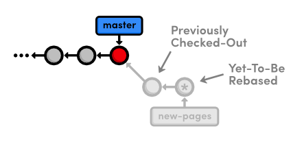
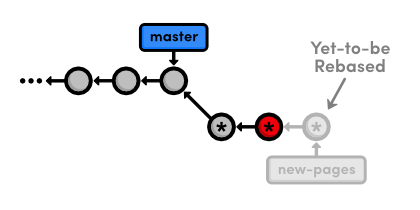
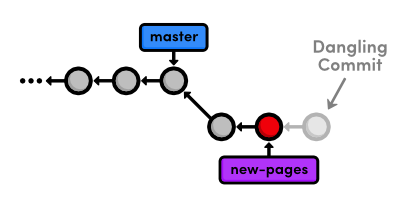
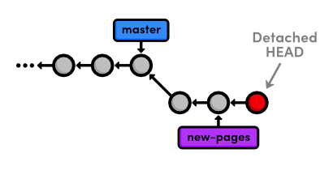
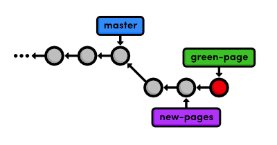
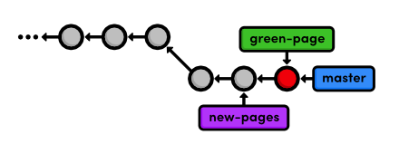
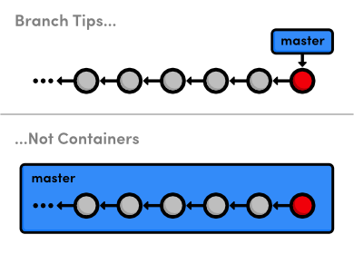

 Rewriting History
=====================================

이전 장은 리베이스(rebasing)를 통해 commit을 이동하는 것과 그 과정에서 몇 가지 기본적인 편집을 수행하는 방법을 배웠다. 
이제 우리는 실제로 우리의 손을 더럽히려고 한다(?). 
우리는 어떻게 commit을 분리하고, 어떻게 잃어버린 스냅샷(snapshot)을 복구하는지, 
그리고 우리가 원하는 정확한 사양으로 저장소의 히스토리를 완벽하게 다시 작성하는 방법을 배울 것이다.

바라건대, 이번 장은 우리 프로젝트의 내부 구조을 살펴보고 편집해 보면서 
핵심이 되는 Git 구성 요소에 대해 더욱 더 익숙하게 될 것이다.

 [이번 장을 위한 저장소 다운로드 받기](media/repo-zips/rewriting-history.zip)

이전 장에서부터 계속 진행중이라면, 여러분은 이미 필요한 모든 것을 가지고 있다. 
그렇지 않으면, 위의 링크에서 압축된 Git 저장소를 다운로드 받아 압축을 풀자. 
그리고 나서 진행해도 좋다.

## Red Page 만들기

먼저, 새로운 branch를 생성하고 몇 개의 HTML 페이지를 추가해 보자.

```
git checkout -b new-pages
git branch
```

우리는 `git checkout` 명령에 `-b` 플래그를 붙여서 branch 생성과 체크아웃을 한 번에 할 수 있다.

다음, `red.html` 파일을 생성하고 다음 내용을 추가하자:

```html
<!DOCTYPE html>
<html lang="en">
<head>
  <title>The Red Page</title>
  <link rel="stylesheet" href="style.css" />
  <meta charset="utf-8" />
</head>
<body>
  <h1 style="color: #C00">The Red Page</h1>
  <p>Red is the color of <span style="color: #C00">passion</span>!</p>
    
  <p><a href="index.html">Return to home page</a></p>
</body>
</html>
```

우리는 이 페이지를 commit하는 것을 잠시동안 보류할 것이다.

## Yellow Page 만들기

`yellow.html` 이라는 이름으로 파일을 생성하자. 내용은 다음과 같다.

```
<!DOCTYPE html>
<html lang="en">
<head>
  <title>The Yellow Page</title>
  <link rel="stylesheet" href="style.css" />
  <meta charset="utf-8" />
</head>
<body>
  <h1 style="color: #FF0">The Yellow Page</h1>
  <p>Yellow is the color of <span style="color: #FF0">the sun</span>!</p>
    
  <p><a href="index.html">Return to home page</a></p>
</body>
</html>
```

## 새로운 페이지를 링크하고 commit하기

그 다음, 우리는 새로운 두 페이지를 홈 페이지에 링크할 것이다. 
`index.html`의 “Navigation” 섹션에 아래 내용을 추가하자:

```html
<li style="color: #C00">
  <a href="red.html">The Red Page</a>
</li>
<li style="color: #FF0">
  <a href="yellow.html">The Yellow Page</a>
</li>
```

그리고 나서, 하나의 스냅샷에 모든 변경사항을 commit하자.

```
git add red.html yellow.html index.html
git status
git commit -m "Add new HTML pages"
```

이것은 *나쁜(bad)* commit의 예이다. 다수의 서로 관련없는 작업을 수행했고, 
상대적으로 뻔한(generic) commit 메시지를 사용했다. 
여태까지 우리는 변경사항을 commit하기 위한 적절한 때가 언제인지 사실상 규정하지 않았지만, 
일반적인 룰은 branch 생성과 기본적으로 동일하다:

- 여러분의 프로젝트에 의미있는 추가를 할 때 마다 스냅샷을 commit 하자.
- 구체적인 메시지 한 개로 떠오르지 않는다면 스냅샷을 commit하지 말자.

이것은 여러분의 프로젝트가 의미있는 commit 히스토리를 갖도록 보장해 줄 것이며, 
이는 언제 어디에서 기능이 추가되었는지 혹은 기능 일부가 분리되었는지 정확하게 확인할 수 있게 해 줄 것이다. 
그러나, 실제로 프로젝트를 개발하는 동안 무엇이 “잘-정의된” 추가가 될 지 
항상 알 수는 없기에 가끔씩 하나의 스냅샷으로 여러 변경사항을 commit하게 될 것이다. 
다행이도, Git은 우리가 사후에 이들 문제있는 commit으로 돌아가서 고칠 수 있도록 해 준다.

## Green Page 만들고 commit하기

“나쁜” commit을 분리하기 전에 페이지를 하나 더 만들어 보자: 
`green.html` 이름의 파일에 다음 HTML을 추가하자.

```html
<!DOCTYPE html>
<html lang="en">
<head>
  <title>The Green Page</title>
  <link rel="stylesheet" href="style.css" />
  <meta charset="utf-8" />
</head>
<body>
  <h1 style="color: #0C0">The Green Page</h1>
  <p><span style="color: #0C0">Green</span> is the color of earth.</p>
    
  <p><a href="index.html">Return to home page</a></p>
</body>
</html>
```

“Navigation” 섹션에 `index.html`에 대한 링크를 추가하자:

```html
<li style="color: #0C0">
  <a href="green.html">The Green Page</a>
</li>
```

마지막으로, green page를 stage하고 스냅샷을 commit 하자.

```
git add green.html index.html
git status
git commit -m "Add green page"
```

## 인터렉티브 rebase 시작하기

우리의 `new-pages` branch에 들어온 commit은 다음과 같다:

```
4c3027c Add green page
db96c72 Add new HTML pages
```

그러나, 우리는 이들 commit이 다음과 같이 보이길 원한다:

```
4c3027c Add green page
9b1a64f Add yellow page
77a1cf1 Add red page
```

이렇게 만들기 위해서, 우리는 이전 장에서 다루었던 인터렉티브 방법을 동일하게 사용할 수 있다. 
단, 이번에는 리베이스 과정 중 실제로 commit을 *생성*할 것이다.

```
git rebase -i master
```

아래와 같이 rebase 목록을 변경하고 파일을 저장하자. 
그리고 rebase를 시작하기 위해 에디터를 종료하자.

```
edit db96c72 Add new HTML pages
pick 4c3027c Add green page
```

## 뻔한 commit 취소하기

먼저, `git log --oneline` 으로 우리가 어디에 있는지 살펴보자:

```
db96c72 Add new HTML pages
7070b0e Add link to about section in home page
...
```

rebase 설정에서 Git이 `edit` 명령을 만나면, 우리가 commit을 수정하도록 멈춘다. 
그 결과, green page commit은 우리 히스토리에 아직 나타나지 않는다. 
이것은 이전 장을 통해 익숙할 것이다. 
그러나 현재 commit을 *개정하는* 대신, 우리는 그것을 완전히 제거할 것이다:

```
git reset --mixed HEAD~1
git log --oneline
git status
```

`git reset` 명령은 체크아웃된 스냅샷을 새로운 commit으로 이동시킨다. 
그리고, `HEAD~1` 파라미터는 현재 `HEAD` 직전에 발생한 commit으로 리셋(resetting)할 것을 지시한다 
(비슷하게, `HEAD~2`는 `HEAD` 이전의 두번째 commit을 참조할 것이다.) 
특히 이 경우에는, `HEAD~1`는 `master`와 일치할 것이다. 
우리의 저장소에 대한 영향은 다음과 같이 시각화 될 수 있다:


> `HEAD~1`으로 리셋하기

여러분은 [Undoing Changes](02-undoing-changes.html) 에서 우리 프로젝트에 commit되지 않은 변경사항을 취소하기 위해 
`git reset --hard`를 사용했던 것이 기억날 것이다.
`--hard` 플래그는 Git에게 가장 최근의 commit과 완전히 똑같이 보이도록 워킹 디렉토리를 만들도록 명령하는데 
이것은 commit되지 않은 변경사항을 제거하여 의도했던 결과를 준다.

그러나, 지금은 워킹 디렉토리를 보존하기 위해 `--mixed` 플래그를 사용했고, 
우리가 분리하기 원하는 변경사항을 포함한다. 
즉, `HEAD`는 움직였지만 워킹 디렉토리는 변경되지 않은 채로 남아있다. 
물론, 그 결과 commit되지 않은 수정사항이 저장소에 같이 있게 된다. 
commit을 분리하기 위해 우리는 이제 `red.html`과 `yellow.html`을 추가할 기회를 갖게 되었다.

## 뻔한 commit 분리하기

이제 red page와 함께 시작해보자. 우리는 red page를 포함하는 내용만 commit하기 원하기 때문에, 
수작업으로 “Navigation” 섹션에서 yellow page의 링크를 제거해야 할 것이다. 
`index.html`에서 이 부분을 다음과 같이 변경하자:

```html
<h2>Navigation</h2>
<ul>
  <li>
    <a href="about/index.html">About Us</a>
  </li>
  <li style="color: #F90">
    <a href="orange.html">The Orange Page</a>
  </li>
  <li style="color: #00F">
    <a href="blue.html">The Blue Page</a>
  </li>
  <li>
    <a href="rainbow.html">The Rainbow Page</a>
  </li>
  <li style="color: #C00">
    <a href="red.html">The Red Page</a>
  </li>
</ul>
```

우리는 이제 red page의 업데이트를 별개의 commit으로 모을 수 있다.

```
git add red.html index.html
git status
git commit -m "Add red page"
```

다음 순서는 yellow page이다. 
`index.html`의 “Navigation”으로 가서 다시 추가하자:

```html
<li style="color: #FF0">
  <a href="yellow.html">The Yellow Page</a>
</li>
```

그리고 다시, 스냅샷을 stage하고 commit하자.

```
git add yellow.html index.html
git status
git commit -m "Add yellow page"
```

아래와 같이 우리는 성공적으로 하나의 commit 내용을 두 개의 새로운 스냅샷으로 분리해 냈다.


> 리베이스 도중 두 개의 새로운 commit 만들기

그러나, rebase는 여전히 green page를 이동시킬 필요가 있음을 잊지 말자:

```
git rebase --continue
```

요약하자면, 우리는 `git reset`과 함께 현재 branch로부터 “나쁜” commit을 제거했고, 
포함된 HTML파일을 `?mixed` 플래그로 그대로 유지했다. 
그리고 나서, 우리는 평소대로  `git add`와 `git commit` 명령으로 별개의 스냅샷에 그것들을 commit했다. 
기억해야 할 점은 rebase를 하는 동안 여러분은 실컷 commit을 추가, 삭제, 그리고 수정할 수 있고, 
전체 결과는 새로운 base로 옮겨질 것이다.

## 마지막 commit 제거하기

다음, 우리는 “고의적으로” green page commit을 제거하려고 한다. 
그래서 Git의 내부 저장소 데이터를 통해 그것을 어떻게 가져오는지 배울 것이다.

```
git reset --hard HEAD~1
git status
git log --oneline
```

이것은 `new-pages` 포인터와 함께 체크아웃된 commit을 한 스냅샷 전으로 옮긴다. 
`--hard` 플래그는 워킹 디렉토리에 모든 변경사항을 없애기 때문에 
`git status`는 commit 할 것이 없다(nothing to commit)라고 말할 것이다. 
물론, `git log`는 `new-pages` branch는 green commit을 더 이상 포함하지 않는다고 보여준다.

이 행위는 인터렉티브 rebase에서 사용했던 reset과는 약간 다른 것이다: 이번에는 *branch*가 새로운 `HEAD`로 움직인다. 
rebase하는 동안 우리는 `(no branch)`에 있기 때문에, 옮겨야 할 branch tip이 없다. 
그러나, 일반적으로, `git reset`은 branch tip을 이동하기 위해 사용되고, 
추가적으로 다양한 플래그(예. `--mixed` 또는 `--hard`)를 통해 워킹디렉토리를 변경한다.


> 가장 최근 commit 삭제하기

우리가 branch로부터 제거한 commit은 이제 **독립(dangling) commit**이다. 
독립 commit은 어떤 branch로부터 도달될 수 없으며 따라서 영영 잃어버릴 위험에 처해 있다.

## Reflog 열기

Git은 여러분의 저장소에 가한 모든 변경 사항을 기록하기 위해 **reflog**라 불리는 것을 사용한다. 
이제 그것을 무엇을 포함하는지 살펴보자:

```
git reflog
```

출력 결과는 다음처럼 보일 것이다. 
Git 버전에 따라, 메시지는 약간 달라질 수도 있다. 
내용을 스크롤하려면 `Space`, 빠져나가려면 `q`를 누를 수 있다.

```
9b1a64f HEAD@{0}: reset: moving to HEAD~1
002185c HEAD@{1}: rebase -i (finish): returning to refs/heads/new-pages
002185c HEAD@{2}: rebase -i (pick): Add green page
9b1a64f HEAD@{3}: commit: Add yellow page
77a1cf1 HEAD@{4}: commit: Add red page
7070b0e HEAD@{5}: reset: moving to HEAD~1
...
```

위의 목록은 우리의 지난 몇 가지 행위들을 반영하고 있다. 
예를 들면, `HEAD@{0}`로 표시된 현재 `HEAD`는 `HEAD`를 `HEAD~1`으로 reset한 결과이다. 
지난 네 개의 행위 전에, `HEAD@{3}`에 보이는 것 처럼 rebase를 하는 동안 yellow page가 적용되었다.

reflog는 저장소의 branch 구조와 무관하게 히스토리를 *발생시간 순으로* 나열한 목록이다. 
이것은 독립 commit을 찾도록 해주는데 그렇지 않으면 프로젝트 히스토리에서 사라질 수도 있다.

## 잃어버린 commit 되살리기

각각의 reflog 진입 시작부분에, 행위 이후의 `HEAD`를 나타내는 commit ID를 찾을 수 있다. 
rebase가 green page를 추가했던 곳인 `HEAD@{2}`의 commit을 체크아웃 하자. 
(아래의 ID를 *여러분의* reflog ID로 변경하자)

```
git checkout 002185c
```

이것은 우리를 `detached HEAD` 상태로 두게 하는데 이것은 우리의 `HEAD`가 
더 이상 branch의 끝(tip)에 있지 않다는 것을 의미한다. 
사실 우리는 branch tip 전의 commit을 체크아웃 했었던 
[Undoing Changes](02-undoing-changes.html)에 있던 것과 반대 상황에 있다. 
이제, 우리는 branch의 끝부분(tip) 다음의 commit을 보고 있지만 여전히 `detached HEAD`를 가지고 있다:


> 독립 commit을 체크아웃

우리의 독립 commit을 완전한 branch로 바꾸기 위해서, 우리가 해야 할 일은 다음 하나를 만드는 것이다:

```
git checkout -b green-page
```

우리는 이제 프로젝트로 다시 merge될 수 있는 branch를 갖게 되었다:


> 독립 commit으로부터 branch 생성하기

위 다이어그램은 `green-page` branch가 `new-pages`의 확장이라는 것을 알기 쉽게 해준다. 
그러나 만약 우리가 저장소의 매 순간마다 그 상태를 그려놓지 않았다면 이것을 어떻게 이해할 수 있을까?

## Log 히스토리 필터하기

branch들 간의 차이점을 보기 위해, 우리는 Git의 log-filtering 문법을 사용할 수 있다.

```
git log new-pages..green-page
```

이것은 `green-page`에는 있지만 `new-pages` branch에 없는 모든 commit을 표시할 것이다. 
위 명령은 `green-page`가 `new-pages`보다 하나 이상의 스냅샷을 포함하고 있음을 우리에게 말해주고 있다: 
우리의 독립(dangling) commit 
(비록, 우리가 그것을 위한 branch를 만들었기 때문에 실제로 더이상 독립은 아닌 것이다).

여러분은 또한 `git log` 출력을 제한하기 위해 이 문법을 사용할 수도 있다. 
예를 들어, 현재 branch 상에서 최근 4개의 commit을 표시하기 위해서, 사용될 수도 있다:

```
git log HEAD~4..HEAD
```

그러나, 이것은 이런 일반적인 작업을 하기에는 장황한 것이다. 
그래서 Git 개발자는 출력을 제한하기 위해 더 쉬운 방법으로 `-n` 플래그를 추가한다.

```
git log -n 4
```

`-n 4` 파라미터는 Git에게 현재 `HEAD`로부터 최근 4개의 commit만 보여줄 것을 명령한다. 
이것은 위에 나온 `HEAD~4..HEAD`와 동일한 것이다. 
비슷하게, `-n 3`, `-n 2`, `-n 1` 은 각각 세개, 두개, 그리고 한개의 commit을 표시할 것이다. 
이 기능은 저장소 history가 한 화면을 넘어설 경우 매우 유용하다.

## 되살린 branch를 merge하기

우리는 잃어버린 commit을 되살렸다. 
이제 `master` branch로 다시 모든 것을 merge할 준비가 되었다. 
merge를 수행하기 전에, 우리가 merge해야 할 것이 무엇인지 정확히 확인해 보자:

```
git checkout master
git log HEAD..green-page --stat
```

`git log HEAD..green-page` 명령은 `green-page`에만 있고 `master`에는 존재하지 않는 commit들만 우리에게 보여준다 
(`master`는 현재 branch이기 때문에, 우리는 `HEAD`로 그것을 참조할 수 있다). 
새로운 `--stat` 플래그는 각 commit에 어떤 파일이 변경되었는지에 관한 정보를 포함한다. 
예를 들면, 가장 최근의 commit은 `green.html` 파일에 14줄이 추가되었고 `index.html`에 3줄이 추가되었음을 말해준다:

```
commit 002185c71e6674915eb75be2afb4ca52c2c7fd1b
Author: Ryan <ryan.example@rypress.com>
Date:   Wed Jan 11 06:49:50 2012 -0600

    Add green page

 green.html |   14 ++++++++++++++
 index.html |    3 +++
 2 files changed, 17 insertions(+), 0 deletions(-)
```

만약 우리가 이 새로운 commit에 무엇이 있는지 미리 알지 못할 경우, 
log 출력은 어떤 파일을 우리가 봐야하는지 알려줄 것이다. 
그러나, 우리는 모든 변경사항을 작성하고 있고, 그래서 merge로 바로 건너뛸 수 있다.

```
git merge green-page
```

다음 다이그램은 merge 이후 우리 저장소의 상태를 보여준다.


> `green-page 브랜치로 `master`를 패스트 포워딩

`green-page` branch는 이미 `new-pages`의 모든 history를 포함하고 있음에 주목하자. 
이것은 우리가 왜 후자(new-pages) 대신에 전자(green-page)를 merge하는지의 이유다. 
만약 그 경우가 아니라면, Git은 우리가 다음 명령을 시도할 때 거부할 것이다.

```
git branch -d new-pages
```

또한 나아가서 green page branch를 삭제할 수 있다.

```
git branch -d green-page
```

## 결론

이번 장은 rebasing, resetting, 그리고 reflog에 대해 상세히 살펴보았다. 
우리는 어떻게 old commit들을 한 개 혹은 여러개의 새로운 commit으로 분리하는지, 
그리고 “잃어버린” commit을 어떻게 되살리는지에 대해 배웠다. 
바라건대, 이것은 워킹 디렉토리, stage, branch 그리고 commit된 스냅샷 들 사이의 
상호작용을 더 잘 이해하도록 해 줬을 것이다. 
우리는 또한 commit 히스토리를 표시하기 위햔 몇 가지 새로운 옵션을 살펴보았다. 
이것은 프로젝트가 커감에 따라 중요한 기술이 될 것이다.

우리는 이번 장에서 branch tip과 함께 많은 일을 했다. 
Git이 *전제 branch*를 표현하기 위해 branch의 *tip*을 사용하는 점을 이해하는 것은 아주 중요하다. 
다시 말해, branch는 실제로 일련의 commit들을 위한 컨테이너가 아니라 하나의 commit에 대한 포인터이다. 
이러한 개념은 우리의 다이어그램에서 암시적으로 반영되어왔다:


> Branch tip은 컨테이너가 아님

히스토리는 branch 자체가 아니라 각각 commit의 부모에 의해 표현된다 (화살표에 의해 지정됨). 
그래서, 새로운 branch를 요구하기 위해서, Git이 해야 할 것은 오직 현재 commit에 대한 참조(reference)를 생성하는 것이다. 
그리고, branch에 스냅샷을 추가하기 위해, branch의 참조를 새로운 commit으로 옮겨야 한다. 
Git의 branch 표현을 이해하는 것은 merging, rebasing, 
그리고 다른 종류의 branch를 조작하는 것들을 더욱 쉽게 파악하게 해 줄 것이다.

우리는 튜토리얼의 [마지막 장](12-plumbing.html)에서 저장소에 대한 Git의 내부 표현에 대해 다시 논의할 것이다. 
하지만 이제, 우리는 Git branch에 전적으로 의존하는 다중 사용자 개발(multi-user development)에 대해 논의할 준비가 되었다.

## 정리

`git reflog`  
저장소의 로컬, 시간순 history를 보여준다.

`git reset --mixed HEAD~<n>`  
HEAD를 <n> commit 전으로 옮긴다, 그러나 워킹 디렉토리를 변경하지 않는다.

`git reset --hard HEAD~<n>`  
HEAD를 <n> commit 전으로 옮기면서 일치시키기 위해 워킹 디렉토리를 변경한다.

`git log <since>..<until>`  
<since>부터 <until>까지에 해당하는 commit을 표시한다. 이 파라미터는 commit ID 또는 branch 이름이 사용될 수 있다.

`git log --stat`  
log 출력에 변경된 파일에 대한 추가 정보를 포함한다.
