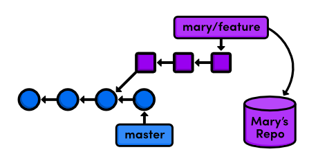
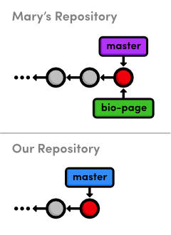
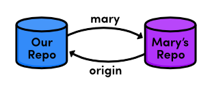
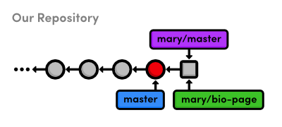
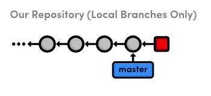
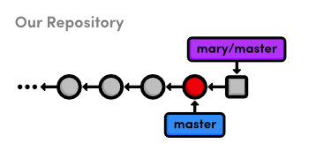
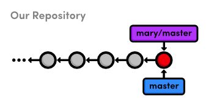

 Remotes
=====================================

간단히 말해서, **원격 저장소(remote repository)**는 여러분의 저장소가 아닌 저장소이다. 
그것은 여러분의 회사 네트워크 또는 인터넷, 심지어 여러분의 로컬 파일시스템에 있는 다른 Git 저장소일 수도 있다. 
단, 핵심은 여러분의 `my-git-repo` 프로젝트와는 별개의 다른 저장소라는 점이다.

이미 우리는 하나의 저장소에서 어떻게 branch들이 워크플로우를 형성하는지 살펴보았는데 
이는 저장소들간에 commit을 공유하기 위한 Git의 메커니즘도 될 수 있다. 
**원격 브랜치(Remote branch)**는 다른 사람의 저장소에 있는 branch를 나타내지만 
우리가 사용해 온 로컬 branch처럼 동작한다.


> remote 저장소의 feature branch 접근하기

이는 즉, 우리는 Git을 환상적인 협업 도구로 만들기 위해 merge와 rebase 기술을 적용할 수 있음을 의미한다. 
이후 장들을 통해, 우리는 예제 웹사이트 상에서 서로 다른 개발자가 일하는 척하면서 
다양한 멀티-유저 워크플로우(multi-user workflow)를 살펴볼 것이다.

이 장의 일부에서, 우리는 웹사이트의 그래픽 디자이너인 Mary처럼 행세하려고 한다. 
Mary의 행동은 각 단계의 제목에 그녀의 이름을 포함하여 분명히 표시할 것이다.

 [이번 장을 위한 저장소 다운로드 받기](media/repo-zips/remotes.zip)

이전 장에서부터 계속 진행중이라면, 여러분은 이미 필요한 모든 것을 가지고 있다. 
그렇지 않으면, 위의 링크에서 압축된 Git 저장소를 다운로드 받아 압축을 풀자. 
그리고 나서 진행해도 좋다.

## 저장소 복제(clone)하기 (Mary)

먼저, Mary는 함께 작업할 저장소에 대해 그녀 자신의 복사본이 필요하다. 
[분산 워크플로우 (Distributed Workflows)](09-distributed-workflows.html) 에서 네트워크 기반의 원격(remote)을 논의할 것이나 
지금은 그냥 로컬 파일 시스템(local file system)에 그것들을 저장하려고 한다.

```console
cd /path/to/my-git-repo
cd ..
git clone my-git-repo marys-repo
cd marys-repo
```

처음 두 라인은 `my-git-repo`의 상위 디렉토리로 이동한다. 
`/path/to/my-git-repo`를 여러분의 저장소에 대한 실제 경로로 변경하자. 
`git clone` 명령은 `my-git-repo`와 동일한 디렉토리에 우리의 저장소를 `marys-repo`로 복사한다. 
그리고 나서, Mary 행세를 시작하기 위해우리는 Mary의 저장소로 이동한다.

Mary의 저장소가 실제는 원본(original) 저장소의 복사본(copy)이라는 것을 
검증하기 위해 `git log`를 실행하자.

## 저장소 환경 설정하기 (Mary)

우선, 누가 무엇을 프로젝트에 기여했는지 알기 위해서 
Mary는 그녀의 저장소를 환경설정할 필요가 있다.

```
git config user.name "Mary"
git config user.email mary.example@rypress.com
```

첫 번째 장에서 우리는 전체 Git 설치에 대한 환경을 설정하기 위해 
`--global` 플래그를 사용했던 걸 기억할 것이다. 
그러나 Mary의 저장소는 로컬 시스템에 있기 때문에, 
그녀는 *로컬* 환경설정(local configuration)이 필요하다.

텍스트 에디터를 사용해서 Mary 프로젝트의 `.git` 폴더 안에 `config` 파일을 열어보자 
(여러분은 아마도 `.git`을 보기 위해 숨김 파일 보기가 필요할 수도 있다). 
이 곳은 로컬 환경설정이 저장되는 곳이고, 우리는 파일 아랫 부분에서 Mary에 대한 정보를 볼 것이다. 
이것은 <a href="./01-the-basics.html">The Basics</a>에서 우리가 설정했던 글로벌 환경설정을 오버라이드(override)한다.

## Mary의 날(Mary’s Day) 시작하기 (Mary)

오늘, Mary는 그녀의 약력에 대해 작업할 것이고 이를 별도 branch에서 개발할 것이다:

```
git checkout -b bio-page
```

Mary는 우리가 프로젝트의 복사본에서 한 것 처럼 branch를 생성하고 체크아웃 할 수 있다. 
그녀의 저장소는 완전히 독립된 개발 환경이며, `my-git-repo`의 진행 사항은 신경쓰지 않고 
그녀가 원하는 것은 무엇이는 할 수 있다. 
branch가 워킹 디렉토리, staged 스냅샷, commit 히스토리 
(working directory, staged snapshot, commit history)를 위한 추상적 개념인 것 처럼 
저장소는 branch들을 위한 추상적 개념이다.

## Mary의 Bio Page 생성하기 (Mary)

Mary의 약력 페이지를 생성해보자. 
`marys-repo`에서 a`about/mary.html`을 다음 내용으로 변경하자:

```html
<!DOCTYPE html>
<html lang="en">
<head>
  <title>About Mary</title>
  <link rel="stylesheet" href="../style.css" />
  <meta charset="utf-8" />
</head>
<body>
  <h1>About Mary</h1>
  <p>I'm a graphic designer.</p>

  <h2>Interests</h2>
  <ul>
    <li>Oil Painting</li>
    <li>Web Design</li>
  </ul>

  <p><a href="index.html">Return to about page</a></p>
</body>
</html>
```

다시 말해, 우리는 베스트 프랙티스(base-practice) 단계로서 branch에서 개발했다: 
우리의 `master` branch는 오직 안정화된, 테스트된 코드만을 위한 것이다. 
스냅샷을 stage하고 commit 하여 결과를 확인하자.

```
git commit -a -m "Add bio page for Mary"
git log -n 1
```

log 출력의 `Author` 필드가 우리가 Mary의 이름과 이메일로 만들었던 로컬 환경설정을 반영할 것이다. 
`-n 1` 플래그는 히스토리 출력을 한 개의 commit으로 제한한다.

## Bio Page 게시하기 (Mary)

이제 우리는 `master` branch로 merge함으로써 bio page를 게시(publish)할 수 있다.

```
git checkout master
git merge bio-page
```

물론, 이것은 패스트-포워드(fast-forward) merge가 된다. 
나중에 우리는 Mary 행세를 그만두고 `my-git-repo`로 이 업데이트를 가져올(pull) 것이다. 
우리 저장소와 비교해서 Mary의 저장소가 어떻게 보이는 지는 다음과 같다:


> Mary의 `bio-page` branch를 그녀의 `master`에 merge하기

두 저장소는 일반적인 로컬 branch를 가지고 있다 
- 우리는 두 저장소 사이에 어떤 상호작용도 하지 않았기에 우리는 아직 remote branch를 확인하지 못했다. 
`my-git-repo`로 다시 돌아가기 전에, Mary의 remote 연결을 시험해 보자.

## Remote 저장소 보기 (Mary)

Mary는 다음 명령을 사용해서 다른 저장소에 대해 그녀가 갖고 있는 연결(connection)들을 나열할 수 있다.

```
git remote
```

보아하니, 그녀는 `origin`이라 불리는 remote를 가지고 있다. 
여러분이 저장소를 복제할 때아마도 앞으로 원본과 상호작용할 것이라 가정하고, 
Git이 자동적으로 원래 저장소를 가리키는 `origin` remote를 추가한다. 
우리는 `-v` (verbose) 플래그로 좀 더 정보를 요구할 수 있다:

```
git remote -v
```

이것은 우리의 원래 저장소에 대한 전체 경로(full path)를 보여주고 
`origin`이 `my-git-repo`에 대한 remote 연결임을 확인시켜 준다. 
같은 경로가 “fetch”와 “push” 위치로 지정되어있다. 잠깐 이 의미가 무엇인지 확인하려고 한다.

## 여러분의 저장소로 돌아가기 (You)

자, 우리는 Mary인 것을 끝내고, 우리 자신의 저장소로 돌아갈 것이다.

```console
cd ../my-git-repo
```

Mary의 bio page는 여전히 비어 있음(empty)을 주목하자. 
이 저장소와 Mary의 저장소가완전히 별개라는 것을 이해하는 것이 매우 중요하다. 
그녀가 bio page를 변경하는 동안, 우리도 `my-git-repo`에 무엇이든 할 수 있다. 
심지어 그녀의 bio page를 수정할 수 있을텐데, 그러면 그녀의 변경사항을 가져오려고 시도할 때 
merge conflict(병합 충돌)가 날 수 도 있다.

## Remote로서 mary 추가하기 (You)

Mary의 bio page를 입수하기 전에 그녀의 저장소에 대한 접근이 필요하다. 
우리의 현재 remote 목록을 확인하자:

```
git remote
```

아직 아무것도 없다 (우리가 어떤 것에서 복제한 것이 아니므로 절대 `origin`이 생기지 않았다). 
remote 저장소로서 mary를 추가해 보자.

```
git remote add mary ../marys-repo
git remote -v
```

`../marys-repo`에 위치한 Mary의 저장소를 참조하기 위해 `mary`를 사용할 수 있다. 
`git remote add` 명령은 쉬운 접근을 위해 다른 Git 저장소를 북마크하기 위해 사용된다. 
그래서 우리의 연결은 아래 그림과 같이 보일 수 있다.


> remote 저장소에 연결

이제 remote *저장소*가 설정되었으니, 
우리는 remote *branch*를 얘기하면서 이 장의 나머지를 채우려고 한다.

## Mary의 branch 가져오기 (You)

이전에 언급했듯이, 다른 저장소의 스냅샷을 접근하기 위해 remote branch를 사용할 수있다. 
우리의 현재 remote branch를 `-r` 플래그와 함께 확인해 보자:

```
git branch -r
```

다시, 우리는 아무것도 가지고 있지 않다. 
remote branch 목록을 나열하기 위해, Mary의 저장소로부터 branch들을 **가져올(fetch)** 필요가 있다.

```
git fetch mary
git branch -r
```

이것은 `git remote -v`에서 본 “fetch” 위치로 가서 거기에 있는 모든 branch를 
우리 저장소로 다운로드 할 것이다. 
그 결과 branch는 아래와 같이 보일 것이다.

```
mary/bio-page
mary/master
```

remote branch는 로컬 branch와 헤깔리지 않기 위해 항상 `<remote-name>/<branch-name>`의 형태로 표시된다. 
위의 목록은 fetch한 시점의 Mary 저장소 상태를 반영하고 있지만 
그것들은 Mary가 branch 개발을 계속하더라도 자동으로 업데이트 되지는 않을 것이다.

다시 말해, 우리의 저장소 branch는 Mary의 저장소에 대한 *직접적인* 링크(direct link)가 아니라 
그녀의 branch에 대해 우리 저장소에 저장된 읽기전용(read-only) 복사본이다. 
이것은 새로운 업데이트에 접근하려면 또다른 fetch를 수행해야 될 수도 있음을 의미한다.


> 우리의 저장소에 있는 Mary의 remote branch들

위 그림은 *우리* 저장소의 상태를 보여준다. 
우리는 비록 Mary의 저장소에 대한 실시간연결을 가진 것은 아니지만 
Mary의 스냅샷(사격형으로 표시)과 그녀의 branch에 대해서는 접근 권한을 가진다.

## Remote branch를 체크 아웃(check out)

Mary의 변경사항을 리뷰하기 위해 remote branch를 체크 아웃 해보자.

```
git checkout mary/master
```

이것은 우리가 독립(dangling) commit을 체크아웃 했을 때와 마찬가지로 `detached HEAD` 상태로 변경한다. 
우리의 remote branch가 Mary의 branch에 대한 *복사본*이라는것을 생각하면 그리 놀랄 일은 아니다. 
다음 다이어그램에 나타나듯이 remote branch를 체크아웃하는 것은 우리의 `HEAD`를 로컬 branch의 tip에서 떨어지게 한다.


> Mary의 `master` branch를 체크 아웃

로컬 branch에 있지 않으면 우리는 개발을 계속 진행할 수 없다. 
`mary/master`에서 빌드(build)하기 위해서는, 우리 자신의 로컬 `master`에 merge하든지 아니면 또다른 branch를 생성할 필요가 있다. 
우리는 <a href="./03-branches-1.html">Branches, Part I</a>에서 old commit을 빌드하기 위해, 
그리고 <a href="./06-rewriting-history.html">이전 장</a>에서는 “잃어버린” commit을 되살리기 위해 또다른 branch를 생성했었다. 
그러나 지금은 Mary가 무엇을 했는지 그냥 확인만 하기 때문에 `detached HEAD` 상태가 실제로 우리에게 영향을 주진 않는다.

## Merge의 변경사항을 찾기

우리는 Mary의 변경 사항을 보기위해 이전 장에서 나온 log-filtering 문법을 동일하게 사용할 수 있다.

```
git log master..mary/master --stat
```

이것은 Mary가 그녀의 master branch에 무엇을 추가하였는지 우리에게 보여준다. 뿐만아니라, Mary의 저장소에는 없는 우리가 새로이 추가한 변경사항이 있는지 확인하는 것도 좋은 생각이다:

```
git log mary/master..master --stat
```

아무 것도 출력되지 않을 것이다. 왜냐하면, 우리는 Mary를 복제한 이후로 데이터베이스를변경하지 않았기 때문이다. 
다시 말해, 우리의 히스토리는 *분기(diverge)*되지 않았으며, 단지 commit이 *뒤쳐져* 있다.

## Mary의 변경사항을 merge하기

Mary의 변경사항을 승인하고 우리의 `master` branch로 그것들을 통합해 보자.

```
git checkout master
git merge mary/master
```

비록 `mary/master`가 remote branch이지만, 이것은 여전히 패스트-포워드(fast-forward) 결과를 낳는다. 
왜냐하면 우리의 `master`에서 `mary/master`의 tip 까지 선형 경로(linear path)이기 때문이다:


> Mary의 `master` branch를 우리 저장소로 merge하기 전

merge 이후, Mary의 remote branch의 스냅샷은 우리의 로컬 master branch의 일부로될 것이다. 
그 결과, 우리의 `master`는 이제 Mary의 `master`로 동기화된다:


> Mary의 `master` branch를 우리 저장소로 merge한 후

우리는 비록 그녀의 `bio-page`에 대한 접근이 가능함에도 불구하고 
오직 Mary의 `master` branch와 함께 상호작용했을 뿐이다. 
만약 우리가 Mary인척 하지 않았다면, 우리는 이 feature branch가 무엇을 위한 건지 
혹은 merge할 준비가 되었는지 알 수 없었을 것이다. 
그러나, 우리가 `master`를 프로젝트를 위한 안정화된 branch로 지정했기 때문에, 
이들 업데이트를 통합하는 것이 안전(safe)해졌다. (Mary 또한 이 관습을 알고 있다고 가정하고)

## Dummy branch 푸시(push)하기

`git fetch` 명령을 보충 설명하고자 **푸시하는 것(pushing)**에 대해 간단하게 살펴볼 것이다. 
push는 다른 저장소로 branch를 익스포트(export)하는 반면, 
fetch는 branch를 임포트(import)하는 점에서 fetch와 push는 *거의* 반대 개념이라 할 수 있다. 다음을 보자:

```
git branch dummy
git push mary dummy
```

이것은 `dummy`라 불리는 새로운 branch를 생성하고 mary에게 보낸다. 
우리가 한 것을 확인하기 위해 Mary의 저장소로 전환하자:

```
cd ../marys-repo
git branch
```

그녀의 *로컬* branch 목록에서 새로운 `dummy` branch를 찾을 수 있을 것이다. 
`git fetch`와 `git push`는 *거의* 반대라고 했는데 왜냐하면 fetch가 
*remote* branch로 commit을 임포트하는 반면 push는 새로운 로컬 branch를 생성하기 때문이다.

이제, Mary의 처지에서 생각해 보자. 그녀는 자신의 저장소에서 개발을 하던 중인데 
갑자기 새로운 `dummy` branch가 난데없이 불쑥 나타났다. 
명백하게, branch를 누군가의 저장소로 push하는 것은 워크플로우를 혼란스럽게 할 수 있다. 
그래서, 일반적인 룰로서, **여러분은 결코 다른 개발자의 저장소로 push 해서는 안된다
(you should never push into another developer’s repository)**. 
그렇다면 `git push`는 뭐 땜에 존재하는가?

이후 장에서 우리는 push가 public 저장소를 유지하기 위해 필수적인 도구임을 알게 될 것이다. 
그전까지는, 그냥 여러분 친구의 저장소로 결코 push 해서는 안된다고 기억하자. 
dummy branch를 저거하고 우리의 저장소로 돌아가자.

```
git branch -d dummy
cd ../my-git-repo
git branch -d dummy
```

## 새로운 태그(tag)를 푸시하기

`git push`의 중요한 특징은 특정 branch와 연관된 tag를 자동으로 push하지 않는 점이다. 
새로운 tag를 생성하여 이것을 테스트 해보자.

```
git tag -a v2.0 -m "An even stabler version of the website"
```

우리는 이제 `my-git-repo`에서 `v2.0` 태그가 있고, `git tag` 명령을 실행해서 볼 수 있다. 
이제, Mary의 저장소로 branch를 push해보자.

```
git push mary master
```

Git은 그녀의 `master` branch가 이미 최신 버전이라고 얘기하면서 그녀의 저장소는 바뀌지않을 것이다. 
tag를 포함하는 branch를 push하는 대신, Git은 tag 자체를 수작업으로 push할 것을 우리에게 요구한다:

```
git push mary v2.0
```

이제 `git tag`와 함께 Mary의 저장소에 있는 `v2.0` 태그를 볼수 있게 되었다. 
새로운 tag를 push하는 것은 까먹기 쉬워서 먄약 여러분의 프로젝트에서 한두개의 태그가 없어진 것 같다면 
아마도 remote 저장소로 태그를 push하지 않았기 때문일 것이다.

## 결론

이번 장에서, 우리는 어떻게 remote branch가 다른 누군가의 저장소에 있는 내용을 접근하는데 사용될 수 있는지 배웠다. 
`git remote`로 나열된 remote들은 단지 다른 저장소의 전체 경로에 대한 북마크에 불과하다. 
우리는 로컬 경로를 사용했으나, 곧 보게 되겠지만, Git은 다른 컴퓨터의 저장소에 접근하기 위해 SSH 프로토콜을 사용할 수 있다.

안정화된(stable) branch로서 `master`를 이용하는 관습은 우리가 Mary와 상의없이 변경사항을 가져오는(pull) 것을 허락한다. 그러나 이것은 필수적으로 반드시 그럴 필요는 없다. 여러분 자신의 워크플로우를 구현할 때, Git은 여러분의 팀원으로부터 언제 어디서 pull해야 하는가에 대해 많은 유연함을 제공한다. 여러분이 프로젝트의 관습을 명확하게 정의한다면 임의의 branch에 특별한 사용법이나 권한을 지정할 수 있다.

그렇긴 하지만, branch가 *주제(topic)*을 위한 것인 반면 remote는 *사람*들을 위한 것이라는 점을 
주목하는 것이 아주 중요하다. 각각의 개발자를 위한 별개의 branch를 생성하지는 말자 
- 그들에게 별도의 저장소를 제공하고 `git remote add`로 북마크하자. 
branch는 사용자 관리가 아니라, 항상 프로젝트 개발을 위해 사용되어야 할 것이다.

이제 어떻게 Git이 저장소들 사이에 정보를 공유하는지 알게 되었으니, 
우리는 멀티-유저개발 환경으로 좀 더 구조를 확장할 수 있게 되었다. 
다음 장은 어떻게 공유된 중앙 저장소(shared central repository)를 셋업하고 접근하는지 여러분에게 보여줄 것이다.

## 정리

`git clone <remote-path>`  
원격의 Git 저장소 복사본을 만들어준다.

`git remote`  
원격 저장소를 나열한다.

`git remote add <remote-name> <remote-path>`  
원격 저장소를 추가한다.

`git fetch <remote-name>`  
원격 branch 정보를 다운로드한다. 단 merge하지는 않는다.

`git merge <remote-name>/<branch-name>`  
원격 branch를 체크아웃된 branch로 merge한다.

`git branch -r`  
원격 branch를 나열한다.

`git push <remote-name> <branch-name>`  
로컬 branch를 다른 저장소로 푸시(push)한다.

`git push <remote-name> <tag-name>`  
태그를 다른 저장소로 푸시(push)한다.
