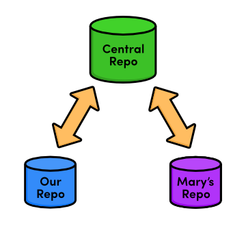
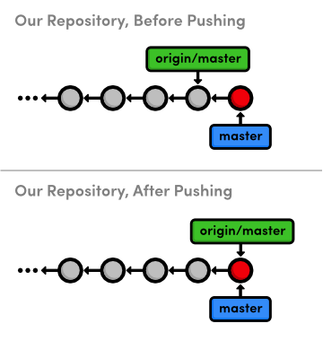
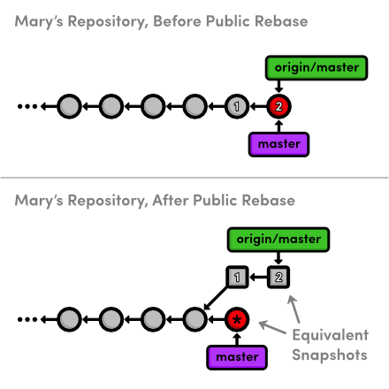
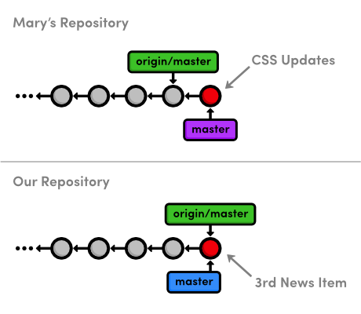
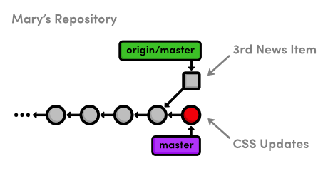
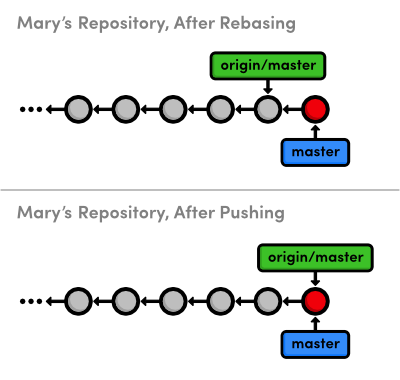
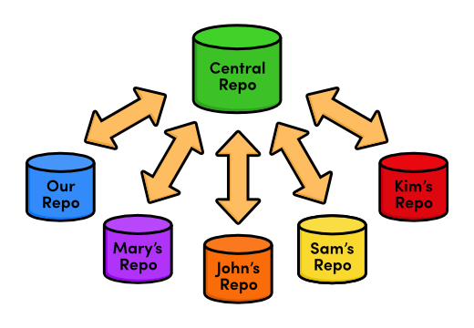

 Centralized Workflows
=======================

이전 장에서, 우리는 두 개발자의 저장소 사이에 직접적으로 정보를 공유했다: `my-git-repo`와 `marys-repo`. 
이것은 간단한 프로그램을 개발하는 아주 작은 팀에 대해서는 기능을 하지만 더 큰 프로젝트들은 더욱 체계화된 환경을 요구한다. 
이 장은 그러한 환경 하나를 소개한다: **중앙집중식 워크플로우**.

우리와 Mary 사이에서 중앙의 커뮤니케이션 허브로서 동작 하기 위해 우리는 세번째 Git 저장소를 사용할 것이다. 
`marys-repo`에서 `my-git-repo`로 혹은 반대로, 변경사항을 가져오는(pull) 대신에, 
우리는 지정된 스토리지 저장소에 push하고 그것으로부터 fetch할 것이다. 
이장 이후, 우리의 워크플로우는 다음과 같이 보일 것이다.


> 중앙집중식 워크플로우

일반적으로, 인터넷 기반의 협업을 허용하기 위해 우리는 서버의 중앙 저장소에 저장할 수도 있다. 
불행하게도, 서버 설정은 호스팅 제공자에 따라 다양하며, 공통적인 단계별 지침을 만들기도 어렵다. 
그래서, 우리는 이전장과 마찬가지로 로컬 파일시스템을 사용해서 remote 저장소 찾기을 진행할 것이다.

만약 서버에 접근권한을 가지고 있다면, 우리가 생성하려고 하는 
중앙 저장소를 호스트하기 위해 서버를 사용하는 것은 마음대로 해도 된다. 
아래 제공되는 경로 대신 여러분의 서버-기반의 저장소를 위해 SSH 경로를 제공해야 한다. 
그것말곤, 이번 장의 지시사항을 있는 그대로 따라갈 수 있다. 
대다수의 사람들을 위해, 우리의 네트워크-기반의 Git 경험이 다음장에서 시작될 것이다.

 [이번 장을 위한 저장소 다운로드 받기](media/repo-zips/centralized-workflows.zip)

이전 장에서부터 계속 진행중이라면, 여러분은 이미 필요한 모든 것을 가지고 있다. 
그렇지 않으면, 위의 링크에서 압축된 Git 저장소를 다운로드 받아 압축을 풀자. 그리고 나서 진행해도 좋다.

## 베어 저장소 (Bare Repository) 생성하기 (Central)

먼저, 우리의 중앙 “커뮤니케이션 허브(communication hub)”를 생성하려고 한다. 
다시, `/path/to/my-git-repo`를 여러분의 저장소의 실제 경로로 변경하자. 
만약 서버에서 중앙 저장소를 호스트하기로 결정했다면, 
SSH를 사용해서 서버에 접속하고 저장소를 저장하기 원하는 곳에서 `git init` 명령을 실행해야 한다.

```
cd /path/to/my-git-repo
cd ..
git init --bare central-repo.git
```

맨 처음 장에서, `git init`은 새로운 저장소를 생성했다. 
그러나 이번에는, Git에게 우리는 워킹디렉토리를 원하지 않는다고 명령하기 위해 `--bare` 플래그를 사용했다. 
이것은 중앙 저장소에서 개발하는 것을 막고, `git push`을 사용해서 다른 사용자의 환경과 섞일 가능성을 제거한다.
중앙 저장소는 개발 환경이 아니라 단지 *스토리지 장치*로 역할을 할 것을 요구한다.

만약 여러분이 결과로 나온 `central-repo.git` 폴더의 내용을 조사하려고 한다면, 
`my-git-repo` 프로젝트의 `.git` 폴더와 완전이 똑같은 파일들을 포함하고 있음을 목격할 것이다. 
Git은 *문자 그대로* 우리의 워킹 디렉토리를 제거했다. 
디렉토리 이름에 관습적인 `.git` 확장자는 이런 특성을 전달하는 한 방법이다.

## Remotes 업데이트하기 (Mary and You)

우리는 중앙저장소를 성공적으로 셋업했고, 우리와 Mary, 그리고 다른 모든 개발자들 간에 업데이트를 공유하기 위해 사용될 수 있다. 
다음, 우리는 `marys-repo`와 `my-git-repo`에 remote로서 그것을 추가해야 한다.

```
cd marys-repo
git remote rm origin
git remote add origin ../central-repo.git
```

이제 우리 저장소를 위해:

```
cd ../my-git-repo
git remote add origin ../central-repo.git
git remote rm mary
```

우리는 `git remote rm`으로 Mary와 `my-git-repo` 사이의 remote 연결을 삭제했다. 
이 장의 나머지에서, 우리는 업데이트를 공유하기 위해 중앙 저장소만을 사용할 것이다.

만약 서버에서 중앙 저장소를 호스트하기로 결정했다면, `../central-repo.git`을 다음으로 변경할 필요가 있다:  
`ssh://user@example.com/path/to/central-repo.git`, 
`user@example.com`를 SSH 유저명과 서버 위치로, 
그리고 `path/to/central-repo.git` 를 중앙 저장소의 위치로 교체.

## Master Branch 로 push하기 (You)

우리는 베어 저장소로서 단지 초기화만 했지 중앙저장소를 *복제(clone)*하지는 않았다. 
이것은 우리의 프로젝트 히스토리를 아직 가지고 있지 않음을 의미한다. 
우리는 지난 장에서 소개한 `git push` 명령을 사용해서 이를 고칠 수 있다.

```
git push origin master
```

중앙 저장소는 이제 우리의 전체 `master` branch를 포함한다. 
우리는 다음으로 중복 체크할 수 있다.

```
cd ../central-repo.git
git log
```

이것은 익숙한 `master` branch의 히스토리 목록을 출력할 것이다.

`git push`는 목적지 저장소에 *로컬* branch를 생성한다는 것을 떠올려보자. 
우리는 친구가 새로운 branch가 랜덤으로 생기는 것을 감사하지 않는 것 처럼, 
친구의 저장소에 push하는 것은 위험하다고 말했었다. 
그러나, `central-repo.git`에 로컬 branch를 생성하는 것은 안전(safe)한데 워킹 디렉토리가 없기 때문이다. 
그것은 누군가의 개발을 방해하는 것이 불가능하다는 것을 의미한다.

## News Update 추가하기 (You)

스냅샷을 좀 더 commit해 보면서 새로운 중앙집중식 협업 워크플로우를 확인해 보자.

```
cd ../my-git-repo
git checkout -b news-item
```

`my-git-repo`에 `news-3.html` 이름으로 파일을 생성하고 다음 HTML을 추가하자.

```html
<!DOCTYPE html>
<html lang="en">
<head>
  <title>Middle East's Silent Beast</title>
  <link rel="stylesheet" href="style.css" />
  <meta charset="utf-8" />
</head>
<body>
  <h1 style="color: #D90">Middle East's Silent Beast</h1>
  <p>Late yesterday evening, the Middle East's largest
  design house&mdash;until now, silent on the West's colorful
  disagreement&mdash;announced the adoption of
  <span style="color: #D90">Yellow</span> as this year's
  color of choice.</p>
    
  <p><a href="index.html">Return to home page</a></p>
</body>
</html>
```

그 다음, `index.html`의 “News” 섹션에 아래와 같이 링크를 추가하자:

```html
<h2 style="color: #C00">News</h2>
<ul>
  <li><a href="news-1.html">Blue Is The New Hue</a></li>
  <li><a href="rainbow.html">Our New Rainbow</a></li>
  <li><a href="news-2.html">A Red Rebellion</a></li>
  <li><a href="news-3.html">Middle East's Silent Beast</a></li>
</ul>
```

스냅샷을 stage하고 commit하자.

```
git add news-3.html index.html
git status
git commit -m "Add 3rd news item"
```

## News Item 게시하기 (You)

일전에, “퍼블리싱(publishing)”은 로컬 `master` branch와 merge하는 것을 의미했다. 
그러나 우리는 *오직* 중앙 저장소와 상호작용하기 때문에, 우리의 `master` branch는 다시 비공개로 되었다. 
Mary가 우리 저장소에서 내용들을 직접적으로 가져올 방법이 없다.

사실, 모든 사람은 공개 `master` branch를 통해 업데이트 접근한다. 
따라서 “퍼블리싱”은 중앙 저장소에 push하는 것을 의미한다.

```
git checkout master
git merge news-item
git branch -d news-item
git push origin master
```

우리가 정상적으로 `master`에 merge한 이후, `git push`는 우리의 로컬 `master`를 반영하기 위해 
중앙 저장소의 `master` branch를 업데이트 할 것이다. 
우리 관점에서, push는 다음과 같이 시각화될 수 있다:


> 중앙 저장소로 `master`를 push하기

이것은 `git push`가 `my-git-repo` 내부로부터 모든 것을 할 수 있도록 허용하는 것을 제외하고는 
중앙 저장소로 가서 fetch/fast-forward merge를 하는 것과 완전히 같은 것을 수행한다. 
우리는 이 장 후반부에서 이 명령의 다른 편리한 특징을 보게 될 것이다.

## CSS 스타일 업데이트하기 (Mary)

다음,  이제 다시 Mary로 돌아와서 CSS 포맷팅을 추가하자 (그녀는 결국 우리의 그래픽 디자이너다).

```
cd ../marys-repo
git checkout -b css-edits
```

`style.css`의 마지막에 다음을 추가하자:

```css
h1 {
  font-size: 32px;
}

h2 {
  font-size: 24px;
}

a:link, a:visited {
  color: #03C;
}
```

그리고 나서, 스냅샷을 stage하고 commit하자.

```
git commit -a -m "Add CSS styles for headings and links"
```

## 추가 CSS 스타일 업데이트하기 (Mary)

이런, Mary가 일부 포맷팅을 추가하는 것을 까먹었다. `style.css`에 `h3` 스타일을 추가하자:

```css
h3 {
  font-size: 18px;
  margin-left: 20px;
}
```

그리고 당연히 업데이트를 stage하고 commit하자.

```
git commit -a -m "Add CSS styles for 3rd level headings"
```

## 게시하기 전 정리하기 (Mary)

Mary가 중앙 저장소로 그녀의 업데이트를 게시하는 것을 고려하기 전에, 깨끗한 히스토리를 가졌음을 확신할 필요가 있다. 
이것은 Mary에 의해 수행되어야 하는데 공개된 이후에는 히스토리를 변경하는 것이 거의 불가능하기 때문이다.

```
git rebase -i master
```

이 특징은 독립적인 기능을 개발하기 위해 별개의 branch를 사용하는 데 대한 또다른 이점이다. 
Mary는 그녀의 현재 branch에 모든 것을 갖고 있기 때문에 돌아가서 어떤 변경사항이 rebase될 필요가 있는지 파악하는 것이 불필요하다:

```
pick 681bd1c Add CSS styles for headings and links
squash eabac68 Add CSS styles for 3rd level headings
```

결합된 commit 메시지를 요구하기 위해 Git이 멈추면, 그냥 첫번째 commit 메시지를 사용하자:

```
Add CSS styles for headings and links
```

중앙 저장소에 push한 이후에 Mary가 rebase한다면 무슨 일이 일어날지 생각해 보자. 
그녀는 다른 개발자들이 그들의 프로젝트에 이미 가져온 commit들을 재작성 할 수 있다. 
Git에 있어, Mary의 commit 재작성은 전체적으로 새로운 commit처럼 보일 것이다 
(그것들은 다른 ID를 가지기 때문에). 이 상황은 아래와 같다:


> 공개된 commit을 변경하기 (squashing)

*1*과 *2*로 표시된 commit은 Mary가 rebase한 공개 commit이다. 
그리고 난 후, 공개 히스토리는 여전히 Mary의 원래 히스토리와 완전히 일치하지만, 
이제 그녀의 로컬 `master` branch는 같은 스냅샷을 나타냄에도 불구하고 `origin/master`와 갈라진다.

그래서, 그녀의 rebase된 `master` branch를 중앙 저장소로 게시하기 위해서는, 
Mary는 `origin/master`와 merge해야 할 것이다. 
이것은 패스트-포워드 merge가 될 수 없고, 그 결과 merge commit이 그녀의 동료들에게 혼란을 주기 쉽고 워크플로우를 방해한다.

rebase하는 동안 기억해야할 가장 중요한 룰은 이것이다: **공유 저장소로 push한 commit은 절대 rebase하지 마라. 
(Never, ever rebase commits that have been pushed to a shared repository)**.

만약 여러분이 공개 commit을 변경할 필요가 있다면, 우리가 [Undoing Changes](02-undoing-changes.html)에서 
논의했던 `git revert` 명령을 사용하자. 
이것은 오래 전 스냅샷을 재작성하는 대신 필요한 요구사항과 함께 새로운 commit을 생성한다.

## CSS 변경사항 게시하기 (Mary)

이제 그녀의 히스토리는 정리되었고, Mary는 변경사항을 게시할 수 있다.

```
git checkout master
git merge css-edits
git branch -d css-edits
```

그녀는 서버에 `css-edits` branch를 push하지 않았는데 더이상 개발되지 않고 
다른 작업자들이 그 안에 무엇이 있는지 알지 못하기 때문이다. 
그러나 만약 우리가 CSS edit를 함께 개발하기로 전부 결정하고 그것을 위한 별개의 환경을 원한다면, 
독립적인 branch로 그것을 게시하는 것이 이해가 될 것이다.

Mary는 여전히 중앙저장소로 변경사항을 push하는 것이 필요하다. 그러나 먼저, 모든 프로젝트의 상태를 살펴보자.


> Mary의 CSS 변경사항을 게시하기 전

여러분은 어떻게 Mary가 중앙 저장소로 그녀의 로컬 `master`를 push할 수 있을지 궁금할 것이다. 
메리가 마지막 fetch한 이후로 중앙 저장소가 진행되었기 때문이다. 
이것은 많은 개발자가 동시에 한 프로젝트에 일하는 경우와 동일한 상황이다. 
Git이 어떻게 다루는지 확인해 보자::

```
git push origin master
```

이것은 장황한 거부(rejection) 메시지를 출력할 것이다. 
만약 패스트 포워드 merge가 되지 않으면 Git은 아무도 원격 서버에 push하지 못하도록 하는 것처럼 보인다. 
이것은`mary/master`에 일치하기 위해 `origin/master`를 덮어쓰기 할 필요가 있는 
`Add 3rd news item`을 잃어버리는 것을 방지한다.

## 변경사항 가져오기(pull) (Mary)

Mary는 그녀의 CSS 변경사항을 push 시도하기 전에 중앙 저장소에서 pull 하여 이 문제를 해결할 수 있다. 
먼저, 그녀는 `origin/master` branch의 가장 최신 버전이 필요하다.

```
git fetch origin
```

`..` 문법을 사용해서 Mary는 `origin/master`에 있고 
로컬 `master`에 없는 것을 확인할 수 있다:

```
git log master..origin/master
```

그리고 또한 그녀의 `master`에 있고 `origin/master`에 없는 것을 확인할 수 있다:

```
git log origin/master..master
```

이 둘은 하나의 commit을 출력하기 때문에 우리는 Mary의 히스토리가 분기되었다고 말할 수 있다.
이것은 또한 아래 다이어그램으로부터 명확한데 업데이트된 `origin/master` branch를 보여준다.


> 중앙 저장소의 `master` branch를 fetch

Mary는 이제 또다른 branch에서의 변경사항을 pull해야할 위치에 있다. 
그녀는 패스트 포워드 될 수 없는 merge를 할수 있거나 선형 히스토리를 위한 rebase를 할 수 있다.

일반적으로, 여러분은 중앙 저장소에서 발견된 것들 맨 위에 여러분의 번경사항을 rebase하기 원할 것이다. 
이것은 이렇게 말하는 것과 동일하다, “나는 모든 사람이 이미 다 해논 것에 나의 변경사항을 추가히길 원한다”. 
이전에 언급하였듯이, rebasing은 불필요한 merge commit을 제거한다. 이러한 이유로, Mary는 rebase를 선택할 것이다.

```
git rebase origin/master
git push origin master
```

rebase 이후, Mary의 master branch는 중앙 저장소로부터 모든 것을 포함하고 
따라서 그녀는 그녀의 변경사항을 게시하기 위해 패스트 포워드 push를 할 수 있게 되었다.


> 중앙 저장소의 `master`로 업데이트

## 변경사항 가져오기 (You)

마지막으로, 우리의 저장소로 다시 돌아와서 Mary의 CSS 포맷팅을 가져올 것이다.

```
cd ../my-git-repo
git fetch origin
git log master..origin/master --stat
git log origin/master..master --stat
```

물론, 두번째 log 명령은 아무것도 출력하지 않을 것이다. 
왜냐하면 Mary가 CSS edit를 추가하는 동안 어떤 새 commit도 추가하지 않았기 때문이다. 
보통 remote branch와 merge를 시도하기 전에 이것을 체크하기 위한 좋은 생각이다. 
그렇지 않으면, 여러분의 branch를 패스트 포워드한다고 생각할 때 결국 추가적인 merge commit을 갖게 될 수도 있다.

```
git merge origin/master
```

우리 저장소는 이제 중앙 저장소와 동기화 되었다. 
Mary가 이동해서 우리가 알지 못하는 어떤 새로운 내용을 추가했을지 모르지만, 그건 상관없다. 
오직 알 필요가 있는 변경사항 만이 `central-repo.git`에 있다. 
이것은 우리가 단지 한 명의 다른 개발자와 일할 때는 큰 차이가 생기지 않지만, 
다수 개발자의 저장소를 실시간으로 파악해야 하는 것을 상상해 보자. 
이런 종류의 혼돈은 정확인 중앙집중식 협업 워크플로우가 풀어야 할 문제다:


> 많은 개발자가 있는 중앙 집중식 워크플로우

우리가 Mary의 CSS update를 push한는 것을 해보면서 발견한 것처럼 중앙 커뮤니케이션 허브의 존재는 
단일 저장소를 모든 개발을 압축하며 아무도 다른 이의 내용을 덮어쓰기 하지 않음을 보장한다.

## 결론

이 장에서는, 프로젝트를 위한 중앙 저장소 장치로서 역할을 하는 또다른 remote 저장소를 소개했다. 
또한 우리는 보통의 저장소와 같고 워킹 디렉토리는 빠져있는 베어(bare) 저장소를 다루었는다. 
베어 저장소가 이미 갖고 있는 commit을 rebase하지 않아야 한다는 것을 기억하는 한, 
베어 저장소는 branch를 push하기 위한 “안전한” 장소를 제공한다.

우리는 로컬 파일 시스템 상에서 중앙 저장소를 호스트 했다. 
우리와 Mary의 프로젝트가 바로 옆에 있었다. 
그러나, 대부분의 실제 중앙 저장소는 인터넷 접근을 통한 원격 서버에 위치한다. 
이것은 어떤 개발자라도 인터넷을 통해 저장소에 fetch하거나 push하게 해주며, 
Git을 매우 강력한 다중 사용자 개발 플랫폼으로 만들어 준다. 
또한 원격 서버에 중앙 저장소를 갖는 것은 프로젝트를 백업하기 위해 적당하고 편리한 방법이다.

다음 순서로는, GitHub로 불리는 서비스를 사용해서 네트워크 기반의 저장소를 설정할 것이다. 
Git 저장소를 위한 네트워크 접근을 소개하는 것에 더하여, 
이것은 또다른 협업 표준에 대해 문을 열어 줄 것이다: 통합자 워크플로우(Integrator Workflow)

## 정리

`git init --bare <repository-name>`  
Git 저장소를 생성한다. 단 워킹 디렉토리는 생략한다.

`git remote rm <remote-name>`  
북마크된 연결에서 특정 remote를 제거한다.
