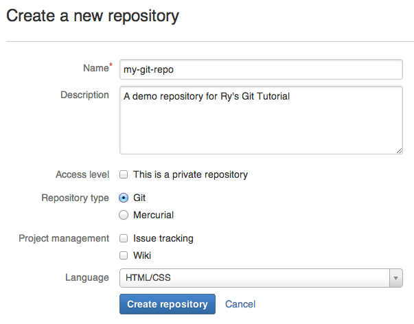
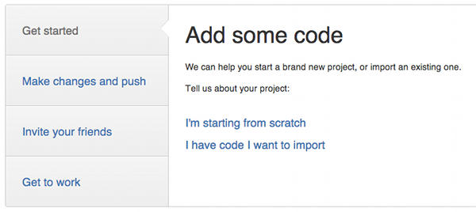
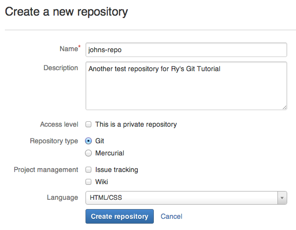
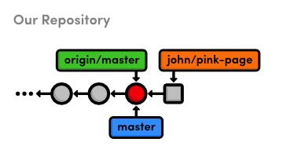
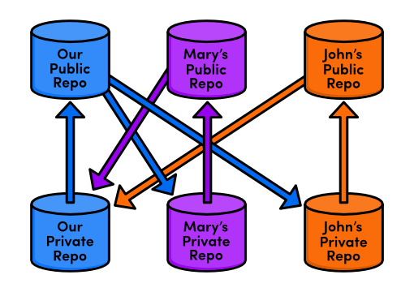
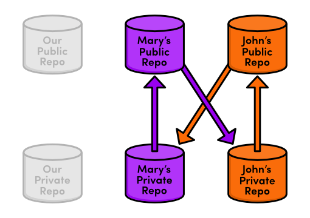

 Distributed Workflows
============================

중앙집중식 워크플로우를 통해 정보를 공유하는 방법을 알게 되었으니, 
이제 우리는 이 협업모델의 일부 단점을 제대로 인식할 수 있다. 
그것은 편리할 지 모르지만 “공식(official)” 저장소로 모든 사람이 push하도록 허용하는 것은 일부 법적인 보안 문제를 제기한다. 
그것은 내용에 기여하기 원하는 누구나 *전체 프로젝트*에 대한 권한이 필요하다는 것을 의미한다.

이것은 여러분이 작은 팀으로 상호작용할 때는 괜찮다. 
하지만 여러분이 오픈 소스 소프트웨어 프로젝트 대해 일하고 있는데 모르는 사람이 
버그를 찾아 고친 다음 메인 프로젝트에 업데이트를 통합하려고 하는 시나리오를 상상해보자. 
여러분은 아마도 중앙 저장소에 push 접근권한(access)를 주고 싶지 않을 것이다. 
그들은 모든 종류의 스냅샷을 닥치는 대로 push해서 실제로 프로젝트의 제어를 잃게 될 수도 있기 때문이다.

그러나, 여러분이 할 수 있는 것은 기여자에게 *그들 자신의* 공개 저장소에 변경사항을 push할 것을 말하는 것이다. 
그리고 나서, 여러분은 선언되지 않은 코드는 어떤 것도 포함하지 않는다는 것을 보장하기 위해 
개인의 저장소에 버그 픽스를 pull 할 수 있다. 
만약 그들의 기여들을 승인한다면, 여러분이 해야할 것은 이전 장에서 했던 것처럼 로컬 branch에 
그것들을 merge하고 메인 저장소로 push하는 것이다. 
여러분은 일반 개발자이면서 *통합자(integrator)*가 되었다:


> 통합자 워크플로우 (The integrator workflow)

이 장에서는 [Bitbucket.org](http://bitbucket.org/)에 무료 공개 저장소를 생성하고 
John이라는 익명 개발자의 기여를 통합해 봄으로써 이 모든 것을 직접 경험을 것이다. 
BitBucket은 DVCS 호스팅 제공자인데 Git 저장소를 셋업하고 개발자 팀과 협업을 시작하는 것을 아주 편리하게 만들어준다.

 [이번 장을 위한 저장소 다운로드 받기](media/repo-zips/distributed-workflows.zip)

이전 장에서부터 계속 진행중이라면, 여러분은 이미 필요한 모든 것을 가지고 있다. 
그렇지 않으면, 위의 링크에서 압축된 Git 저장소를 다운로드 받아 압축을 풀자. 
그리고 나서 진행해도 좋다.

## Bitbucket 계정 생성하기

이 장의 첫 부분은 BitBucket 계정을 셋업하는 것을 설명할 것이다. 
[Bitbucket.org](http://bitbucket.org/) 로 웹브라우저를 이동하고 무료 계정을 위해 등록(sign up)하자.


> Bitbucket 로고

여러분은 계정을 위해 어떤 이름이라도 선택할 수 있지만 이메일 주소는 
[The Basics](01-the-basics.html)에서 `git config`로 Git 설치에 부여했던 것과 일치해야 할 것이다. 
만약 여러분이 이메일을 변경할 필요가 있으면, 
`git config --global user.email you@example.com` 명을 실행할 수 있다.

## 공개(public) 저장소 생성하기 (You)

우리의 첫 네트워크 Git 저장소를 생성하기 위해, Bitbucket 계정에 로그인하고 
*Repositories&nbsp;&gt;&nbsp;Create repository* 로 이동하자. 
저장소 *이름(Repository Name)*으로 `my-git-repo`를 사용하고, 
*설명(Description)*에 원하는 것을 입력하자. 
이것이 그냥 예제 프로젝트이기 때문에, *비공개 저장소(This is a private repository)*를 체크해제한다. 
 *Language*는 *HTML/CSS*를 선택하고나서 저장소 생성을 클릭한다.


> Bitbucket의 새 저장소 폼

근본적으로, 단지 우리는 Bitbucket 서버에 `git init --bare`를 실행했다. 
우리는 이전 장에서 `central-repo.git`에 했던 것처럼 이 저장소에 push와 fetch를 할 수 있게 되었다.

설치가 끝나면, Bitbucket은 일부 도움이 되는 설명들을 제공하지만 아직 그것들을 따라하지는 말자. 
우리는 다음 부분에서 이미 갖고 있는 저장소를 임포트하는 것을 설명하려고 한다.


> Bitbucket의 설치 설명서
## 공개 저장소로 push (You)

우리의 기존 `my-git-repo` 프로젝트를 가지고 새 저장소로 올리기 전에, 
먼저 우리는 Bitbucket 저장소에 대한 `origin` remote를 가리킬 필요가 있다. 
`&lt;username&gt;` 부분을 여러분의 실제 Bitbucket 이름으로 변경하자.

```
cd /path/to/my-git-repo
git remote rm origin
git remote add origin https://<username>@bitbucket.org/<username>/my-git-repo.git
```

remote의 활용은 매번 이 저장소에 대한 전체 경로를 타이핑함으로써 
이전 장보다 좀더 분명해져야 한다. 다소 지루할 수도 있지만 상호작용하기 위해서는 반드시 필요하다.

우리의 코드를 remote 저장소로 올리기 위해, 우리는 중앙집중식 워크플로우와 
동일한 push 메커니즘을 사용할 것이다. 
암호를 요구하면, 등록했던 것을 사용하자.

```
git push origin master
```

## 공개 저장소 탐색하기 (You)

이제 Bitbucket 사이트에서 우리 프로젝트를 볼수 있게 되었다. 
*Source*  탭은 프로젝트 안의 모든 파일을 표시하고 *Commits* 탭은 
전체 commit 히스토리를 포함한다. 또한 저장소의 branch 구조는 각 commit의 왼쪽에 시각화되어 있다.


> Our history in Bitbucket’s Commit tab

지금 이 저장소는 우리 예제 웹사이트의 “공식적인” 사본으로써 역할을 하고 있다. 
우리는 이 저장소로부터 다운로드 할 것을 다른 이들에게 알릴 것이고 
우리는 그것에 우리의 로컬 `my-git-repo` 변경사항을 모두 push할 것이다. 
그러나, 이 “공식적인” 상태(status)는 단지 관습이라는 것에 주목하는 것이 중요하다. 
`master` branch가 그냥 branch인것 처럼, Git에 따르면 우리의 Bitbucket 저장소도 그냥 또 하나의 저장소일 뿐이다.

모든 개발자들이 공개(public)과 비공개(private) 저장소를 갖도록 하는 것은 
여러분이 이전에 만나 보지 못했던 서드파트로부터의 기여와 협업하는 것을 쉽게 만들어 준다.

## 저장소 복제하기 (John)

그 다음, 우리는 우리 웹사이트의 서드파티 기여자인 John인 것처럼 행동하려고 한다. 
John은 우리가 pink page를 가지고 않은 것에 주목했고, 그 자신이 우호적인 개발자가 되어, 
우리를 위해 하나 만들어 주기를 원하고 있다. 
우리는 그에게 기여하도록 해주길 원했지만 우리의 전체 저장소에 대한 push권한은 주고 싶지 않다 - 
이것은 우리의 모든 어려운 작업을 재작성하거나 심지어 삭제하는 것을 그에게 허용할 수도 있다.

다행이도, John은 Bitbucket의 협업을 어떻게 활용하는지 알고 있다. 
그는 우리의 공개 저장소의 사본을 복제하는 것으로 시작할 것이다:

```
cd /path/to/my-git-repo
cd ..
git clone http://bitbucket.org/<username>/my-git-repo.git johns-repo
cd johns-repo
```

이제 여러분은 `my-git-repo`와 동일한 폴더에 `johns-repo`라 불리는 저장소의 또다른 사본을 가지게 되었다. 
이것은 John의 *비공개(private)* 저장소이다 ? 그가 안전하게 pink page를 개발할 수 있는 완전히 독립된 환경이다. 
그의 이름과 이메일을 빠르게 설정해 보자:

```
git config user.name "John"
git config user.email john.example@rypress.com
```

## pink page 추가하기 (John)

물론, John은 저장된 feature branch에서 그의 기여를 개발해야 할 것이다.

```
git checkout -b pink-page
```

가장 좋은 관습(베트스 프랙티스)에 추가하여, 이것은 어떤 commit을 포함해야 할지 통합자(integrator)가 확인하는 것을 쉽게 만들어 준다.
John이 작업을 완료하면, 그는 그의 저장소가 어디에 있는지 그리고 새로운 기능이 어느 branch에 있는지 우리에게 알려줄 것이다. 
그리고 나서, 우리는 최소한의 노력으로 그의 내용을 merge할 수 있을 것이다.

`pink.html`을 생성하고 다음 코드를 추가하자:

```html
<!DOCTYPE html>
<html lang="en">
<head>
  <title>The Pink Page</title>
  <link rel="stylesheet" href="style.css" />
  <meta charset="utf-8" />
</head>
<body>
  <h1 style="color: #F0F">The Pink Page</h1>
  <p>Pink is <span style="color: #F0F">girly,
  flirty and fun</span>!</p>

  <p><a href="index.html">Return to home page</a></p>
</body>
</html>
```

`index.html`의 “Navigation” 섹션에 pink page를 추가하자:

```html
<li style="color: #F0F">
  <a href="pink.html">The Pink Page</a>
</li>
```

그리고나서, 평소처럼 스냅샷을 stage하고 commit하자.

```
git add pink.html index.html
git status
git commit -m "Add pink page"
```

## Pink page를 게시하기 (John)

이제, John은 공개 저장소에 그의 기여를 게시할 필요가 있다. 
우리는 그가 `origin` remote에 저장된 *우리의* 공개 저장소에 push하기를 원하지 않음을 기억하자. 
사실, 우리가 잠깐 논의하게될 이유 때문에 `origin`으로 push할 수 없다.

대신에, 그는 그 자신의 Bitbucket 저장소를 생성할 것이고 우리는 그것으로부터 기여를 가져올(pull) 수 있다. 
실제 John은 그 자신의 Bitbucket 계정을 가졌을 테지만, 
편의상 그냥 우리의 계정에 그의 공개 저장소를 저장할 것이다. 
다시 한번, Bitbucket 홈페이지로 이동하여 John의 공개 저장소를 생성하기 위해 
*Repositories&nbsp;&gt;&nbsp;Create&nbsp;repository*를 클릭하자. 
*이름*은 `johns-repo`를 사용하자.


> John의 새로운 저장소 폼

John의 개인 저장소로 돌아와서, 우리는 remote로 이것을 추가할 필요가 있을 것이다:

```
git remote add john-public https://<username>@bitbucket.org/<username>/johns-repo.git
```

이것은 John이 우리가 접근해야할 pink page를 게시할 장소이다. 
그가 HTTS로 push하기 때문에, 그는 그의 Bitbucket 계정을 위한 패스워드를 입력할 필요가 있을 것이다. 
(실제로는 *여러분* 계정의 패스워드를 사용)

```
git push john-public pink-page
```

John이 해야할 것은 우리에게 feature branch의 이름을 알려주고 
아래처럼 저장소에 대한 링크를 우리에게 보내주는 것이다:

```
http://bitbucket.org/<username>/johns-repo.git
```

John은 그의 공개 저장소에 push하기 위해 우리에게 fetch하라고 준 경로가 아니라 다른 경로를 사용했었다. 
가장 중요한 차이점은 전송 프로토콜이다: 전자는 `https://`를 사용한 반면 후자는 `http://`를 사용했다. 
HTTPS(혹인 SSH)를 통해 저장소에 접근하는 것은 fetch나 push를 하게 해주지만 이미 보았듯이 패스워드를 필요로 한다. 
이것은 알 수 없는 개발자가 commit을 덮어쓰기하는 것으로부터 지켜준다.

반면에, HTTP를 통해 fetch하는 것은 사용자 이름이나 패스워드가 필요없지만 push는 불가능하다. 
이것은 보안과 타협없이 누구나 저장소로부터 fetch하게 해준다. 
통합자 워크플로우(integrator workflow)에서는, 여러분이 HTTPS를 통해 변경사항을 게시하는 동안 
다른 개발자들이 HTTP를 통해 여러분의 저장소에 접근한다. 
또한 이것은 그의 `origin` remote에 왜 push하지 못하는지 이유이기도 하다.

물론, 여러분이 비공개(private) 프로젝트에서 작업한다면, 
그 저장소에 대해 익명의 HTTP 접근은 비활성화될 것이다.

## John의 기여를 확인하기 (You)

자, 우리는 John이 되는 것을 마치고, 공식 프로젝트로 그의 코드를 통합할 준비가 되었다. 
우리의 저장소로 다시 전환하여 John의 공개 저장소를 remote로서 추가하자.

```
cd ../my-git-repo
git remote add john http://bitbucket.org/<username>/johns-repo.git
```

우리는 John의 개인 저장소에 대해 어떤 것도 관심이 없음을 주목하자 
? 단지 중요한 것은 그가 게시한 변경사항이다.
그의 branch를 다운로드 받고, 그가 무엇을 작업하였는지 살펴보도록 하자:

```
git fetch john
git branch -r
git log master..john/pink-page --stat
```

우리는 다음과 같이 이 히스트리 정보를 시각화할 수 있다.


> John의 `pink-page` branch를 merge하기 전

그의 실제 변경사항을 자세히 살펴보자:

```
git checkout john/pink-page
```

올바른지 확인하기 위해 `pink.html`을 열어보자. John은 신뢰하는 협업자가 아님을 기억하자, 
그리고 우리는 이 파일이 무슨 내용을 포함하는지 알지 못할 것이다. 
이를 염두에 두고, 그 내용을 검증하는 것이 상당히 중요하다. 
**서드 파티 기여자로부터의 내용을 절대 맹목적으로 merge하지 말자.**

## John의 기여를 통합하기 (You)

John의 업데이트를 승인하는 것으로 가정하면서, 우리는 이제 그것을 프로젝트에 merge할 준비가 되었다.

```
git checkout master
git merge john/pink-page
```

우리가 서로 다른 위치로부터 pull과 push를 하고 있다는 점을 제외하면, 
중앙집중식 워크플로우에서 Mary의 변경사항을 통합했던 것과 정확히 같은 방식임을 주목하자:


> John과 함께하는 통합자 워크플로우(integrator workflow)

게다가, John의 워크플로우는 우리와 같다: 
로컬의 비공개 저장소에서 개발한 다음 공개 저장소로 변경사항을 push하는 것. 
통합자 워크플로우는 단지 협업 노력을 조작화하는 표준화된 방법일 뿐이다
? 우리가 어떻게 로컬로 개발하는지 바뀐 것은 아무것도 없으며 지난 몇 장에서 해왔던 것처럼 동일한 Git 명령어를 사용하고 있다.

## John의 기여를 게시하기 (You)

우리는 로컬 `my-git-repo` 저장소에 John의 기여(contribution)를 통합했다. 
하지만 우리가 그랬다는 것을 아무도 알지 못한다. 우리의 `master` branch를 다시 게시할 타임이다.

```
git push origin master
```

우리는 프로젝트의 “공식” 소스로서 공개된 Bitbucket 저장소를 지정했기 때문에, 
모든 사람은 (즉, Mary와 John) 이제 그것과 동기화할 수 있을 것이다.

## Mary의 저장소 업데이트하기 (Mary)

Mary는 이제 이전 장에 나왔던 중앙 저장소 대신에 Bitbucket 저장소로부터 변경사항을 가져올 것이다. 
그녀가 이것을 설정하는 것은 쉽다.

```
cd ../marys-repo
git remote rm origin
git remote add origin http://bitbucket.org/<username>/my-git-repo.git
```

다시, `&lt;username&gt;`의 여러분의 Bitbucket 계정 이름으로 변경하자. 복잡함을 피하기 위해, 
우리는 Mary의 저장소로 John의 업데이트를 맹목적으로 merge할 것이다. 
(정상적으로, Mary는 그렇게 하기 전에 무엇을 통합할 지 체크해야 할 것이다.)

```
git checkout master
git fetch origin
git rebase origin/master
```

Mary에게는, 그것이 John으로부터 온 업데이트라는 것은 정말 중요하지 않다. 
그녀가 알야할 것은 오직 “공식” `master` branch가 앞으로 이동했다는 것이고 그녀의 개인 저장소를 동기화하도록 요구한다는 것이다.

## John의 저장소 업데이트하기 (John)

John은 pink page를 그의 `master` branch로 통합하는 것이 여전히 필요하다. 
그는 `pink-page` topic branch로부터 직접 merge해서는 안되는데 
왜냐하면 그것이 게시되기전 그의 기여를 우리가 편집했을 수도 있고 
다른 기여들을 포함할 수도 있기 때문이다. 
대신에, 그는 “공식” `master`로부터 가져올 것이다:

```
cd ../johns-repo
git checkout master
git fetch origin
git rebase origin/master
```

John은 그의 로컬 `pink-page`로부터 `master`를 직접 업데이트했다면, 
메인 프로젝트와 맞지않은 상태가 될 수도 있다. 
이러한 이유 때문에, 통합자 워크플로우는 모든 사람이 자신의 공개 저장소로 *push*하는 동안 
하나의 공식적인 저장소로부터 *pull*할 요구한다:


> 많은 개발자들이 함께하는 통합자 워크플로우(integrator workflow)

이러한 방버으로, 한 기여자로부터의 추가는 승인될 수 있고, 통합되며, 
그리고 다른 이들의 독립적인 개발을 방해하지 않고 모든 사람들이 이동가능하게 된다.

## 결론

통합자 워크플로우를 사용하여, 우리의 비공개 개발 과정은 대체로 동일하게 유지된다 
(feature branch를 개발하고 `master`로 그것을 merge하고, 그리고 그것을 게시한다) 
그러나, 우리는 추가적인 작업을 더하였다: 서드 파티의 기여자로부터 변경사항을 통합하는 것이다. 
운좋게도, 이것은 어떤 새로운 기술을 요구하는 것은 아니다 ? 단지 여러 개의 remote 저장소에 접근하는 것이다.

이 셋업이 우리에게 여러 remote를 파악하고 있어야 하는 것을 강제하지만, 
또한 많은 개발자들과 함께 좀 더 쉽게 작업할 수 있게 해준다. 
여러분은 통합자 워크플로우를 사용하면서 보안과 관련된 걱정을 안 해도 되는데 
여러분은 “공식” 저장소 접근에 대해서는 여전히 혼자일 것이기 때문이다.

또한 보안에 대한 흥미있는 부작용도 있었다. 각 개발자에게 그들 자신의 공개 저장소를 제공하여, 
통합자 워크플로우는 오픈소스 소프트웨어 프로젝트를 위한 좀더 안정적인 개발 환경을 만들었다. 
만약 리더 개발자가 “공식” 저장소를 유지하는 것을 멈춘다면, 
모든 다른 참여자들은 간단하게 그들의 공개 저장소를 새로운 “공식” 프로젝트로 지정함으로써 인계받을 수도 있다. 
이것은 무엇이 GIt을 *분산* 버전 관리 시스템이 되게 하는가 대한 부분이다: 
Git이 모두에게 의존하도록 강제하는 단일의 중앙 저장소는 없다.


> 프로젝트 유지보수를 인계받는 John/Mary

다음 장에서, 우리는 commit을 공유하기 위한 좀더 유연한 방법을 살펴볼 것이다. 
이 저-수준(low-level) 접근은 어떻게 내부적으로 Git이 우리의 내용을 관리하는지 더 깊은 이해를 줄 것이다.
