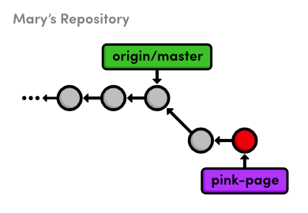
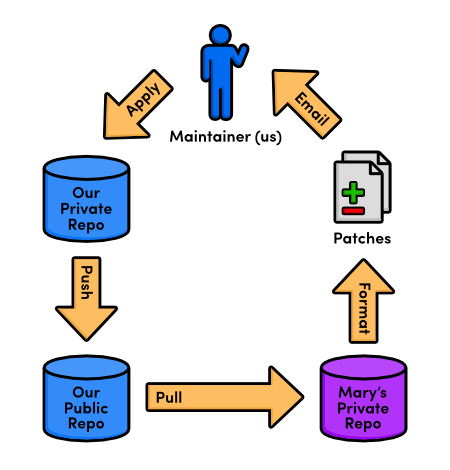

 Patch Workflows
=====================

지금까지, 우리가 본 모든 협업 워크플로우는 branch에 크게 의존한다. 
예를 들어, 지난 장에서, 우리가 프로젝트로 merge하기 위해서는 기여자가 전체 *branch*를 게시해야 했다. 
하지만 ***패치(patch)***를 사용한 *commit* 레벨에서 직접적으로 통신(communicate)하는 것도 가능하다.

변경사항(예를 들면 commit)에 대한 단일 셋(set)을 나타내는 패치 파일(patch file)은 
순서에 상관없이 모든 branch에 적용될 수 있다. 
이런 의미에서, 패치 워크플로우는 다른 개발자와 패치를 쉽게 공유할 수 있다는 점을 제외하고 
인터렉티브 리베이스(interactive rebase)와 동일한 종류이다.

commit 레벨에 대해 통합하는 것은 또한 어떻게 Git 저장소가 
프로젝트 히스토리를 기록하는지에 대해 더 깊은 이해를 줄 것이다.

 [이번 장을 위한 저장소 다운로드 받기](media/repo-zips/patch-workflows.zip)

이전 장에서부터 계속 진행중이라면, 여러분은 이미 필요한 모든 것을 가지고 있다. 
그렇지 않으면, 위의 링크에서 압축된 Git 저장소를 다운로드 받아 압축을 풀자. 
그리고 나서 진행해도 좋다. 
만약 Bitbucket 계정을 설정했다면, 다운로드 저장소를 설정하기 위해 다음 명령을 실행해야 할 것이다:

```
cd /path/to/my-git-repo
git remote add origin https://<username>@bitbucket.org/<username>/my-git-repo.git
cd ../marys-repo
git remote add origin http://bitbucket.org/<username>/my-git-repo.git
```

## Pink page 변경하기 (Mary)

우리는 다시 Mary인척 하려고 한다. 
Mary는 John이 기여한 pink page를 맘에 들어하지 않아서 그것을 변경하기를 원한다.

```
cd /path/to/marys-repo
git checkout -b pink-page
```

새 branch를 개발하는 것은 Mary에게 독립된 환경을 제공하며, 
또한 그녀가 pink page 편집을 끝내면 패치 시리즈를 생성하는 것을 쉽게 해준다. 
`pink.html`에서 다음 라인을 찾자:

```html
<p>Pink is <span style="color: #F0F">girly,
flirty and fun</span>!</p>
```

이것을 다음과 같이 변경하자.

```html
<p>Only <span style="color: #F0F">real men</span> wear pink!</p>
```

평소처럼 업데이트를 stage하고 commit하자.

```
git commit -a -m "Change pink to a manly color"
```

Mary의 로컬 개발 과정은 전혀 변경되지 않았다. 
중앙집중식이나 통합자 워크플로우처럼 패치는 단지 개발자들 사이에 변경사항을 공유하는 한 방법이다. 
이 튜토리얼의 첫 부분에 소개된 기본 Git 개념에 거의 영향을 주지 않는다.

## Patch 생성하기 (Mary)

Mary는 `git&nbsp;format-patch` 명령을 사용한 새 commit으로부터 패치를 생성할 수 있다.

```
git format-patch master
```

이것은 마지막 단계에서 `0001-Change-pink-to-a-manly-color.patch`라는 이름의 파일을 생성하는데 
이 파일은 commit을 재생성하기 위해 충분한 정보를 포함하고 있다. 
`master` 파라미터는 `master`에 없는 현재 branch에 있는 모든 commit에 대해 
patch를 생성하라고 Git에게 명령한다.

텍스트 에디터에서 patch 파일을 열어보자. 
파일 상단에 주소에서 보듯이, 실제로 완정한 이메일이다. 
이것은 다른 개발자에게 패치를 보내는 것을 상당히 쉽게 만들어준다. 
좀더 아래로 내리면, 다음을 보게 될 것이다.

```
index 98e10a1..828dd1a 100644
--- a/pink.html
+++ b/pink.html
@@ -7,8 +7,7 @@
 </head>
 <body>
   <h1 style="color: #F0F">The Pink Page</h1>
-  <p>Pink is <span style="color: #F0F">girly,
-  flirty and fun</span>!</p>
+  <p>Only <span style="color: #F0F">real men</span> wear pink!</p>
 
   <p><a href="index.html">Return to home page</a></p>
 </body>
```

이것은 ***diff***라 불리는 독특한 포맷이다.
그것은 파일의 두 버전 사이의 차이점을 보여주기 때문이다. 
우리의 경우, 이것은 `98e10a1`과 `828dd1a` commit 사이에 
`pink.html`파일에 무언가가 변경되었음을 말해준다 (여러분의 patch는 다른 commit ID를 가겼을 것이다). 
`-7,8 +7,7` 부분은 파일의 각 버전에서 영향있는 라인을 서술하며, 
나머지 텍스트는 변경되어야 할 내용을 우리에게 보여준다.
`-`로 시작하는 라인은 새로운 버전에서 삭제되어야 하며, `+`로 시작하는 것은 추가된다.

여러분이 patch를 사용하기 위해 diff의 구석구석을 알지는 못하지만, 
하나의 패치 파일이 완전한 commit을 나타낸다는 사실을 이해할 필요가 있다. 
그리고 보통의 파일(그리고 또한 이메일)이기 때문에, Git branch보다 전달하기 더 쉽다.

당분간은 patch 파일을 삭제하자 (나중에 다시 만들 것이다).

## Pink 블록 추가하기 (Mary)

어떻게 patch를 commit으로 다시 바꾸는지 배우기 전에, Mary는 스냅샷을 좀 더 추가할 것이다.

`pink.html`에서 `&lt;meta&gt;` 태그 이후 라인에 다음을 추가하자.

```html
<style>
  div {
    width: 300px;
    height: 50px;
  }
</style>
```

그리고, `Only real men wear pink!` 이후에 HTML의 다음 라인을 추가하자:

```html
<div style="background-color: #F0F"></div>
```

스냅샷을 stage하고 commit하자.

```
git commit -a -m "Add a pink block of color"
```

이제 Mary의 저장소는 `master`의 tip 다음에 두개의 commit을 포함한다:


> `pink-page` branch에 두개의 commit 추가하기

## 전체 branch의 patch 생성하기 (Mary)

그녀의 `pink-page` branch에서 모든 commit에 대한 패치를 생성하기 위해 
이전과 동일한 명령을 사용할 수 있다.

```
git format-patch master
```

첫번째 패치는 우리가 이전에 시험했던 것과 완전히 동일하지만, 
우리는 또한 `0002-Add-a-pink-block-of-color.patch`라 불리는 새로운 것을 가지게 된다. 
commit 메시지의 첫번째 라인은 path를 위한 파일 이름을 만드는데 항상 사용될 것이다. 
여러분은 두번째 패치에서 다음 diff를 찾게 될 것이다.

```
index 828dd1a..2713b10 100644
--- a/pink.html
+++ b/pink.html
@@ -4,10 +4,17 @@
   <title>The Pink Page</title>
   <link rel="stylesheet" href="style.css" />
   <meta charset="utf-8" />
+  <style>
+    div {
+      width: 300px;
+      height: 50px;
+    }
+  </style>
 </head>
 <body>
   <h1 style="color: #F0F">The Pink Page</h1>
   <p>Only <span style="color: #F0F">real men</span> wear pink!</p>
+  <div style="background-color: #F0F"></div>
 
   <p><a href="index.html">Return to home page</a></p>
 </body>
```

이것은 우리가 두번째 commit을 하는 동안 HTML을 추가만 했기 때문에 `-` 라인을 제외하고 
첫번째 패치와 같은 형식을 가진다. 
여러분이 확인할 수 있듯이, 이 패치는 실제 앞서 했던 우리의 행동을 
기계가 읽을 수 있도록(machine-readable) 한 것이다.

## 패치를 메일보내기 (Mary)

이제 Mary가 일련의 패치를 준비하였으니, 
그녀는 프로젝트 관리자 (우리)에게 그것들을 보낼 수 있다. 
전형적인 패치 워크플로우에서, 그녀는 다음 방법 중 하나를 사용하여 
이메일을 통해 그것들을 보낼 것이다:

<ul>
<li>패치 파일의 내용을 이메일 클라이언트에 복사, 붙여넣기하는 것. 
그녀가 만약 이 방법을 사용하면, Mary는 그녀의 메일 애플리케이션이 
그것을 보낼 때 패치 안의 화이트 스페이스(whitespace)를 변경하지 않았다는 것을 확신할 수 있다.</li>
<li>보통의 이메일에 패치 파일을 첨부하여 보내는 것</li>
<li>편리한 `git send-email` 명령을 사용하는 것과 파일 혹은 보낼 파일들의 디렉토리를 지정하는 것. 
예를 들면, `git send-email .` 는 현재 디렉토리에 있는 모든 패치를 보낼 것이다. 
Git은 또한 이 명령에 좀 특별한 설정을 요구한다. 상세한 내용은 
[official Git documentation]("http://www.kernel.org/pub/software/scm/git/docs/git-send-email.html")</a>
을 참고하자.</li>
</ul>

`.patch` 파일의 포인트는 Git 저장소로 프로젝트에 
그것을 패치하기 원하는 누구라도 그들의 방법을 찾는 것이 필요하다.
우리 예제를 위하여, 우리가 해야할 모든 것은 패치를 프로젝트의 
로컬버전을 나타내는 `my-git-repo` 디렉토리로 복사하는 것이다.

## 패치 적용하기 (You)

`marys-repo`에서 `my-git-repo`로 두 개의 패치 파일을 복사하자. 
새로운 `git am` 명령을 사용해서, 우리는 우리의 저장소에 Mary의 
commit을 추가하기 위해 이들 패치를 사용할 수 있다.

```
cd ../my-git-repo
git checkout -b patch-integration
git am < 0001-Change-pink-to-a-manly-color.patch
git log master..HEAD --stat
```

첫째로, 우리는 새로운 topic branch에서 우리의 통합을 하려는 것을 주목하자. 
다시, 이것은 우리가 기존 기능을 손상하는 것을 보장하고 변경사항을 승인할 기회를 제공한다. 
두번째, `git am` 명령은 패치 파일을 가져와서 그것으로부터 새 commit을 생성한다. 
로그 출력은 통합 branch가 그녀의 작성자 정보와 함께 Mary의 업데이트를 포함한다고 보여준다.

두번째 commit을 위해 절차를 반복하자.

```
git am < 0002-Add-a-pink-block-of-color.patch
git log master..HEAD --stat
```

`git am` 명령은 “표준 입력”이라 불리는 것으로부터 읽어들이기 위해 설정되고 
`&lt;` 문자는 우리가 어떻게 파일의 내용을 표준 입력으로 변경할 수 있는지 방법이다. 
그것은 실제로 운영체제의 주제에 가깝지만 여러분은 `git am` 명령의 부분으로 이 문법을 생각할 수도 있다.

이 패치를 적용한 이후, 우리의 통합 branch는 이제 Mary의 `pink-page` branch와 똑같이 보일 것이다. 
우리는 그녀가 했던 것과 같은 순서로 Mary의 패치를 적용했지만 반드시 그럴 필요는 없다. 
패치 이면의 모든 개념은 여러분이 commit을 분리하고 마음대로 움직일 수 있게 해준다는 점이다.

## 패치를 통합하기 (You)

다시 한번, 우리는 안정화된 `master` branch로 topic branch를 통합하기 위한 익숙한 상황에 있다.

```
git checkout master
git merge patch-integration
git branch -d patch-integration
git clean -f
git push origin master
```

Mary의 업데이트는 이제 완전히 우리의 로컬 저장소로 통합되었고 
그래서 우리는 `git clean`으로 패치 파일을 제거할 수 있다. 
이것은 또한 공개 저장소에 변경사항을 push하기 위한 적절한 시점이며, 
그래서 다른 개발자들이 프로젝트의 가장 최신 버전에 접근할 수 있게 되었다.

## Mary의 저장소를 업데이트 하기 (Mary)

Mary는 그녀의 `master` branch에 직접 그녀의 `pink-page` branch를 merge하려고 
시도할 수도 있겠지만 이것을 실수를 하게 될 수도 있다. 
그녀의 `master` brank는 이전 장에서 논의한 바와 같이 “공식” 저장소의 `master`를 따라야 한다.

```
cd ../marys-repo
git checkout master
git fetch origin
git rebase origin/master
git branch -D pink-page
git clean -f
```

패치는 개발자들 간에 commit을 공유하기 위한 편리한 방법이긴 하나 
패치 워크플로우는 여전히 *모든 이들의* 변경사항을 포함하는 “공식” 저장소를 필요로 한다. 
만약 우리에게 패치를 보내는 사람이 Mary 하나가 아니라면 어떤 일이 일어날까? 
우리는 아마도 서로 다른 패치를 매우 잘 적용하거나 아니면 
Mary의 기여를 다른 순서로 적용할 지도 모른다. 
그녀의 `master` branch를 업데이트하기 위해 Mary의 `pink-page`를 사용하는 것은 
이들 모든 업데이트를 완전히 무시하게 될 수도 있다.

이점을 고려하면, 우리의 마지막 패치 워크플로우는 다음과 비슷하게 된다.


> 패치 워크플로우 (The patch workflow)

## 결론

remote 저장소가 전체 *branch*를 공유하기 위한 방법인 반면에, 
패치(patch)는 다른 개발자에게 개개의 *commit*을 보내기 위한 방법이다. 
패치가 보통 프로젝트 관리자(project maintainer)에게만 보내는 것을 기억하자. 
그는 누가 봐도 알 수 있듯이 패치를 “공식” 프로젝트로 통합한다. 
모든 사람이 같은 순서로 패치를 적용하지 않는 한 오직 패치만을 사용해서 
서로 전달하는 것은 불가능할 수 있다. 결국, 모든 사람의 프로젝트 히스토리를 
전체적으로 서로 다르게 보일 수 있다.

여러모로, 패치는 이전 장의 통합자 워크플로우 보다는 기여를 접수하기 위한 
더 단순한 방법이다. 오직 프로젝트 관리자는 공개 저장소를 필요로 하고, 
그는 결코 다른 사람의 저장소를 엿보아서는 안 될 것이다. 
관리자의 관점에서, 패치는 또한 통합자 워크플로우처럼 동일한 보안을 제공한다: 
그는 여전히 그의 “공식” 저장소에 아무나 접근권한을 줘서는 안된다. 
그러나, 이제는 또한 그가 다른 사람의 remote 저장소를 추적해서는 안된다.

프로그래머로서, 여러분은 다른 누군가의 프로젝트에서 버그를 수정하기 원할 때 
대부분 패치를 사용하기 원한다. 그것을 고친 후에, 여러부은 결과로 나온 
commit의 패치를 그들에게 보낼 수 있다. 이러한 종류의 한번의 수정(one-time-fix)을 위해, 
공개 Git 저장소를 셋업하는 것 보다는 패치를 생성하는 것이 좀 더 편리하다.

이 장은 표준 Git 워크플로우에 대한 우리의 논의를 결론짓는다. 
바라건대, 여러분은 이제 중앙집중식, 통합자, 혹은 패치 워크플로우를 사용해서 
개인적인고 전문적인 소프트웨어 프로젝트를 어떻게 잘 관리할 수 있는지 
좋은 아이디어를 갖게 되었길 바란다. 
다음 장에서, 우리는 주제를 바꿔서 다양한 실용적인 Git 명령을 소개할 것이다.

## 정리

`git format-patch <branch-name>`  
<branch-name>에는 없고 현재 branch에 있는 각각의 commit을 위한 패치를 생성한다. <branch-name> 대신에 commit ID를 지정할 수도 있다.

`git am < <patch-file>`  
현재 branch에 패치를 적용한다.
