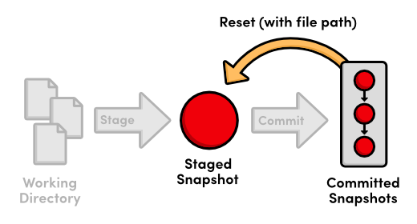
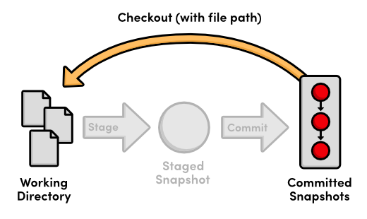

 Tips & Tricks
==========================

이 장은 유용한 Git 유틸리티에 대한 광범위한 조사를 설명한다. 우리는 Git의 이론적인 측면에서 한 걸음 물러나 저장소를 릴리즈 하고 백업을 하기 위해 프로젝트를 준비하는 것과 같은 일반적인 작업들에 초점을 맞추고자 한다. 이 장을 통해 작업을 하는 동안, 우리의 목적은 잡다한 모든 도구들을 마스터하기 위한 것이 아니라 오히려 왜 그것들이 생겨났고, 언제 도움이 되는지 이해하는 것이다.

 [이번 장을 위한 저장소 다운로드 받기](media/repo-zips/tips-and-tricks.zip)

이전 장에서부터 계속 진행중이라면, 여러분은 이미 필요한 모든 것을 가지고 있다. 그렇지 않으면, 위의 링크에서 압축된 Git 저장소를 다운로드 받아 압축을 풀자. 그리고 나서 진행해도 좋다.

## 저장소 압축(Archive)하기

먼저, 우리의 저장소를 ZIP 압축으로 내보내기 해보자. `my-git-repo`의 로컬 사본에서 다음 명령을 실행하자.

```
git archive master --format=zip --output=../website-12-10-2012.zip
```

혹은, 유닉스 유저는 tarball을 선호설 수도 있다:

```
git archive master --format=tar --output=../website-12-10-2012.tar
```

이것은 현재 `master` branch를 가져와서 `.git` 디렉토리는 제외하고 모든 파일을 ZIP 압축으로 만들 것이다. (혹은 tarball) `.git` 디렉토리를 제외하는 것은 모든 버전 관리 정보를 제거하는 것이다. 그래서 여러분의 프로젝트에 대해 하나의 스냅샷만 남게 된다.

여러분은 고객에게 리뷰를 위해 비록 그들의 장비에는 Git 설치가 되어 있지 않더라도 결과로 나온 압축(아카이브)을 보낼 수 있다. 이것은 또한 중요한 개정에 대해 Git과 무관한(Git-independent) 백업을 생성하기 쉬운 방법이기도 하다. 이것은 항상 좋은 생각이다.

## 저장소를 뭉치기(Bundle)

`git archive` 명령과 비슷하게, `git bundle`은 저장소를 단일 파일로 변경한다. 그러나, 이경우에는, 파일은 전체 프로젝트의 버전관리 정보를 유지한다. 다음 명령을 실행해보록 하자.

```
git bundle create ../repo.bundle master
```

remote 저장소 대신 하나의 파일에 포함하는 것을 제외하고는 remote에 우리의 `master` branch를 push하는 것과 비슷하다. 우리는 `git clone` 명령을 사용하여 심지어 복제할 수도 있다:

```
cd ..
git clone repo.bundle repo-copy -b master
cd repo-copy
git log
cd ../my-git-repo
```

로그 출력은 우리 `master` branch의 전체 히스토리를 보여줄 것이다. 그리고 `repo.bundle` 또한 새 저장소를 위한 `origin` remote가 된다. 이것은 우리가 “정상적인” Git 저장소를 복제할 때 마주했던 것과 완전히 동일한 행위이다.

번들은 전체 Git 저장소를 백업하기 위한 최상의 방법이다. (`git archive` 처럼 그냥 별개의 스냅샷이 아니다). 그것들은 또한 여러분이 네트워크 연결 없이도 변경사항을 공유할 수 있게 해 준다. 예를 들어, 여러분이 비공개 Git 서버를 위한 SSH 계정을 설정하기 원치 않으면, 여러분은 저장소를 뭉쳐서(bundle), USB에 담아 공동 작업자의 컴퓨터에 옮길 수도 있다. 물론 이것은 활발한 프로젝트에 대해서는 다소 성가신 일이 될 수도 있다.

우리는 `repo.bundle` 파일과 `repo-copy` 폴더가 필요없을 것이기에 지금 삭제하자.

## 파일을 무시하기

Git은 파일을 자동으로 추적하지 않는다는 점을 기억하자. 왜냐하면 우리는 C 바이너리나 컴파일된 파이썬 모듈처럼 생성된 파일을 기록하기 원하지 않기 대문이다. 그러나, `git status`로 “Untracked files” 목록 아래의 파일을 보는 것은 큰 프로젝트에서 혼란을 가져올 수 있다. 그래서 Git은 `.gitignore`라 불리는 특별한 텍스트 파일을 사용해서 파일을 무시하게 해 준다.

프로젝트에 관한 약간의 개인적인(비공개의) 커멘트를 저장하기 위해 `notes.txt`라는 이름으로 파일을 생성한 후 이것이 어떻게 동작하는지 확인해 보자. 파일에 약간의 텍스트를 추가하고 다음을 실행하자.

```
git status
```

기대한 바와 같이, 이것은 “Untracked files”에 `notes.txt`를 표시할 것이다. 그 다음, `my-git-repo` 폴더에 `.gitignore`라는 이름으로 파일을 생성하고 그 안에 다음 텍스트를 입력하자. 윈도 유저는 Git Bash에서 `touch .gitignore` 명령을 실행해서 점으로 시작하는 파일을 생성할 수 있다. (파일 탐색기에서 숨김 파일을 보이도록 해야 할 것이다.)

```
notes.txt
```

다시 `git status`를 실행하면 여러분은 더이상 “Untracked files”에 notes 파일이 표시되지 않는 것을 확인할 것이다. `.gitignore`는 Git 기반의 프로젝트에 대해서 공통 파일이다. 그래서 저장소에 그것을 추가해 보자.

```
git add .gitignore
git commit -m "Add .gitignore file"
git status
```

또한 여러분은 `.gitignore`에 전체 디렉토리를 지정하거나 특정 확장자를 가진 파일을 무시하기 위해 `*` 와일드카드를 사용할 수 있다. 예를 들면, 다음은 간단한 C 프로젝트에 대한 전형적인 `.gitignore` 파일이다. 그것은 Git에게 저장소에 있는 모든 `.o`, `.out`, `.exe` 파일들을 넘어가라고 명령한다.

```
*.o
*.out
*.exe
```

## commit되지 않은 변경사항 보관하기 (stash)

다음, 우리는 commit되지 않은 변경사항을 편리하게 보관(stash)하는 **stashing**에 관해 간략히 살펴볼 것이다. `style.css`를 열어 `h1` 태그를 다음과 같이 변경하자:

```
h1 {
  font-size: 32px;
  font-family: "Times New Roman", serif;
}
```

이제 우리 프로젝트에 긴급한 fix를 만들어야 한다고 해보자. 우리는 미완성인 기능을 commit하고 싶지 않고 또한 현재 CSS 추가 사항을 잃고 싶지 않다. 해결 방법은 `git stash` 명령으로 이들 변경사항을 임시로 제거하는 것이다:

```
git status
git stash
git status
```

stash하기 전에, `style.css`는 “Changed by not updated”에 표시된다. `git stash` 명령은 이들 변경사항을 숨기며 깨끗한 작업 디렉토리를 제공한다. 우리는 이제 현재 상태를 그냥 저장하기 위해 의미없는 스냅샷을 commit하지 않고, 중요한 업데이트를 만들기 위해 새로운 hotfix branch를 생성하도록 전환할 수 있게 되었다.

우리의 긴급 업데이트를 완료했다고 가정하고 CSS 변경사항에 대한 작업을 계속할 준비가 되었다. 우리는 다음 명령으로 보관된 내용을 다시 가져올 수 있다.

```
git stash apply
```

`style.css` 파일은 stash 이전에 있던 것과 동일하게 보일 것이다. 그리고 아무 일도 없었던 것처럼 개발을 계속 진행할 수 있다. 패치(patch)가 commit된 스냅샷을 나타내는 반면, stash는 *commit되지 않은* 변경사항의 셋(set)을 나타낸다. 그것은 commit되지 않은 수정사항을 가져와 내부적으로 저장한 다음 워킹 디렉토리를 정리하기 위해 `git reset –hard`를 수행한다. 이것은 또한 stash가 그것이 생성된 branch 하나 뿐 아니라 *모든* branch에 적용될 수 있음을 의미한다.

임시로 commit되지 않은 변경사항을 저장하는데 더하여, stashing은 branch간에 수정 사항을 전달하는 간단한 방법이다. 그래서, 예를 들어 만약 잘못된 branch에서 개발하는 것을 알게 되었다면, 모든 변경사항을 stash하고 올바른 branch를 체크아웃한 다음 `git stash apply`를 실행할 수 있다.

진행하기 전에 이 CSS 업데이트를 취소하자.

```
git reset --hard
```

## Git의 내부 낚아채기(hook)

거의 틀림없이, Git의 가장 유용한 설정 옵션은 **hook**이다. hook은 저장소에서 발생하는 특정 이벤트를 Git이 매번 실행하는 스크립트다. 이 섹션에서, 우리는 누군가 `central-repo.git` 저장소로 push할 때 마다 우리의 웹사이트를 자동적으로 게시함으로서 Git hook에 대해 실습을 할 것이다.

`central-repo.git` 디렉토리에서, `hooks` 디렉토리를 열고 `post-update.sample`을 `post-update`로 변경하자. `.sample`확장자를 제거한 후에, 이 스크립트는 *모든* branch가 `central-repo.git`으로 push될때마다 실행될 것이다. `post-update`의 디폴트 내용을 다음으로 교체하자.

```
#!/bin/sh
 
# Output a friendly message
echo "Publishing master branch!" >&2
 
# Remove the old `my-website` directory (if necessary)
rm -rf ../my-website
 
# Create a new `my-website` directory
mkdir ../my-website
 
# Archive the `master` branch
git archive master --format=tar --output=../my-website.tar
 
# Uncompress the archive into the `my-website` directory
tar -xf ../my-website.tar -C ../my-website
 
exit 0
```

쉡 스크립트가 이 튜토리얼의 범위를 벗어나지만, 위 코드의 대부분 명령어는 여러분이 익숙할 것이다. 요약하면, 이 새로운 `post-update` 스크립트는 `master` branch의 압축을 생성하고 나서 `my-website`라 불리는 디렉토리로 내보낼 것이다. 이것은 우리의 “실제(live)” 웹사이트이다.

우리는 `central-repo.git` 저장소에 branch를 push하여 스크립트를 확인할 수 있다.

```
git push ../central-repo.git master
```

중앙 저장소가 새 `master` branch를 받은 이후, 우리 `post-update` 스크립트가 실행된다. 여러분은 `Publishing master branch!`를 볼 것이다. `my-git-repo`와 같은 디렉토리에 새로운 `my-website` 폴더와 함께 스크립트로부터 메시지가 출력된다. 여러분은 `master` branch의 모든 파일이 포함되었는지 검증하기 위해 웹 브라우저에서 `index.html`을 열 수 있으며, hook에 의해 생성된 `.tar` 압축을 또한 확인할 수 있다.

이것은 단순하고 최적화되지 않은 예제이지만 Git hook은 무한히 다재다능하다. `hooks` 디렉토리안의 각각의 `.sample` 스크립트는 여러분이 대기(listen)할 수 있는 서로 다른 이벤트를 나타낸다. 그것들은 프로젝트가 따라야 할 commit 정책을 강화하기 위해 릴리즈를 자동적으로 생성하고 게시하는 모든 것을 할 수 있다. (더 이상 투박한 FTP 업로드를 하지 않아도 된다.) hook은 저장소 단위로 설정되는데 이것은 여러분이 중앙 저장소와 다른 스크립트를 로컬 저장소에서 실행할 수 있음을 의미한다.

이용 가능한 hook의 자세한 설명은 [official Git documentation](http://www.kernel.org/pub/software/scm/git/docs/githooks.html) 를 확인하자.

## Commit간 Diff 확인하기

지금까지, 우리는 새 commit에서 나온 변경사항을 확인하기 위해 `git log –stat`을 사용해 왔다. 그러나, 이것은 주어진 파일에 어떤 라인이 변경되었는지 보여주진 않는다. 이 상세한 레벨을 위해, 우리는 `git diff` 명령이 필요하다. `Add a pink block of color` commit에서 업데이트를 살펴보자:

```
git diff HEAD~2..HEAD~1
```

이것은 `Add a pink block of color` commit (`HEAD~1`) 과 하나 이전 (`HEAD~2`) 사이의 diff를 출력할 것이다:

```
index 828dd1a..2713b10 100644
--- a/pink.html
+++ b/pink.html
@@ -4,10 +4,17 @@
   <title>The Pink Page</title>
   <link rel="stylesheet" href="style.css" />
   <meta charset="utf-8" />
+  <style>
+    div {
+      width: 300px;
+      height: 50px;
+    }
+  </style>
 </head>
 <body>
   <h1 style="color: #F0F">The Pink Page</h1>
   <p>Only <span style="color: #F0F">real men</span> wear pink!</p>
+  <div style="background-color: #F0F"></div>
 
   <p><a href="index.html">Return to home page</a></p>
 </body>
```

이 diff는 우리가 이전장에 생성한 path와 거의 동일하게 보인다. 그리고 `HEAD~2`로부터 `HEAD~1`까지 정확히 무엇이 추가되었는지 보여준다. `git diff` 명령은 다른 개발자로부터의 기여를 찾아내는데 상당히 유용하다. 예를 들면,  [분산 워크플로우 (Distributed Workflows)](09-distributed-workflows.html)에서 프로젝트로 merge하기 전에 우리는 John의 `pink-page` branch와 우리의 `master` 사이에 차이점을 확인하기 위해 다음을 사용할 수도 있다.

```
git diff master..john/pink-page
```

이 유연한 명령은 또한 commit되지 않은 변경사항에 대해 상세한 보기(view)를 생성할 수도 있다. `blue.html`을 열어 변경을 하고, 파일을 저장하자. 그리고, 그냥 `git diff`를 실행하자:

```	
git diff
```

그리고, staging 영역에 무엇을 추가할 지 잊어먹는 경우에 한해, 우리는 staged 스냅샷과 가장 최근 commit간의 diff를 생성하기 위해 `–cached` 플래그를 사용할 수 있다:

```
git add blue.html
git diff --cached
```

그냥 `git diff`는 `blue.html`이 staging 영역으로 추가된 다음에는 아무것도 출력하지 않자만 `–cached` 플래그를 통해 이제 변경사항이 보이게 된다. 이것들은 `git diff` 명령의 세가지 주요 설정이다.

## 파일 리셋과 체크아웃(reset and check out)

이 튜토리얼을 통해 `git reset`과 `git checkout`을 많이 사용해왔다; 그러나, 단지 우리는 brach와 commit과의 작업하는 걸로 봐왔다. 개개의 파일에 reset과 check out을 할수도 있으며 두 명령의 행동이 약간 달라진다.

우리가 익숙한 `git reset`은 현재 branch를 새 commit으로 이동시키고 부가적으로 워킹 디렉토리가 일치하도록 업데이트한다. 그러나, 우리가 파일 경로를 전달하면, `git reset`은 현재 디렉토리 대신에 주어진 commit에 일치하려고 *staging 영역*을 업데이트한다. 그리고 현재 branch의 포인터를 이동하지 않는다. 이것은 다음 명령으로 staged 스냅샷으로부터 `blue.html`을 제거할 수 있음을 의미한다.

```
git reset HEAD blue.html
git status
```

이것은 staging 영역에 있는 `blue.html`을 `HEAD`에 저장된 버전에 일치하도록 만들어준다. 그러나 워킹 디렉토리와 현재 branch는 그대로 남겨둔다. 그 결과는 가장 최근 commit과 일치하는 staging 영역과 수정된 `blue.html`을 포함하는 워킹 디렉토리이다. 다시 말하면, 이러한 형태의 `git reset`은 파일을 unstage하는데 사용될 수 있다:


> 파일 경로와 함께 `git reset`을 사용하기

`git checkout`으로 한단계 더 나아가보자. 우리가 사용했던 `git checkout`은 워킹 디렉토리를 업데이트하고 branch를 전환하는데 사용했다. 만약 `git checkout`에 파일 경로를 더하면, 특정 파일로만 초점을 좁히고 branch 포인터를 업데이트하지 않는다. 이것은 우리가 다음 명령으로 가장 최근의 버전을 “체크 아웃(check out)”할 수 있다는 것을 의미한다.

```
git checkout HEAD blue.html
git status
```

우리의 `blue.html` 파일은 이제 `HEAD`에 저장된 버전과 정확히 똑같으며 따라서 우리는 깨끗한(clean) 워킹 디렉토리를 갖게 된다. `git checkout` 으로 파일 경로를 전달하는 것은 특정 commit으로 그 파일을 복구(revert)한다.


> 파일 경로와 함께 `git checkout` 사용하기 

`git reset`과 `git checkout`의 파일 경로 행위를 요약하면, 둘은 참조 포인트로서 commit된 스냅샷을 가져와서 각각 staging 영역 혹은 워킹 디렉토리에 있는 파일을 그 참조와 일치하도록 만든다.

## 가명(Alias) 및 다른 설정

여러분이 지난 10개의 장에 걸쳐 새 branch를 확인하기 원할 때마다 매번 `git checkout`을 입력하는 것은 약간은 귀찮은 일이다. 운좋게도, Git은 **alias**를 생성할 수 있도록 해주는데, 다른 명령에 대한 바로가기이다. 우리의 가장 일반적인 명령에 대해 몇가지 alias를 생성해보자:

```
git config --global alias.co checkout
git config --global alias.ci commit
git config --global alias.br branch
```

이제, 우리는 `git checkout` 대신에 `git co`, commit을 위해 `git ci`, branch을 보기위해 `git br`을 사용할 수 있게 되었다. 우리는 새 branch를 생성하기 위해 `git br <branch-name>` 도 사용할 수 있게 되었다.

Git은 이들 alias를 Mary의 저장소(`marys-repo/.git/config`)에서 보았던 로컬 설정 파일과 비슷하게 전역(global) 설정 파일에 저장한다. 디폴트로, 전역 설정은` ~/.gitconfig`에 위치하는데 `~` 문자는 여러분의 홈 디렉토리를 나타낸다. 이 파일은 다음과 같이 될 것이다.

```
[user]
    name = Ryan
    email = ryan.example@rypress.com
[alias]
    co = checkout
    ci = commit
    br = branch
```

물론, 여러분의 셋팅은 [기초 (The Basics)](01-the-basics.html) 에서 입력한 이름과 이메일을 반영할 것이다. 여러분이 본대로, 모든 새 alias도 `.gitconfig`에 저장되있다. 이 파일을 직접 수정하여 몇가지 좀더 유용한 설정을 추가해 보자. `.gitconfig`에 다음 내용을 추가하자.

```
[color]
    status = always
[core]
    editor = gvim
```

이것은 Git이 `git status`의 출력을 컬러화하며, commit 메시지를 만들기 위해 `gVim` 텍스트 에디터를 사용하게 해 준다. 다른 에디터를 사용하기 위해서, 간단하게 gvim을 여러분의 에디터를 여는 명령으로 변경하자. 예를 들면, Emacs 유저는 `emacs`를 사용하고, 메모장 유저는 `notepad.exe`를 사용할 수도 있다.

Git includes a long list of configuration options, all of which can be found
in the <a href="http://www.kernel.org/pub/software/scm/git/docs/git-config.html">official
manual</a>. Note that storing your global configurations in a plaintext file
makes it incredibly easy to transfer your settings to a new Git installation:
just copy `~/.gitconfig` onto your new machine.

Git은 긴 목록의 설정 옵션을 포함하며, 모든 것은 [공식 메뉴얼(official manual)](http://www.kernel.org/pub/software/scm/git/docs/git-config.html) 에서 찾을 수 있다. 일반 텍스트 파일로 여러분의 전역 설정을 저장하는 것은 새로운 Git 설치에 여러분의 셋팅을 상당히 쉽게 전달할 수 있게 해준다: 그냥 `~/.gitcnofig`를 새로운 장비로 복사하자.

## 결론

이 장에서 우리는 스냅샷을 내보내는(export) 법, 저장소를 백업하는 법, 파일을 무시하는 법, 변경사항을 임시로 보관(stash)하는 법, Git의 내부를 hook하는 법, diff를 생성하는 법, 개별 파일을 리셋하는 법, 그리고 일반 명령에 대한 짧은 alias를 생성하는 법을 배웠다. Git이 제공하는 모든 특징을 이러한 실습 가이드에서 모두 다루는 것은 불가능하지만, 이제 여러분이 Git의 방대한 가능성에 대한 좀더 명확한 그림을 가질 수 있게 되었길 희망한다.

이 모든 편리한 기능과 함께, Git의 근본 목적에 대한 시야를 잃지 않고 완벽한 워크플로우를 디자인 해나갈 수 있다. 여러분의 저장소에 새로운 명령을 추가함에 따라, 그것이 소프트웨어 프로젝트 개발을 항상 더 쉽게 만들어 줄 수 있을가? 무지 어렵다. 만약 Git이 좋은 것 보다 안 좋은 것을 발생시키는 것을 발견하면, 고급 기능을 버리는 것을 두려워 하지 말고 기본으로 돌아가자.

마지막 장은 Git 버전 관리 모델의 잠재력을 인식하는데 도움을 주도록 먼 길을 갈것이다. 우리는 수작업으로 스냅샷을 들여다보고 생성하면서 Git의 내부적인 데이터베이스를 탐색할 것이다. 이 저-수준(low-level) 지식으로 무장하여, 여러분은 더욱더 Git 기반의 프로젝트 관리의 현실로 뛰어들 준비가 될 것이다.

## 정리

`git archive <branch-name> --format=zip --output=<file>`  
하나의 스냅샷을 <file> 이름으로 된 ZIP 압축으로 export 한다.

`git bundle create <file> <branch-name>`  
전체 branch를 완전한 히스토리와 함께 특정 파일로 export 한다.

`git clone repo.bundle <repo-dir> -b <branch-name>`  
bundle된 저장소로부터 프로젝트를 재생성하고 <branch-name>을 체크아웃 한다.

`git stash`  
깨끗한(clean) 워킹 디렉토리를 만들기 위해 변경사항을 일시적으로 보관(stash)한다.

`git stash apply`  
보관된 변경사항을 워킹 디렉토리에 재적용한다.

`git diff <commit-id>..<commit-id>`  
두 commit 사이에 차이(diff)를 표시한다.

`git diff`  
워킹 디렉토리와 staging 영역 사이의 차이(diff)를 표시한다.

`git diff --cached`  
staging 영역과 가장 최근 commit 사이의 차이(diff)를 표시한다.

`git reset HEAD <file>`  
파일을 unstage한다. 그러나 워킹 디렉토리를 변경하거나 현재 branch를 이동하지 않는다.

`git checkout <commit-id> <file>`  
branch를 바꾸지 않고 특정 commit에 일치시키기 위해 개별 파일을 복구(revert)한다.

`git config --global alias.<alias-name> <git-command>`  
임의의 명령에 대한 바로가기를 생성하고 전역 설정 파일에 저장한다.
