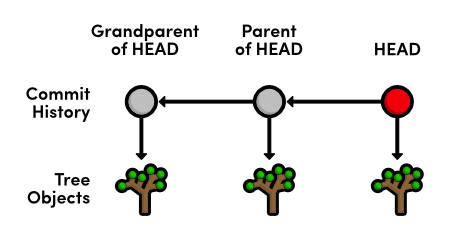
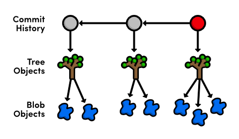
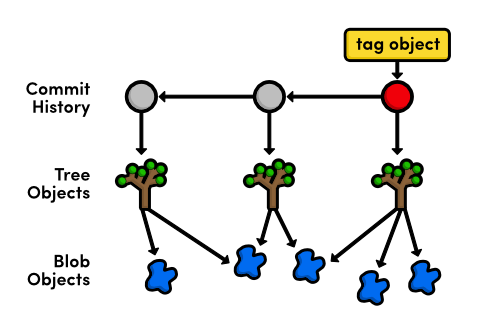
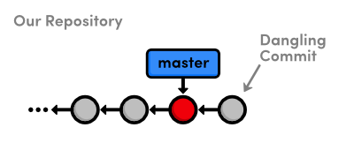

 Plumbing
=================================

[히스토리 다시쓰기 (Rewriting History)](06-rewriting-history.html) 에서, Git 저장소의 내부 표현에 관해 얘기했다. 여러분을 약간은 잘못 인도했을지도 모르겠다. reflog, interactive rebasing, 그리고 resetting은 Git의 다소 복잡한 기능인 반면, 그것들은 여전히 우리가 다룰 다른 모든 명령어처럼 여전히 **포세린(도자기, porcelain)**의 일부로 여겨진다. 이번 장에서, 우리는 Git의 **플러밍(plumbing)**에 대해 살펴보려고 한다 – 저수준(low level) 명령은 우리에게 Git의 *진짜* 프로젝트에 대한 내부 표현에 접근하도록 해 준다.

Git의 소스 코드 해킹을 시작하지 않는 한, 여러분은 아마도 아래 나오는 플러밍 명령을 사용할 필요가 절대 없을 것이다. 그러나, 저장소를 수작업으로 조작하는 것은 실제로 Git이 어덯게 여러분의 데이터를 저장하는가에 대한 개념적인 세부사항을 채워줄 것이며 그리고 이 튜토리얼을 통해 우리가 사용했던 기술의 더 깊은 이해와 함께 나아가게 해줄 것이다. 결국, 이러한 지식은 친숙한 포세린 명령어를 좀 더 강력하게 만들 것이다.

우리는 Git의 오브젝트 데이터베이스를 조사하면서 시작할 것이고, 그리고 난 후 Git의 저수준 인터페이스만 사용해서 수작업으로 스냅샷을 생성하고 commit할 것이다.

 [이번 장을 위한 저장소 다운로드 받기](media/repo-zips/plumbing.zip)

이전 장에서부터 계속 진행중이라면, 여러분은 이미 필요한 모든 것을 가지고 있다. 그렇지 않으면, 위의 링크에서 압축된 Git 저장소를 다운로드 받아 압축을 풀자. 그리고 나서 진행해도 좋다.

## commit 세부사항 살펴보기

먼저, `git cat-file` 플러밍 명령과 함께 가장 최근의 commit을 좀 더 자세히 들여다보자.

```
git cat-file commit HEAD
```

`commit` 파라미터는 Git에게 우리가 commit 오브젝트를 보기 원한다고 명령한다. 그래고 우리가 이미 알고 있듯이, `HEAD`는 가장 최근의 commit을 참조한다. 이것은 다음과 같이 출력할 것이고 여러분의 ID와 유저 정보는 다를 것이다.

```
tree 552acd444696ccb1c3afe68a55ae8b20ece2b0e6
parent 6a1d380780a83ef5f49523777c5e8d801b7b9ba2
author Ryan <ryan.example@rypress.com> 1326496982 -0600
committer Ryan <ryan.example@rypress.com> 1326496982 -0600
 
Add .gitignore file
```

이것은 commit에 대한 완벽한 표현 방식이다: 트리(tree), 부모(parent), 유저 데이터, commit 메시지. 유저 정보와 commit 메시지는 비교적 간단하지만, *tree* 나 *parent* 값은 이전에 본 적이 없다.

**tree 오브젝트**는 튜토리얼의 시작 때부터 얘기해온 “스냅샷”에 대한 Git의 표현 방식이다. 그것들은 시간이나 작성자에 대한 언급 없이 주어진 시점의 디렉토리 상태를 기록한다. 연관된 프로젝트 히스토리로 tree를 함께 묶기 위해서, Git은 각각을 **commit 오브젝트**로 감싸고 다른 commit으로 부모(**parent**)를 지정한다. 각 commit의 부모를 따라감으로써, 여러분은 프로젝트의 전체 히스토리를 파악할 수 있다.


> commit과 tree 오브젝트

각각의 commit이 tree 오브젝트 하나씩 참조하는 것에 주목하자. `git cat-file` 출력에서, 우리는 tree가 그것의 ID를 위해 SHA-1 체크섬을 사용한다는 것을 또한 유추할 수도 있다. 이것은 모든 Git의 내부 오브젝트에 적용될 것이다.

## Tree 살펴보기

다음, 동일한 `git cat-file` 명령을 사용해서 tree를 조사해 보자. `552acd4`를 이전 단계에서의 여러분의 tree ID로 변경하도록 하자.

```
git cat-file tree 552acd4
```

안타깝게도, tree는 바이너리 데이터를 가지고 있으며 가공되지 않은 형태로 표시되어 상당히 보기 싫다. 그래서, Git은 다른 유용한 플러밍 명령을 제공한다:

```
git ls-tree 552acd4
```

이것은 tree의 내용을 출력할 것이며, 디렉토리 목록과 매유 유사하게 보인다:

```
100644 blob 99ed0d431c5a19f147da3c4cb8421b5566600449    .gitignore
040000 tree ab4947cb27ef8731f7a54660655afaedaf45444d    about
100644 blob cefb5a651557e135666af4c07c7f2ab4b8124bd7    blue.html
100644 blob cb01ae23932fd9704fdc5e077bc3c1184e1af6b9    green.html
100644 blob e993e5fa85a436b2bb05b6a8018e81f8e8864a24    index.html
100644 blob 2a6deedee35cc59a83b1d978b0b8b7963e8298e9    news-1.html
100644 blob 0171687fc1b23aa56c24c54168cdebaefecf7d71    news-2.html
...
```

위의 출력을 살펴봄으로써, 우리는 “blob”가 저장소에 있는 파일을 나타내며, 반면에 tree는 폴더를 나타낸다고 추정할 수 있다. 나아가서 이것이 맞는지 확인하기 위해 또다른 `git ls-tree`로 `about` tree를 살펴보자. 여러분은 `about` 폴더의 내용을 볼 수 있을 것이다.

그래서, **blob 오브젝트**는 Git이 우리의 파일 데이터를 저장하는 방법이며, tree 오브젝트는 디렉토리 목록으로 blob와 다른 tree를 결합한다. 그리고, commit 오브젝트는 프로젝트 히스토리로 tree를 묶는다. 이것들은 우리가 사용한 거의 모든 포세린 명령어를 구현하기 위해 Git이 필요로 하는 오브젝트 타입들이다. 그리고 그들의 관계는 다음과 같이 요약된다:


> commit, tree, 그리고 blob 오브젝트

## Blob 살펴보기

`blue.html`과 관련된 blob를 살펴보자 (다음을 *여러분의* tree 출력에서 `blue.html` 다음에 있는 ID로 변경하자)

```
git cat-file blob cefb5a6
```

이것은 blob가 실제는 plain 데이터 파일이라는 것을 확인해 주면서, `blue.html`의 전체 내용을 출력할 것이다. blob는 진짜 내용임에 주목하자: 위의 출력에 파일이름에 대한 언급이 전혀 없다. 즉, `blue.html` 이름은 *blob* 자체가 아니라 blob를 포함하는 tree에 저장된다.

여러분은 [기초 (The Basics)](01-the-basics.html) 에서 오브젝트의 내용이 Git이 알지 못한채 절대 손상되지 않는다는 것을 SHA-1 체크섬이 보장해 준다는 것이 생각날 것이다. 체크섬은 유일한 문자 시퀀스를 생성하기 위해 오브젝트의 내용을 이용하여 작업한다. 이것은 식별자(identifier)로 기능을 할 뿐만 아니라, 또한 오브젝트가 아무말없이 손상되지 않을 것을 보장한다. (변경된 내용은 다른 ID를 생성할 것이다)

blob 오브젝트에 관한 한, 이것은 추가적인 이득을 가진다. 같은 데이터를 가진 두 blob는 같은 ID를 가질 것이기 때문에, Git은 여러 tree에 걸쳐 blob를 공유해야만 한다. 예를 들어, 우리의 `blue.html` 파일은 그것이 생성된 이후로 전혀 수정되지 않았는데, 우리의 저장소는 관련된 blob 한개만 가질 것이다. 그래서 이후의 모든 tree는 그것을 참조할 것이다. 각 tree 오브젝트에 대해 중복된 blob를 생성하지 않음으로써, Git은 저장소의 크기를 엄청 줄이게 된다. 이를 생각하면, 우리는 다음과 같이 Git 오브젝트 다이어그램을 고칠 수 있다.


> Commit, tree, 공유된 blob 오브젝트

그러나, 한 파일에서 한 줄을 변경하자마자, Git은 그 내용이 바꼈기 때문에 새 SHA-1 체크섬을 가진 새로운 blob 오브젝트를 생성해야 한다.

## 태그(tag) 살펴보기

네번째 그리고 마지막 Git 오브젝트 타입은 **tag 오브젝트**이며, 우리는 tag의 세부사항을 보기 위해 동일한 `git cat-file` 명령을 사용할 수 있다.

```
git cat-file tag v2.0
```

이것은 tag의 이름, 작성자, 생성일, 메시지와 함께 `v2.0`과 관련된 commit ID를 출력할 것이다. tag와 commit 사이의 관계는 우리의 마지막 Git 오브젝트 다이어그램을 제공한다:


> Commit, tree, blob, tag 오브젝트

## Git의 branch 표현방식 조사하기

이제 우리는 Git의 branch 표현방식을 완전히 살펴보기 위한 도구를 가졌다. `-t` 플래그를 사용해서, 우리는 Git이 branch를 위해 어떤 종류의 오브젝트를 사용하는지 판단할 수 있다.

```
git cat-file -t master
```

맞다, branch는 그냥 commit 오브젝트에 대한 참조일 뿐이다. 이것은 보통의 `git cat-file`로 그 내용을 확인할 수 있음을 의미한다.

```
git cat-file commit master
```

이것은 우리의 원래 `git cat-file commit HEAD`와 정확히 같은 정보를 출력할 것이다. `master` branch와 `HEAD`는 commit오브젝트에 대한 단순 참조인 것처럼 보인다.

텍스트 에디터를 사용해서, `.git/refs/heads/master` 파일을 열어보자. 여러분은 `git log -n 1`로 확인할 수 있는 가장 최근 commit의 commit 체크섬을 발견할 수 있을 것이다. 이 단일 파일은 Git이 `master` branch를 유지하기 위해 필요한 모든 것이다 – 다른 모든 정보는 위에서 논의한 commit 오브젝트 관계를 통해 추정된다.

반면에, `HEAD` 참조는 `.git/HEAD`에 기록된다. branch tip고 달리, `HEAD`는 commit에 대한 직접적인 링크가 아니다. 대신, 그것은 branch를 참조하며 Git이 어느 commit이 현재 체크아웃 되어 있는지 확인하기 위해 사용한다. `detached HEAD` 상태는 `HEAD`가 어떤 branch에 tip에도 있지 않을 때 발생함을 기억하자. 내부적으로, 이것이 Git에 의미하는 것은 `.git/HEAD`가 로컬 branch를 포함하지 않는 것이다. old commit 체크아웃을 시도해 보자:

```
git checkout HEAD~1
```

이제, `.git/HEAD`는 branch 대신 commit ID를 포함할 것이다. 이것은 GIt에게 우리가 `detached HEAD` 상태 있다는 것을 알려준다. 여러분이 어떤 상태에 있는지와 무관하게, `git checkout` 명령은 항상 `.git/HEAD`에 채크아웃 참조를 기록할 것이다.

진행하기 전 `master` branch로 다시 돌아오자:

```
git checkout master
```

## 오브젝트 데이터베이스 살펴보기

우리가 Git의 오브젝트 동작의 기본 이해를 한 반면에 아직 이들 오브젝트를 Git이 어디에 유지하는지 살펴보지 못했다. 여러분의 `my-git-repo` 저장소에서, `.git/objects` 폴더를 열어보자. 이것이 Git의 오브젝트 데이터베이스이다.

각 오브젝트는 타입과 상관없이 SHA-1체크섬 일부를 파일이름으로 사용하여 파일로 저장된다. 그러나 하나의 폴더에 모든 오브젝트를 저장하는 대신에, 그것들은 디렉토리 이름으로 그들의 ID의 첫 두개 문자를 사용해서 분리한다. 그 결과 오브젝트 데이터 베이스는 다음과 같이 보이게 된다.

```
00  10  28  33  3e  51  5c  6e  77  85  95  f7
01  11  29  34  3f  52  5e  6f  79  86  96  f8
02  16  2a  35  41  53  63  70  7a  87  98  f9
03  1c  2b  36  42  54  64  71  7c  88  99  fa
0c  26  30  3c  4e  5a  6a  75  83  91  a0  info
0e  27  31  3d  50  5b  6b  76  84  93  a2  pack
```

예를 들면, 다음 ID로 시작하는 오브젝트는 :

```
7a52bb857229f89bffa74134ee3de48e5e146105
```

`7a`라 불리는 폴더에 자장되고 나머지 문자 (`52bb8…`)은 파일이름으로 사용된다. 이것은 우리에게 오브젝트 ID를 제공하지만 우리가 오브젝트 데이터베이스에 있는 아이템을 조사할 수 있기 전에는 그것이 어떤 형태의 오브젝트인지 알아야할 필요가 있다. 다시 말하면, 우리는 `-t` 플래그를 사용할 수 있다:

```
git cat-file -t 7a52bb8
```

물론, 오브젝트 ID를 *여러분의* 데이터베이스의 오브젝트로 변경하자 (전체 ID를 얻기위해 폴더 이름과 파일 이름을 합치는 것을 잊지 말자). 이것은 commit의 타입을 출력할 것이고, 우리는 `git cat-file`로 보통의 호출에 전달할 수 있다.

```
git cat-file blob 7a52bb8
```

오브젝트는 blob 지만 여러분의 것은 다를 수도 있다. 그것이 tree라면, 읽기 힘든 바이너리 데이터를 깔끔한 디렉토리 목록으로 바꾸기 위해 `git ls-tree`를 사용하는 것을 잊지 말자.

## 가비지 콜렉트 (Garbage Collect)

저장소가 증가함에 따라, Git은 “pack” 파일이라 알려진 좀더 압축된 형태로 여러분의 오브젝트 파일을 자동적으로 옮길수도 있다. 여러분은 가비지 컬렉션 명령과 함께 강제 압축을 할 수도 있지만 알고 있어라: 이 명령은 취소할 수 있다(undo-able). 만약 여러분이 `.git/objects` 폴더의 내용을 탐색하는 것을 계속하기 원하면, 다음 명령을 실행하기 전에 그걸 해야만 할 것이다. 보통의 Git 기능성은 영향을 받지 않을 것이다.

```
git gc
```

이것은 더 빠르고 더 작은 pack 파일로 개별 오브젝트 파일을 압축하며, dangling commit을 제거한다. (예를 들면 삭제되고 merge되지 않은 branch의)

물론, 같은 오브젝트 ID를 가진 모든 것은 여전히 `git cat-file`과 함께 작업할 것이고 모든 포세린 명령어는 영향받지 않을 것이다. `git gc` 명령은 저장소의 내용이 아니라 단지 Git의 저장 메커니즘만 변경한다. `git gc`를 자주 실행하는 것은 여러분의 저장소의 최적화를 유지함으로서 대개 좋은 생각이다.

## 인덱스에 파일 추가하기

지금까지, 우리는 commit된 스냅샷에 대한 Git의 저수준 표현방식을 논의했다. 이 장의 나머지는 주제를 바꿔 수작업으로 새 스냅샷을 준비하고 commit하기 위한 “플러밍” 명령어를 좀더 사용할 것이다. 이것은 Git이 어떻게 워킹 디렉토리와 staging 영역을 관리하는지에 대한 아이디어를 우리에게 제공할 것이다.

`my-git-repo`에 `news-4.html` 이름으로 새 파일을 생성하고 다음 HTML을 추가하자.

```html
<!DOCTYPE html>
<html lang="en">
<head>
  <title>Indigo Invasion</title>
  <link rel="stylesheet" href="style.css" />
  <meta charset="utf-8" />
</head>
<body>
  <h1 style="color: #A0C">Indigo Invasion</h1>
  <p>Last week, a coalition of Asian designers, artists,
  and advertisers announced the official color of Asia:
  <span style="color: #A0C">Indigo</span>.</p>
    
  <p><a href="index.html">Return to home page</a></p>
</body>
</html>
```

그리고 나서, `index.html`의 “News” 섹션을 다음과 일치하도록 업데이트하자.

```html
<h2 style="color: #C00">News</h2>
<ul>
  <li><a href="news-1.html">Blue Is The New Hue</a></li>
  <li><a href="rainbow.html">Our New Rainbow</a></li>
  <li><a href="news-2.html">A Red Rebellion</a></li>
  <li><a href="news-3.html">Middle East's Silent Beast</a></li>
  <li><a href="news-4.html">Indigo Invasion</a></li>
</ul>
```

`git add` 대신에, 우리는 staging 영역에 파일을 추가하기 위한 저수준의 `git update-index` 명령을 사용할 것이다. **인덱스(index)**는 staged 스냅샷을 위한 Git의 용어이다.

```
git status
git update-index index.html
git update-index news-4.html
```

마지막 명령은 에러를 낼 것이다 – Git은 여러분이 그것이 새 파일이라고 명시없이는 인덱스에 새 파일을 추가하도록 허용하지 않는다:

```
git update-index --add news-4.html
git status
```

우리는 방금 워킹디렉토리를 인덱스로 옮겼으며 이것은 우리가 commit을 위해 준비된 스냅샷을 가지는 것을 의미한다. 그러나, 절차는 단순한 `git commit`처럼 간단하지 않다.

## 데이터베이스에 인덱스 저장하기

모든 commit은 그 commit을 위한 스냅샷을 나타내는 tree 오브젝트를 참조하는 것을 기억하자. 그래서, commit 오브젝트를 생성하기 전에, 우리는 Git의 오브젝트 데이터베이스에 우리의 인덱스(staged 트리)를 추가할 필요가 있다. 우리는 다음의 명령으로 이를 수행할 수 있다.

```
git write-tree
```

이 명령은 인덱스로부터 tree 오브젝트를 생성하고 `.git/objects`에 그것을 저장한다. 그것은 결과 tree의 ID를 출력할 것이다. (여러분의 것은 다를 수도 있다):

```
5f44809ed995e5b861acf309022ab814ceaaafd6
```

여러분의 새 스냅샷을 `git ls-tree`로 시험해 볼 수 있다. 이 commit을 위해 생성된 새로운 blob는 `index.html`과 `news-4.html` 만이라는 것을 기억하자. tree의 나머지는 기존 blob를 참조할 것이다.

```
git ls-tree 5f44809
```

자, 우리는 tree 오브젝트를 가졌지만, 아직 프로젝트 히스토리에 그것을 추가해야 한다.

## commit 오브젝트를 생성하기

새로운 tree 오브젝트를 commit하기 위해, 우리는 수작업으로 부모(parent) commit의 ID를 파악할 필요가 있다.

```
git log --oneline -n 1
```

이것은 다음 라인을 출력할 것이며 여러분의 commit ID는 다를 수 있다. 우리는 새 commit 오브젝트의 부모를 지정하기 위해 이 ID를 사용할 것이다.

```
3329762 Add .gitignore file
```

`git commit-tree` 명령은 tree와 부모 ID로부터 commit 오브젝트를 생성하는 동안, 작성자 정보는 Git에 의해 셋팅된 환경 변수로부터 가져온다. `5f44809`를 여러분의 tree ID로 변경하고 `3329762`를 여러분의 가장 최근의 commit ID로 변경하자.

```
git commit-tree 5f44809 -p 3329762
```

이 명령은 입력을 기다릴 것이다: commit 메시지. `Add 4th news item` 을 입력하고 commit 메시지를 생성하기 위해 `Enter`를 누르자, 그리고 나서 입력을 마치기 위한 “End-of-file” 문자를 지정하기 위해 윈도에서는 `Ctrl-Z`와 `Enter`를, 유닉스에서는 `Ctrl-D`를 누른다. `git write-tree` 명령과 마찬가지로, 이것은 결과 commit 오브젝트의 ID를 출력할 것이다.

```
c51dc1b3515f9f8e80536aa7acb3d17d0400b0b5
```

여러분은 이제 `.git/objects`에서 이 commit을 찾을 수 있을 것이다, 하지만 `HEAD`나 branch는 이 commit을 포함하도록 업데이트 되지 않았다. 이 시점에서는 *dangling commit*인 것이다. 우리로서는 다행스럽게도, Git이 그것의 branch 정보를 어디에 저장하는지 우리는 알고 있다.


> dangling commit 생성하기

## HEAD 업데이트

우리는 `detached HEAD` 상태에 있지 않기 때문에, `HEAD`는 branch에 대한 참조이다. 그래서, 우리가 `HEAD`를 업데이트하기 위해 필요한 것은 `master` branch를 우리의 새 commit object쪽으로 앞으로 옮기는 것이다. 텍스트 에디터를 사용해서, `.git/refs/heads/master`의 내용을 이전 단계의 `git commit-tree`의 출력으로 교체하자.

만약 이 파일이 사라진 것처럼 보인다면, 쫄지마라! 이것은 단지 `git gc` 명령이 하나의 파일로 우리의 branch 참조를 모두 압축한 것을 의미한다. `.git/refs/heads/master` 대신에, `.git/packed-refs`를 열어서 `refs/head/master` 라인을 찾아 ID를 변경하자.

이제 우리의 `master` branch는 새 commit을 가리키고 있으니, 우리는 프로젝트 히스토리에 `news-4.hmtl`을 확인할 수 있을 것이다.

```
git log -n 2
```
마지막 네개 섹션은 우리가 `git commit -a -m “Some Message”`를 실행할 때 보이는 것 이면에 일어나는 모든 것을 설명한 것이다. 여러분이 다시는 Git의 플러밍을 사용하지 않아도 된다는 사실이 기쁘지 않으세요?


> master branch를 수작업으로 업데이트

## Conclusion

결론

이 장을 마친 후,  대부분의 Git 명령을 위해 바탕이 되는 오브젝트 데이터베이스에 대한 확고한 개념을 가지길 바란다. 우리는 commits, trees, blobs, tags, 그리고 branches를 살펴보았고, 심지어 맨땅에서 commit 오브젝트를 생성하는 것도 해보았다. 이 모든 것은 Git의 포세린 명령에 대해 더 깊은 이해를 주기 위함이며, 이제 여러분은 아마도 버전 관리 시스템이 요구되는 모든 작업에 사실상 Git을 적용할 준비가 되었다고 느낄 것이다.

이러한 기술들을 실제 프로젝트에 적용하는 데 있어서, Git이 소프트웨어 프로젝트를 관리하는 만병통치약이 아니라 단지 여러분의 파일을 추적하기 위한 도구임을 꼭 기억하자. Git 지식에 대한 익숙한 정도가 개발 팀 내의 마구잡이식 관습을 만회할 수는 없다.

이로서 Git 기반의 개정 관리와 함께 하는 우리의 여행을 끝낸다. 이 튜토리얼은 여러분을 하룻밤 사이에 Git 전문가로 변신시켜주는 것이 아니라 분산형 소프트웨어 개발을 위한 실제 업무를 준비하는 것을 목적으로 한다. 여러분은 자신의 프로젝트를 관리할 수 있으며, 다른 Git 유저와 협업하며, 아마도 가장 중요한 점인 Git 문서의 다른 부분들이 무엇을 따르려고 하는지 정확히 이해할 것이다.

이제 여러분이 할 일은 이 기술을 습득하여 새 프로젝트에 적용하는 것이며, 이전에 본적이 없었던 복잡한 히스토리를 통해 면밀히 살펴보는 것, 다른 개발자들과 함께 Git 워크플로우에 관해 얘기하는 것, 그리고 “어떻게 될 지 궁금하다…”와 같은 모든 시나리오를 실제로 시도해 보는데 시간을 보내는 것이다. 행운을 빈다!

질문, 코멘트, 혹은 제안이 있다면 연락주기 바란다. (please [contact us](http://rypress.com/about).)

## 정리

`git cat-file <type> <object-id>`  
특정 오브젝트를 표시한다. <type>은 commit, tree, blob 혹은 tag 중 하나.

`git cat-file -t <object-id>`  
특정 오브젝트의 타입을 출력한다.

`git ls-tree <tree-id>`  
지정된 tree object의 가공된(preety) 버전을 출력한다.

`git gc`  
오브젝트 데이터베이스에 가비지 컬렉션을 수행한다.

`git update-index [--add] <file>`  
새로운 untracked 파일을 나타내기 위해 –add 플래그 옵션을 사용해서 특정 파일을 stage한다.

`git write-tree`  
인덱스로부터 tree를 생성하고 오브젝트 데이터베이스 안에 그것을 저장한다. 새로운 tree 오브젝트의 ID를 반환한다.

`git commit-tree <tree-id> -p <parent-id>`  
주어진 tree 오브젝트와 부모 commit으로부터 새 commit 오브젝트를 생성한다. 새 commit 오브젝트의 ID를 반환한다.
